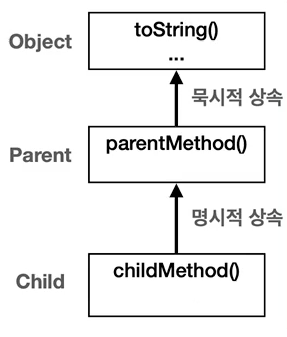
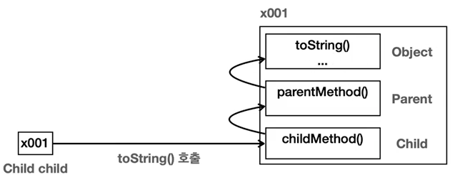
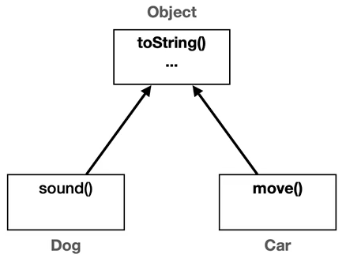
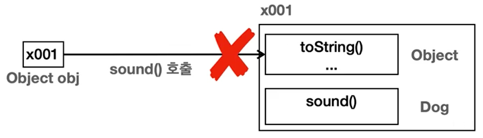
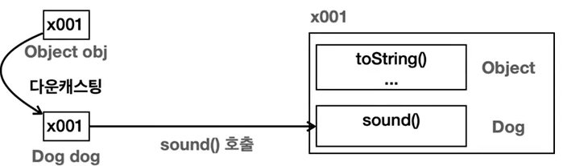
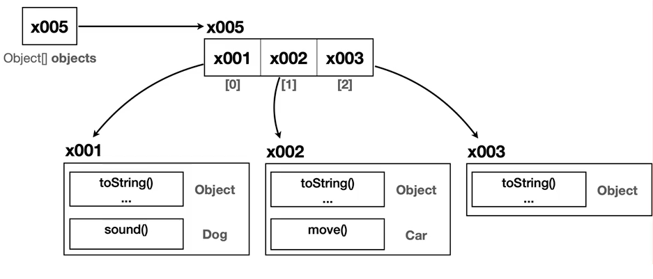

## 자바 중급 1편

### Object 클래스 학습
> 1. java.lang 패키지
> 2. Object 클래스
> 3. Object 다형성
> 4. Object 배열

### 1. java.lang 패키지
> 1. java.lang 패키지의 대표적인 클래스
> 2. import 생략 가능

#### java.lang 의 대표 클래스들
- `java.lang` 에서 lang 은 **Language(언어)의 줄임말**이다.
- 즉, ***Java 언어를 이루는 가장 기본이 되는 클래스들을 보관하는 패키지***를 뜻한다.
- java.lang 패키지의 대표적인 클래스
    - `Object` : 모든 자바 객체의 부모 클래스
    - `String` : 문자열
    - `Integer`, `Long`, `Double` : Wrapper 타입(기본형 타입을 객체로 감싼것)
    - `Class` : 클래스의 메타 정보
    - `System` : 시스템과 관련된 기본 기능들을 제공

#### import 생략 가능
- 기본적으로 패키지의 클래스를 쓴다면 import 키워드를 상단에 선언해줘야 한다.
- 하지만 ***java.lang 패키지의 클래스를 사용할 때는 import를 생략 가능***하다.
  ```java
  //import java.lang.System; 생략되어도 실행이 가능 !!
  
  public class LangMain {
      public static void main(String[] args) {
          System.out.println("hello Java");
      }
  }
  ```

### 2. Object 클래스
> 1. Object 클래스란?
> 2. Java 에서 Object 클래스가 최상위 부모클래스인 이유

#### Object 클래스란?

- Java에서 **모든 클래스의 최상위 부모 클래스는 항상 Object 클래스**다.
- _**클래스의 부모클래스가 없을때 묵시적으로 Object 클래스를 상속**_ 받는다.
    - 굳이 명시적으로 Object 클래스를 상속받을 필요가 없다.
    - Child 는 Parent 를 상속받고 Parent 는 Object 를 상속받기 때문에 **Child 는 Object 클래스의 메서드를 사용**할 수 있다.
  ```java
  public class ObjectMain {
      public static void main(String[] args) {
          Child child = new Child();
          child.childMethod();
          child.parentMethod();
  
          // toString() 메서드는 Object 클래스의 메서드이다.
          // toString() 은 객체의 정보를 출력해준다.
          String string = child.toString();
          System.out.println("string = " + string);
      }
  }
  ```
  
- 즉, ***Java 에서 모든 객체의 최종 부모***는 `Object`이다.

#### Java 에서 Object 클래스가 최상위 부모클래스인 이유
- 공통 기능 제공
    - 객체의 정보를 제공하고, 객체가 같은지 비교하고, 객체가 어떤 클래스로 만들어졌는지 등등의 모든 객체에게 필요한 기본 기능이 있다.
    - 이런 기본기능들을 클래스를 만들때 마다 새로 만들면 상당히 번거롭다.
    - 그래서 Object 클래스가 공통 기능을 가지고 있고, 모든 클래스의 부모가 된다면 어떤 객체를 만들어도 기본기능을 사용할 수 있다.
    - 공통 기능 종류 : `toString()` , `equals()` , `getClass()` 등등
- 다형성의 기본 구현
    - 부모는 자식을 담을 수 있는 다형성은 Object 클래스가 모든 객체를 참조할 수 있게 해준다.
    - 즉, 타입이 다른 객체들을 어딘가에 보관해야 한다면 Object 에 보관하면 된다.
    - 
### 3. Object 다형성
> 1. Object 다형성이란
> 2. Object 다형성의 장점
> 3. Object 다형성의 한계
> 4. Object를 활용한 다형성의 한계

#### Object 다형성이란?
- Dog 와 Car 라는 서로 관련이 없는 클래스들은 Object 의 자식이므로 Object 의 기능을 상속받는다.

- 아래 코드와 같이 `Object` 타입으로 파라미터를 가지는 메서드에선 **다운캐스팅**이 필요하다.
  ```java
  public class ObjectPolyExample1 {
    public static void main(String[] args) {
      Dog dog = new Dog();
      Car car = new Car();
  
      actdion(dog);
      actdion(car);
    }
  
    private static void action(Object obj){
  //        obj.sound(); 안된다 !!
  //        obj.move(); 안된다 !!
  
      // 다운 캐스팅이 필요하다 !!
      if(obj instanceof Dog dog) dog.sound();
      else if(obj instanceof Car car) car.move();
    }
  }
  ```
#### Object 다형성의 장점
- 위 코드의 `action(Object obj)` 메서드는 `Object` 를 받기 때문에 모든 객체를 받을 수 있다.
  ```java
  action(dog);
  void action(Object obj = dog(Dog));
  
  action(car)
  void actdion(Object obj = car(Car));
  ```
#### Object 다형성의 한계
- `Object` 타입은 부모이기 때문에 부모클래스는 자식클래스의 내용을 모른다. 즉, ***자식 객체의 메서드를 사용할려면 다운캐스팅이 필요***하다 !!

- 아래 코드처럼 다운캐스팅을 하여 각 객체의 메서드를 호출하면 된다.
  ```java
  private static void action(Object obj){


    // 다운 캐스팅이 필요하다 !!
    if(obj instanceof Dog dog) dog.sound();
    else if(obj instanceof Car car) car.move();
  }
  ```
  
#### Object를 활용한 다형성의 한계
- `Object` 는 모든 객체의 부모이기 때문에 모든 객체를 대상으로 다형적 참조가 가능하다.
- 하지만 ***전달 받은 객체를 호출할려면 객체에 맞는 다운캐스팅 과정이 필요***하다.
- `Object` 에는 위 코드의 `Dog.sound()`, `Car.move()` 등의 다른객체의 메서드는 정의되어 있지않다. 즉, **메서드 오버라이딩을 활용할 수 없다.**

### 4. Object 배열
> 1. Object 배열이란?
> 2. Object가 없다면?

#### Object 배열이란?
- `Object` 는 모든 타입의 객체를 담을 수 있기 떄문에 `Object[]` 를 만들면 ***모든 객체를 담을 수 있는 배열***을 만들 수 있다.
  ```java
  public class ObjectPolyExample2 {
      public static void main(String[] args) {
          Dog dog = new Dog();
          Car car = new Car();
          Object object = new Object(); // Object 인스턴스도 가능
  
          Object[] objects = {dog, car, object};
          
          size(objects);
      }
  
      private static void size(Object[] objects) {
          System.out.println("전달된 객체의 수는 : "+objects.length);
      }
  }
  ```
  
- `size(Object[] objects)` 메서드는 `Object` 타입만 사용한다. 즉, **java를 사용하는 어떤 프로젝트에서도 사용**가능한 메서드이다.

#### Object 가 없다면?
- 위 예제에 있는 `void action(Object obj)` 처럼 모든 객체를 받는 메서드를 못 만든다.
- `Object[] objects` 처럼 모든 객체를 담을 수 있는 배열도 못 만든다.
- 물론 Object 가 없으면 MyObject 나 WeObject 처럼 임의의로 클래스를 만들면 된다.
- 하지만 모든 개발자가 똑같이 코드를 안짜기 떄문에 호환이 안된다 !