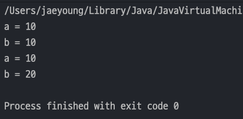
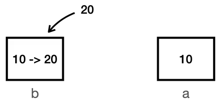
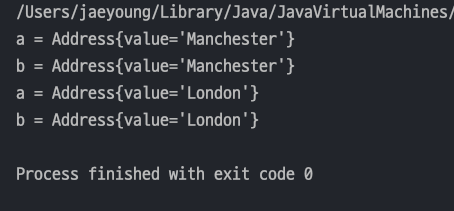
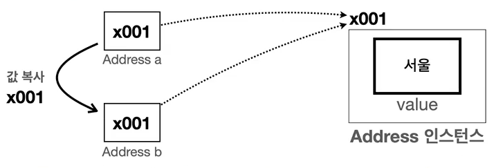
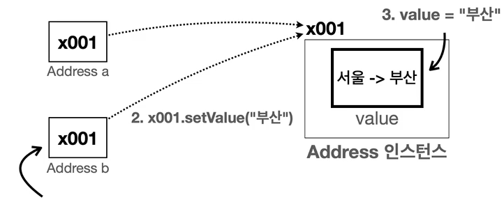
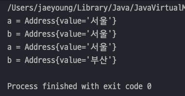
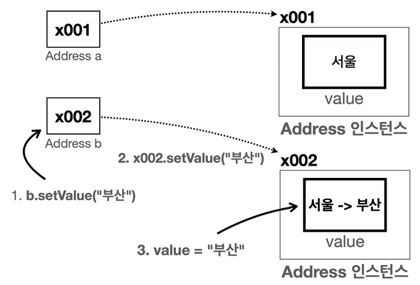

## 자바 중급 1편

### 불변 객체 학습
> 1. 기본형과 참조형의 공유
> 2. 공유 참조와 사이드 이펙트
---
### 1. 기본형과 참조형의 공유
> Java 에서 데이터 타입을 2가지로 나누면 `기본형(Primitive Type)`과 `참조형(Reference Type)`으로 나눌 수 있다.
> - **기본형** : _하나의 값을 여러 변수에서 절대로 공유하지 않는다._
> - **참조형** : _하나의 객체를 참조값을 통해 여러 변수에서 공유할 수 있다._

#### 기본형 예제
- a의 값을 b에 복사하고 b의 값을 변경해도 기본형이기 때문에 a 값에 영향이 없다.
    ```java
    public class PrimitiveMain {
        public static void main(String[] args) {
            // 기본형 : 절대로 같은 값을 공유하지 않는다.
            int a = 10;
            int b = a;
    
            System.out.println("a = " + a);
            System.out.println("b = " + b);
    
            b=20; // b 의 값을 변경해도 a의 영향이 없다.
            System.out.println("a = " + a);
            System.out.println("b = " + b);
        }
    }
    ```
    
- `b=a` 라고 하면 `Java`에서 ***a의 값을 복사해서 b에 대입***하기 때문에 b의 값이 변경해도 a의 값이 변경되지 않는다.

    
#### 참조형 예제
- 참조형은 인스턴스를 공유하기 때문에 b 값을 변경하면 a의 값도 변경된다.
  ```java
  public class RefMain1_1 {
      public static void main(String[] args) {
          // 참조형 : 하나의 인스턴스를 공유한다.
          Address a = new Address("Manchester");
          Address b = a;
  
          System.out.println("a = " + a);
          System.out.println("b = " + b);
  
          b.setValue("부산");
          System.out.println("a = " + a);
          System.out.println("b = " + b);
      }
  }
  ```
  
- 참조형변수 b에 참조형변수 a를 대입하면 **참조값을 복사**하여 b에 전달된다.(_**자바는 항상 값을 복사해서 대입**_)
- 즉, _**참조값을 복사해서 넣었기 때문에 a와 b는 같은 인스턴스를 가리키게 된다.**_

  
---
### 2. 공유 참조와 사이드 이펙트
> `사이드 이펙트(Side Effect)`는 프로그래밍에서 어떤 계산이 주된 작업 외에 추가적인 부수 효과를 일으키는 것을 말한다

- 위에서 했던 코드를 예시로 들면, b 의 값만 부산 으로 바꿀려고 했지만 a 의 값도 같이 바뀌게되었다. 이것이 사이드 이펙트이다.
  ```java
  public class RefMain1_1 {
      public static void main(String[] args) {
          // 생략 ....
          b.setValue("London");
          System.out.println("a = " + a); // 사이드 이펙트 발생
          System.out.println("b = " + b);
      }
  }
  ```
- 이렇게 개발자에 의도는 b 의 값만 바꿀려고 했으나 참조형 변수의 특징으로 인해 a의 값도 바뀌게 되었다. 
- 이런 *개발자에 의도와 다르게 변경이 의도치 않게 다른 부분에 영향을 미치는 경우는 디버깅이 어려워지고 코드의 안정성이 저하*될 수 있다.

  
#### 사이드 이펙트 해결 방안
> 각각의 객체를 ***서로 다른 인스턴스를 참조***하게 하면 된다.
- 위 코드를 수정해보면 a 와 b 를 다른 인스턴스를 참조하게 초기화하면 된다.
  ```java
  public class RefMain1_2 {
      public static void main(String[] args) {
          // 참조형 : 하나의 인스턴스를 공유한다.
          Address a = new Address("서울"); // x001
          Address b = new Address("서울"); // x002
  
          System.out.println("a = " + a);
          System.out.println("b = " + b);
  
          b.setValue("부산");
          System.out.println("a = " + a); // 사이드 이펙트가 발생하지 않는다 !
          System.out.println("b = " + b);
      }
  }
  ```
  
- 즉, `서울` 이라는 같은 값을 가지지만 _참조값은 전혀 다르기 때문에 값을 수정해도 서로 영향을 끼치지 않는다._

  
- 하지만 참조값을 다르게 한다고 해도 _**하나의 객체를 여러 변수가 공유하지 않도록 강제로 막을 수 있는 방법은 없다.**_
- 아까 처럼 `b = a` 라고 코드를 짜도 어떤 오류가 발생하지 않는다. **즉, 자바 문법상 오류가 없기에 강제로 막을 수 있는 방법은 없다.**
  ```java
  public class RefMain1_1 {
      public static void main(String[] args) {
          Address a = new Address("Manchester");
          Address b = a; // 문법상 오류가 없다 !!
          // 생략...
      }
  }
  ```
- 참조형 변수의 객체 공유는 꼭 필요할 때도 있지만, 때로는 공유하는 것이 사이드 이펙트를 만드는 경우가 있다.