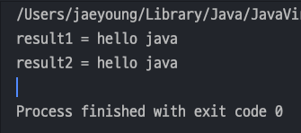
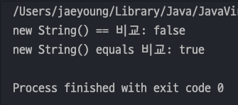
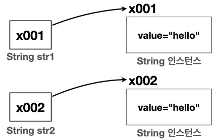
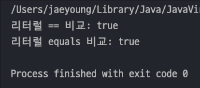
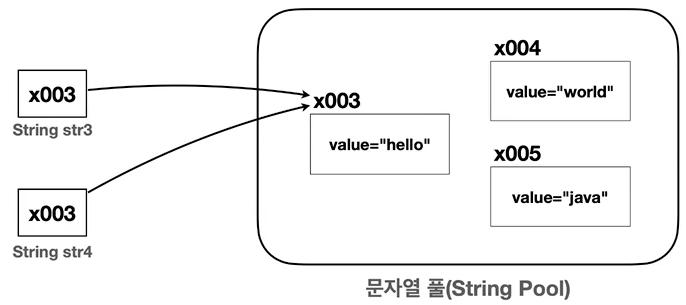
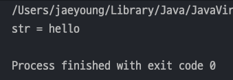
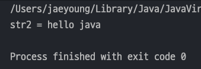
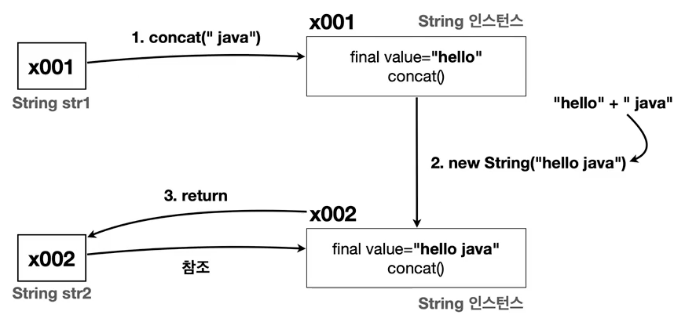
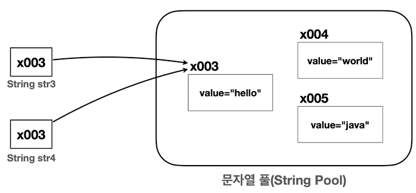

## 자바 중급 1편

### String 클래스 학습
> 1. String 클래스 - 기본
> 2. String 클래스 - 비교
> 3. String 클래스 - 불변 객체
---
### String 클래스 - 기본
> Java 에서 문자를 다루는 대표적인 타입은 `char` , `String` 2가지가 있다.
- `char` 타입을 사용하게 되면 문자 1개만 담을 수 있다.
- 문자를 여러개 담을려면 `char[]` 타입을 사용하면 된다.
- 하지만 문자열은 보통 `String` 을 이용하여 많이 한다.
    ```java
    public class CharArrayMain {
        public static void main(String[] args) {
            char a = 'a'; // 반드시 문자 1개만 담을 수 있다.
            System.out.println("a = " + a);
    
            // 여러개를 담기 위해 배열이 피룡
            char[] charArr = new char[]{'h', 'e', 'l', 'l', 'o'};
            System.out.println(charArr);
    
            // 문자열은 String 을 사용하는게 편하다.
            String str = "hello";
            System.out.println("str = " + str);
        }
    }
    ```
- 하지만 `String` 은 `참조타입(Reference Type)`이다. `char` 와 같은 기본타입은 `=` 연산자를 통해 값을 대입하지만 참조타입은 `new` 키워드를 사용해야 한다.
    ```java
    public class StringBasicMain {
        public static void main(String[] args) {
            String str1 = "hello"; // String 은 레퍼런스 타입
            String str2 = new String("hello"); // new 키워드로 생성 가능
    
            System.out.println("str1 = " + str1);
            System.out.println("str2 = " + str2);
        }
    }
    ```
- 위 코드와 같이 `=` 연산자로 값을 대입하나 `new` 키워드로 값을 메모리에 할당하나 문제가 없는것이 보인다.
- 그 이유는 `Java` 에서 문자열을 자주사용하기 떄문에 **편의상 = 연사자로 값을 대입해도 자동으로 new String("값") 으로 바꿔주기 때문**이다.

#### String 클래스 구조
- String 클래스 파일을 들여다 보면 아래와 같다.
    ```java
    public final class String{
        // 문자열 보관
        private final char[] value; // 자바 9 이전
        private final byte[] value; // 자바 9 이후
        
        // 여러 메서드
        public String concat(String str) { ... }
        public int length() { ... }
        ...
    }
    ```
- 필드를 보면 `char[]` 타입의 `value` 변수가 있는데, `String` 은 다루기 불편한 ***char[] 를 내부에 숨기고 개발자가 편리하게 문자열을 사용할 수 있도록 제공***해준다.
  - Java 9 이후로는 char[] 대신 byte[] 를 사용한다.
  - 왜냐하면 `Java` 에서 `char` 타입은 `2byte`를 차지한다. 그런데 **영어, 숫자는 보통 1byte로 표현**이 가능하다.
  - 그래서 영어나 숫자는 `1byte` 나머지는 `2byte`로 사용한다. -> 즉, _**메모리를 효율적으로 사용할 수 있다.**_
- 메서드 종류
  - `length()` : 문자열의 길이를 반환한다.
  - `charAt(int index)` : 특정 인덱스의 문자를 반환한다.
  - `substring(int beginIndex, int endIndex)` : 문자열의 부분 문자열을 반환한다.
  - `indexOf(String str)` : 특정 문자열이 시작되는 인덱스를 반환한다.
  - `toLowerCase()` , `toUpperCase()` : 문자열을 소문자 , 대문자로 변환한다.
  - `trim()` : 문자열 양 끝의 공백을 제거한다.
  - `concat(String str)` : 문자열을 더한다.
#### String 문자열 더하기
- 기본적으로 참조타입인 `String` 을 `+` 연산하기 위해서는 `+` 연산자가 아닌 특정 메서드를 통해서 사용해야 한다.
- 하지만 문자열은 자주 사용하기 때문에 `Java` 에서 편의상 `+` 연산을 제공한다.
  ```java
  public class StringConcatMain {
      public static void main(String[] args) {
          String a = "hello";
          String b = " java";
  
          String result1 = a.concat(b);
          String result2 = a + b;
  
          System.out.println("result1 = " + result1);
          System.out.println("result2 = " + result2);
      }
  }
  ```
  
---
### 2. String 클래스 - 비교
> `String` 클래스를 비교할 때는 `==` 비교가 아닌 `equals()` 비교를 해야한다.
>> `동일성(Identity)` : `==` 연산자를 통해 두 객체의 참조가 동일한 객체를 가리키고 있는지 확인</br>
>> `동등성(Equality)` : `equals()` 메서드를 사용하여 두 객체가 논리적으로 같은지 확인

#### new String() 객체 동일성,동등성 비교
- `String` 에서 제공하는 `equals()` 는 `Object` 클래스의 `equals()` 를 오버라이딩 해놨기 때문에 문제없이 잘 작동한다!!
  ```java
  public class StringEqualsMain1 {
      public static void main(String[] args) {
          String str1 = new String("hello");
          String str2 = new String("hello");
          System.out.println("new String() == 비교: " + (str1 == str2));
          System.out.println("new String() equals 비교: " + str1.equals(str2));
      }
  }
  ```
  
- 메모리 구조를 보게 되면 `str1` 과 `str2` 는 `heap` 메모리공간에서 **다른 메모리 주소를 가리키고 있다.**

  
- 즉, "hello" 라는 값을 갖고 있기 떄문에 동등성(`equals()`)는 `true` 지만 동일성(`==`)은 `false` 이다.
#### = 연산자로 만든 String 객체 동일성,동등성 비교
- 하지만 `String` 을 `=` 연산자로 값을 대입해서 동등성과 동일성을 비교하면 같은 값이 나오게 된다.
  ```java
  public class StringEqualsMain1 {
      public static void main(String[] args) {
          String str3 = "hello";
          String str4 = "hello";
          System.out.println("리터럴 == 비교: " + (str3 == str4));
          System.out.println("리터럴 equals 비교: " + str3.equals(str4));
      }
  }
  ```
  
- `=` 연산자로 생성한 `String` 객체들은 `문자열 풀(String Pool)` 이라는 공간에 들어가 있다.

  
- 위 코드의 `String str3 = "hello";` 와 같이 ***문자열 리터럴를 사용하는 경우 자바는 메모리 효율성과 성능 최적화***를 위해 `String Pool` 을 사용한다.
- `String Pool` 은 `Java` 가 **실행되는 시점에 클래스에 문자열 리터럴이 있으면 String Pool 에 String 인스턴스를 미리 만들어둔다.** 이때 같은 문자열이 또 있다면 만들지 않는다.
  > **<참고**></br>
  > 프로그래밍에서 `풀(Pool)`은 **공용 자원을 모아둔 곳**을 뜻한다.</br>
  > 문자열 풀에 필요한 `String` _**인트턴스를 미리 만들어두고 여러곳에서 재사용할 수 있다면 성능과 메모리를 더 최적화**_ 할 수 있다.
- _**String 클래스 객체의 비교를 할 때는 무조건 equals() 메서드를 통해 비교해야 한다 !!!**_ 
---
### 3. String 클래스 - 불변 객체
> String 클래스는 대표적인 불변(Immutable)객체이다.

- `hello` 값을 가지는 `String` 변수에 `concat()` 메서드를 이용하여 ` java` 문자열을 더해보자
  ```java
  public class StringImmutable1 {
      public static void main(String[] args) {
          String str = "hello";
          str.concat(" java");
          System.out.println("str = " + str);
      }
  }
  ```
  
  - 값이 제대로 안나온다!! 왜냐하면 불변객체의 특성 때문이다. 
- `concat()` 메서드는 ***불변객체의 특성 떄문에 기존의 값을 변경하지 않고 변경값을 가지는 새로운 String 객체를 반환***한다 !!
  ```java
  public class StringImmutable2 {
      public static void main(String[] args) {
          String str = "hello";
          String str2 = str.concat(" java"); 
          System.out.println("str2 = " + str2);
      }
  }
  ```
  
- 실행과정은 아래와 같다 
  - `concat()` 메서드를 호출하면 ***기존의 값과 추가할값을 더한 새로운 결과값을 new String() 에 담아 반환***하게 된다.
  

#### String 클래스가 불변으로 설계된 이유
- `String` 이 불변으로 설계된 이유는 `String Pool` 때문이다 !!
- String Pool 에 있는 String 인스턴스 값이 바뀌게 되면 문자열을 참조하는 다른 변수의 값도 함께 변경되기 때문이다 !!

  
