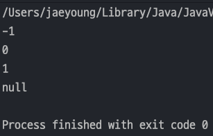

## 자바 중급 1편

### 래퍼, Class 클래스
> 1. 래퍼 클래스 - 기본형의 한계1
> 2. 래퍼 클래스 - 기본형의 한계2
> 3. 래퍼 클래스 - 자바 래퍼 클래스
> 4. 래퍼 클래스 - 오토 박싱
---
### 1. 래퍼 클래스 - 기본형의 한계1
> `Java` 는 객체 지향 언어이다. 하지만 `int` , `double` 같은 `기본형(Primitive Type)`은 한계가 있다.</br>
> 1. **객체가 아님** : 객체는 유용한 메서드를 제공할 수 있는데, 기본형은 객체가 아니므로 메서드를 제공할 수 없다.</br>
> 2. **null 값을 가질 수 없음** : 때로는 데이터가 없음 이라는 상태를 나타내야 할 때 `null` 을 넣어줘야 하는데 기본형 타입은 `null` 을 가질 수 없다.

#### 기본형의 한계
- 아래 예시로 기본형의 한계를 알 수 있다.
    ```java
    public class MyIntegerMethodMain0 {
        public static void main(String[] args) {
            int value = 10;
    
            int i1 = compareTo(value, 5);
            int i2 = compareTo(value, 10);
            int i3 = compareTo(value, 20);
    
            System.out.println("i1 = " + i1);
            System.out.println("i2 = " + i2);
            System.out.println("i3 = " + i3);
        }
    
        public static int compareTo(int value, int target) {
            if (value < target) return -1;
            else if(value > target) return 1;
            else return 0;
        }
    }
    ```
- 위 코드와 같이 `value` 라는 **변수를 계속 새로운 값과 비교하는 메서드를 실행**한다. 
- 만약 `value` 가 객체라면 `value` **객체 스스로 자기 자신의 값과 다른 값을 비교하는 메서드를 만드는것이 유용**하다.

#### 직접 만든 래퍼 클래스
- 위 코드에서 ***int 타입인 value 를 클래스로 감싸서(Wrap) 만드는 것***을 `래퍼 클래스(Wrapper class)`라 한다.
  ```java
  public class MyInteger {
      private final int value;
  
      public MyInteger(int value) {
          this.value = value;
      }
  
      public int getValue() {
          return value;
      }
  
      public int compareTo(int target) {
          if (value < target) return -1;
          else if (value > target) return 1;
          else return 0;
      }
  
      @Override
      public String toString() {
          return String.valueOf(value);
      }
  }
  ```
  - `value` 라는 int 타입 필드를 **불변형**으로 갖고 있다.
  - 이전에 했던 예제에 `compareTo()` 메서드를 **MyInteger 클래스의 멤버함수**로 만들었다.
- `main()` 메서드로 테스트를 해보면 `MyInteger` 는 객체이므로 자기 자신의 메서드를 편리하게 호출할 수 있다.
- 그리고 ***불변이기 때문에 자신의값이 바뀔 일이 없다.***
  ```java
  public class MyIntegerMethodMain1 {
      public static void main(String[] args) {
          MyInteger myInteger = new MyInteger(10);
  
          int i1 = myInteger.compareTo(5);
          int i2 = myInteger.compareTo(10);
          int i3 = myInteger.compareTo(30);
  
          System.out.println("i1 = " + i1);
          System.out.println("i2 = " + i2);
          System.out.println("i3 = " + i3);
      }
  }
  ```
---
### 2. 래퍼 클래스 - 기본형의 한계2
#### 기본형과 null
- 기본형은 항상 값이 들어가 있어야 출력이든 뭐든 할 수 있다.
- 하지만 서비스에 따라 기본형도 `값이 없음(null)` 상태를 가져야 할 때가 있다. 
  ```java
  public class MyIntegerNullMain0 {
      public static void main(String[] args) {
          int[] intArr = {-1, 0, 1, 2, 3};
  
          System.out.println(findValue(intArr, -1)); // -1 이 있으니까 반환
          System.out.println(findValue(intArr, 0));
          System.out.println(findValue(intArr, 1));
          System.out.println(findValue(intArr, 100)); // 100은 없으므로 -1 반환 
      }
  
      private static int findValue(int[] intArr, int target) {
          for (int value : intArr) {
              if (value == target) return value;
          }
          return -1; // 뭐라도 반환해야 한다.
      }
  }
  ```
  - 위 코드와 같이 보통 찾는 값이 없으면 -1 을 반환한다.
  - 하지만 만약 찾는값이 -1 이라면 -1을 반환하고 찾는값이 없어도 -1을 반환한다.
  - _**클라이언트 입장에서는 -1을 찾아서 반환한건지 못찾아서 반환한건지 알수가 없다.**_
- 이러한 문제 때문에 **`null` 이라는 명확한 값이 필요**하다
  ```java
  public class MyIntegerNullMain1 {
      public static void main(String[] args) {
          MyInteger[] intArr = {new MyInteger(-1), new MyInteger(0), new MyInteger(1)};
  
          System.out.println(findValue(intArr, -1)); // -1 이 있으니까 반환
          System.out.println(findValue(intArr, 0));
          System.out.println(findValue(intArr, 1));
          System.out.println(findValue(intArr, 100)); // 100은 없으므로 -1 반환
      }
  
      private static MyInteger findValue(MyInteger[] intArr, int target) {
          for (MyInteger myInteger : intArr) {
              if (myInteger.getValue() == target) return myInteger;
          }
          return null; // 뭐라도 반환해야 한다.
      }
  }
  ```
  
- 위와 같이 수정하면 `null` 이 반환되면 못찾았다는 것을 알 수 있다.
---
### 3. 래퍼 클래스 - 자바 래퍼 클래스
> Java에서는 기본적으로 기본형에 대응하는 래퍼클래스를 제공한다.
  - `byte` -> `Byte`
  - `short` -> `Short`
  - `int` -> `Integer`
  - `long` -> `Long`
  - `float` -> `Float`
  - `double` -> `Double`
  - `char` -> `Character`
  - `boolean` -> `Boolean`
- 이러한 래퍼 클래스는 2가지 특징이 있다.
  1. 불변이다.
  2. `equals` 로 비교해야 한다.
- 예제로 보자
  - 래퍼 클래스는 객체기 때문에 `new` 키워드를 통해 `heap` 메모리에 띄우는게 맞다.
  - 하지만 **성능 최적화**를 위해 ***자주 쓰는 값들을 캐싱***하여 가져오는 `valueOf()` 메서드를 사용하면 된다. -> `박싱(Boxing)`
  - 캐싱해서 가져온 값들끼리 비교하면 `==` 비교에도 `true` 가 나온다. -> `String Pool` 과 유사
  - 래퍼클래스에서 기본형으로 값을 가져올려면 `intValue()` , `longValue()` 와 같은 메서드를 사용하면 된다.  -> `언박싱(Unboxing)`
  ```java
  public class WrapperClassMain {
      public static void main(String[] args) {
          Integer newInteger = new Integer(10); // 미래에 삭제 예정
          Integer integerObj = Integer.valueOf(10); // -128~127 자주 사용하는 숫자 재사용(캐싱하여 가져온다)
          Long longObj = Long.valueOf(10L);
          Double doubleObj = Double.valueOf(10.5);
  
          System.out.println("newInteger = " + newInteger);
          System.out.println("integerObj = " + integerObj);
          System.out.println("longObj = " + longObj);
          System.out.println("doubleObj = " + doubleObj);
  
          // 레퍼런스에서 기본형으로 값을 꺼낼 수 있다.
          int intValue = integerObj.intValue();
          System.out.println("intValue = " + intValue);
  
          long longValue = longObj.longValue();
          System.out.println("longValue = " + longValue);
  
          System.out.println("비교");
          System.out.println("==: " + (newInteger == integerObj));
          System.out.println("equals: " + (newInteger.equals(integerObj)));
      }
  }
  ```
---
### 4. 래퍼 클래스 - 오토 박싱
> `오토박싱(Auto Boxing)` 은 말 그대로 자동으로 Boxing 을 해준다는 의미이다.

- 박싱과 언박싱의 간단한 예제이다.
  ```java
  public class AutoboxingMain1 {
      public static void main(String[] args) {
          // Primitive -> Wrapper
          int value = 7;
          Integer boxedValue = Integer.valueOf(value);
  
          // Wrapper -> Primitive
          int unboxedValue = boxedValue.intValue();
  
          System.out.println("boxedValue = " + boxedValue);
          System.out.println("unboxedValue = " + unboxedValue);
      }
  }
  ```
- 개발을 하다보면 박싱,언박싱 사용이 정말 많고 자주 발생한다.
- `Java` 는 이러한 문제를 해결하기 위해 `Java 5(JDK 1.5)` 부터 `Auto-boxing` , `Auto-Unboxing` 을 지원한다.
- 위 코드를 수정하여 오토 박싱과 오토 언박싱을 사용해보자.
  ```java
  public class AutoboxingMain2 {
      public static void main(String[] args) {
          // Primitive -> Wrapper
          int value = 7;
          Integer boxedValue = value; // Auto-boxing
  
          // Wrapper -> Primitive
          int unboxedValue = boxedValue; // Auto-Unboxing
  
          System.out.println("boxedValue = " + boxedValue);
          System.out.println("unboxedValue = " + unboxedValue);
      }
  }
  ```
  - 일반 변수 대입하듯 대입하면 _**컴파일러가 자동으로 박싱과 언박싱을 해준다 !**_