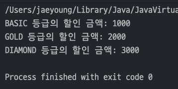
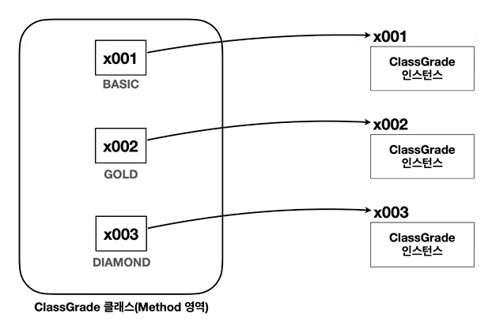
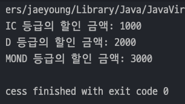
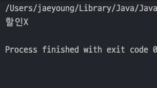
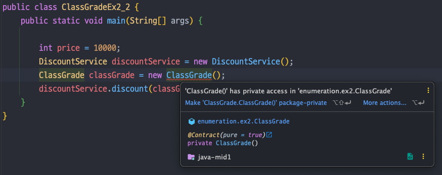

## 자바 중급 1편

### 열거형 - ENUM 
> 1. 문자열과 타입 안정성1
> 2. 문자열과 타입 안정성2
> 3. 타입 안전 열거형 패턴(Type-Safe Enum Pattern)
---
### 1. 문자열과 타입 안정성1
> Java 가 제공하는 열거형(Enum Type)을 이해하려면 왜 열거형이 생겨났는지 알아야한다. 예제를 통해 알아보자.
#### 예제 요구사항
- 고객은 `BASIC` , `GOLE` , `DIAMOND` 등급으로 나뉘고 각 등급마다 `10%`, `20%`, `30%` 할인이 들어간다.
- 등급마다 할인해주는 코드는 아래와 같다.
    ```java
    public class DiscountService {
    
        public int discount(String grade, int price){
            int discountPercent = 0;
    
            if(grade.equals("BASIC")) discountPercent = 10;
            else if(grade.equals("GOLD")) discountPercent = 20;
            else if(grade.equals("DIAMOND")) discountPercent = 30;
            else System.out.println(grade + "는 할인을 안합니다 !");
    
            return price * discountPercent / 100;
        }
    }
    ```
- 직접 실행하는 main() 은 아래와 같다.
    ```java
    public class StringGradeEx0_1 {
        public static void main(String[] args) {
            int price = 10000;
    
            DiscountService discountService = new DiscountService();
            int basic = discountService.discount("BASIC", price);
            int gold = discountService.discount("GOLD", price);
            int diamond = discountService.discount("DIAMOND", price);
    
            System.out.println("BASIC 등급의 할인 금액: " + basic);
            System.out.println("GOLD 등급의 할인 금액: " + gold);
            System.out.println("DIAMOND 등급의 할인 금액: " + diamond);
        }
    }
    ```
  
- 위와 같은 비즈니에서 등급을 문자열로 사용하면 다음과 같은 문제가 있다.
  - **타입 안정성 부족** : 문자열은 ***오타가 자주 발생***하고, ***유효하지 않은 값이 입력***될 수 있다.
  - **데이터 일관성** : `GOLD`, `Gold`, `gold` 등 ***다양한 형식으로 문자열을 입력할 수 있어 일관성***이 떨어진다.
- `String` 사용시 타입 안정성이 부족하다.
  - **값의 제한 부족**
  - **컴파일 시 오류 감지 불가**
---
### 2. 문자열과 타입 안정성2
- 위 예제에서 등급을 문자열로 받았는데 고정된 문자열을 상수로 정하면 더 안전해진다.
    ```java
    public class StringGrade {
        public static final String BASIC = "BASIC";
        public static final String GOLD = "GOLD";
        public static final String DIAMOND = "DIAMOND";
    }
    ```
- 그리고 `DiscountService` 에서 문자열에 오타를 입력해도 상수기 때문에 컴파일 에러가 뜬다.
    ```java
    public class DiscountService {
    
        public int discount(String grade, int price){
            int discountPercent = 0;
    
            if(grade.equals(StringGrade.BASIC)) discountPercent = 10;
            else if(grade.equals(StringGrade.GOLD)) discountPercent = 20;
            else if(grade.equals(StringGrade.DIAMOND)) discountPercent = 30;
            else System.out.println(grade + "는 할인을 안합니다 !");
    
            return price * discountPercent / 100;
        }
    }
    ```
- `main()` 에서도 오타를 낼 일이 없다.
  ```java
  public class StringGradeEx1_1 {
      public static void main(String[] args) {
          int price = 10000;
  
          DiscountService discountService = new DiscountService();
          int basic = discountService.discount(StringGrade.BASIC, price);
          int gold = discountService.discount(StringGrade.GOLD, price);
          int diamond = discountService.discount(StringGrade.DIAMOND, price);
  
          System.out.println("BASIC 등급의 할인 금액: " + basic);
          System.out.println("GOLD 등급의 할인 금액: " + gold);
          System.out.println("DIAMOND 등급의 할인 금액: " + diamond);
      }
  }
  ```
  
- 이렇게 기존의 등급을 문자열이 아닌 문자열상수로 받기 때문에 `StringGrade` 클래스에 속하는 문자열만 사용할 수 있게 된다.
- **오타가 나도 컴파일 시점에 오류가 발생하기 때문에 개발자가 바로 찾을 수 있다.**
- 하지만 문자열상수도 완전히 안전한 방법은 아니다. 왜냐하면 _문자열상수가 아닌 문자열을 입력해도 컴파일이 되기 때문이다._
---
### 3. 타입 안전 열거형 패턴(Type-Safe Enum Pattern)
- `enum` 은 `enumeration` 의 줄임말인데, 번역하면 열거라는 뜻이고 **어떤 항목을 나열하는 것**을 뜻한다.
- 위 예제의 경우 `BASIC`, `GOLD`, `DIAMOND` 를 나열하는 것이다.
- 이렇게 되면 사용자는 열거형인 `BASIC` , `GOLD` , `DIAMOND` 만 사용할 수 있고 오타나 유효하지 않은 값을 입력할 수 없다.

- 타입 안전 열거형 패턴은 아래와 같이 구현된다.
  ```java
  public class ClassGrade {
      public static final ClassGrade BASIC = new ClassGrade();
      public static final ClassGrade GOLD = new ClassGrade();
      public static final ClassGrade DIAMOND = new ClassGrade();
  }
  ```
  
- 기존의 `DiscountService` 의 코드도 변경된다.
  ```java
  public class DiscountService {
  
      public int discount(ClassGrade classGrade, int price) {
          int discountPercent = 0;
  
          if (classGrade == ClassGrade.BASIC) discountPercent = 10;
          else if (classGrade == ClassGrade.GOLD) discountPercent = 20;
          else if (classGrade == ClassGrade.DIAMOND) discountPercent = 30;
          else System.out.println("할인X");
  
          return price * discountPercent / 100;
      }
  }
  ```
  - 기존의 `discount()` 에서 첫번째 매개변수의 타입이 `String` -> `ClassGrade` 로 변경되었다.
- main() 에서 잘 동작하는지 확인해보자
  ```java
  public class ClassGradeEx2_1 {
      public static void main(String[] args) {
          int price = 10000;
  
          DiscountService discountService = new DiscountService();
          int basic = discountService.discount(ClassGrade.BASIC, price);
          int gold = discountService.discount(ClassGrade.GOLD, price);
          int diamond = discountService.discount(ClassGrade.DIAMOND, price);
  
          System.out.println("BASIC 등급의 할인 금액: " + basic);
          System.out.println("GOLD 등급의 할인 금액: " + gold);
          System.out.println("DIAMOND 등급의 할인 금액: " + diamond);
      }
  }
  ```
  
- 오타, 유효하지 않은 값을 입력해도 `ClassGrade` 에 있는 상수필드만 사용할 수 있기 때문에 컴파일 이전에 오류를 잡을 수 있다.
- 하지만 이 방법도 완벽하지 않다. 아래 예제를 통해 보자.
  - 새로운 `ClassGrade` 객체를 만들어 넣을 수 있다. 파라미터 타입이 같기 때문에 에러도 뜨지 않는다.
  ```java
  public class ClassGradeEx2_2 {
      public static void main(String[] args) {
  
          int price = 10000;
          DiscountService discountService = new DiscountService();
          ClassGrade classGrade = new ClassGrade();
          discountService.discount(classGrade, price);
      }
  }
  ```
  
- 위 방법을 막을려면 생성자를 `private` 로 막아버리면 컴파일에러가 뜨기때문에 잡을 수 있다.
  ```java
  public class ClassGrade {
      public static final ClassGrade BASIC = new ClassGrade();
      public static final ClassGrade GOLD = new ClassGrade();
      public static final ClassGrade DIAMOND = new ClassGrade();
  
      // private 생성자
      private ClassGrade() {}
  }
  ```
  

#### 타입 안전 열거형 패턴(Type-Safe Enum Pattern)의 장점
- `타입 안정성 향상` : 정해지 객체만 사용하기 때문에 ***잘못된 값을 입력하는 문제를 근본적으로 방지***할 수 있다.
- `데이터 일관성` : 정해진 객체만 사용하므로 ***데이터의 일관성이 보장***된다.
- `제한된 인스턴스 생성` : 클래스는 사전에 정의된 몇 개의 인스턴스만 생성하고, ***외부에서 이 인스턴스들만 사용***할 수 있도록 한다.
- `타입 안정성` : 잘못된 값이 할당되거나 사용되는 것을 ***컴파일 시점에 방지***할 수 있다.