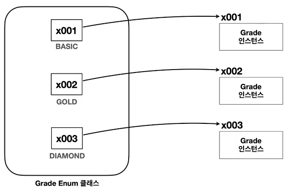
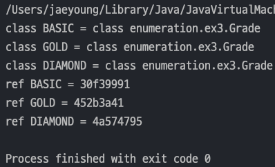

## 자바 중급 1편

### 열거형 - ENUM
> 1. 열거형 - Enum Type
> 2. 열거형 - 주요 메서드
> 3. 열거형 - 리팩토링 1
> 4. 열거형 - 리팩토링 2
> 5. 열거형 - 리팩토링 3
---
### 1. 열거형 - Enum Type
> `Java` 에서 **타입 안전 열거형 패턴(Type-Safe Enum Pattern)**을 편리하게 이용할 수 있도록 `Enum Type`을 제공한다.
- 타입 안전 열거형 패턴을 `Enum Type`으로 바꾸면 아래와 같이 간편해진다.
    ```java
    public enum Grade {
        BASIC, GOLD, DIAMOND
    }
    ```
#### ENUM 특징
- 열거형도 사실 `class` 이다. `class`를 표기하는 곳에 `enum` 으로 바꿨을 뿐이지 `class`이다.
- 열거형은 자동으로 `java.lang.Enum` 을 상속받는다.
- 외부에서 임의로 생성할 수 없다.

    
- 위 그림이 맞는지 확인해보자.
  - `Enum` 은 `toString()`을 오버라이딩 되어 있어서 참조값을 확인할려면 별도의 메서드를 만들어서 확인해야 한다.
  - `System.identityHashCode(object)` : `Java` 가 관리하는 객체의 참조값을 숫자로 반환한다.
  - `Integer.toHexString()` : 숫자를 16진수로 변환
  ```java
  public class EnumRefMain {
      public static void main(String[] args) {
          System.out.println("class BASIC = " + Grade.BASIC.getClass());
          System.out.println("class GOLD = " + Grade.GOLD.getClass());
          System.out.println("class DIAMOND = " + Grade.DIAMOND.getClass());
  
          // ENUM 은 자동으로 toString()이 오버라이딩 되어있어서 참조값을 확인할 수 없다.
          System.out.println("ref BASIC = " + refValue(Grade.BASIC));
          System.out.println("ref GOLD = " + refValue(Grade.GOLD));
          System.out.println("ref DIAMOND = " + refValue(Grade.DIAMOND));
      }
  
      private static String refValue(Object obj) {
          return Integer.toHexString(System.identityHashCode(obj));
      }
  }
  ```
  

#### 예제에 ENUM 적용