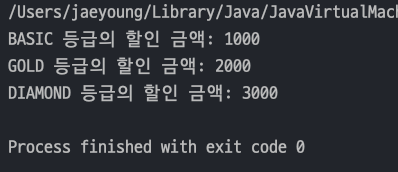
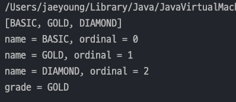
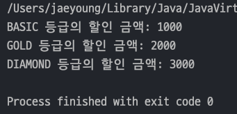

## 자바 중급 1편

### 열거형 - ENUM
> 1. 열거형 - Enum Type
> 2. 열거형 - 주요 메서드
> 3. 열거형 - 리팩토링 1
> 4. 열거형 - 리팩토링 2
---
### 1. 열거형 - Enum Type
> `Java` 에서 **타입 안전 열거형 패턴(Type-Safe Enum Pattern)**을 편리하게 이용할 수 있도록 `Enum Type`을 제공한다.
- 타입 안전 열거형 패턴을 `Enum Type`으로 바꾸면 아래와 같이 간편해진다.
    ```java
    public enum Grade {
        BASIC, GOLD, DIAMOND
    }
    ```
#### ENUM 특징
- 열거형도 사실 `class` 이다. `class`를 표기하는 곳에 `enum` 으로 바꿨을 뿐이지 `class`이다.
- 열거형은 자동으로 `java.lang.Enum` 을 상속받는다.
- 외부에서 임의로 생성할 수 없다.

    
- 위 그림이 맞는지 확인해보자.
  - `Enum` 은 `toString()`을 오버라이딩 되어 있어서 참조값을 확인할려면 별도의 메서드를 만들어서 확인해야 한다.
  - `System.identityHashCode(object)` : `Java` 가 관리하는 객체의 참조값을 숫자로 반환한다.
  - `Integer.toHexString()` : 숫자를 16진수로 변환
  ```java
  public class EnumRefMain {
      public static void main(String[] args) {
          System.out.println("class BASIC = " + Grade.BASIC.getClass());
          System.out.println("class GOLD = " + Grade.GOLD.getClass());
          System.out.println("class DIAMOND = " + Grade.DIAMOND.getClass());
  
          // ENUM 은 자동으로 toString()이 오버라이딩 되어있어서 참조값을 확인할 수 없다.
          System.out.println("ref BASIC = " + refValue(Grade.BASIC));
          System.out.println("ref GOLD = " + refValue(Grade.GOLD));
          System.out.println("ref DIAMOND = " + refValue(Grade.DIAMOND));
      }
  
      private static String refValue(Object obj) {
          return Integer.toHexString(System.identityHashCode(obj));
      }
  }
  ```
  

#### 예제에 ENUM 적용
- 기존의 `DiscountService` 코드에서 `Enum` 으로 수정하였다.
  ```java
  public class DiscountService {
  
      public int discount(Grade classGrade, int price) {
          int discountPercent = 0;
  
          if (classGrade == Grade.BASIC) discountPercent = 10;
          else if (classGrade == Grade.GOLD) discountPercent = 20;
          else if (classGrade == Grade.DIAMOND) discountPercent = 30;
          else System.out.println("할인X");
  
          return price * discountPercent / 100;
      }
  }
  ```
- `main()` 에서도 잘 작동한다.
  ```java
  public class ClassGradeEx3_1 {
      public static void main(String[] args) {
          int price = 10000;
  
          DiscountService discountService = new DiscountService();
          int basic = discountService.discount(Grade.BASIC, price);
          int gold = discountService.discount(Grade.GOLD, price);
          int diamond = discountService.discount(Grade.DIAMOND, price);
  
          System.out.println("BASIC 등급의 할인 금액: " + basic);
          System.out.println("GOLD 등급의 할인 금액: " + gold);
          System.out.println("DIAMOND 등급의 할인 금액: " + diamond);
      }
  }
  ```
  

#### ENUM 의 장점
1. `타입 안정성 향상` : 열거형에 정의된 상수들만 사용할 수 있기 때문에, ***유효하지 않은 값이 입력될 가능성이 없다.***
2. `간결성 및 일관성` : 열거형을 사용하면 코드가 더 간결하고 명확해지며, ***데이터의 일관성이 보장***된다.
3. `확장성` : 위 예제에서 새로운 등급을 추가해야하면, `ENUM` 에 상수만 추가하면 된다.
---
### 2. 열거형 - 주요 메서드
- 코드로 알아보자
  - `Arrays.toString(object[])` : 배열의 참조값이 아니라 배열의 내부의 값을 출력
  - `values()` : 모든 ENUM 상수를 반환
  - `valueOf(String name)` : name 과 일치하는 ENUM 상수를 반환
  - `name()` : ENUM 상수의 이름을 문자열로 반환
  - `ordinal()` : ENUM 상수의 선언 순서(0부터)를 반환
  ```java
  public class EnumMethodMain {
      public static void main(String[] args) {
          Grade[] values = Grade.values();
          System.out.println(Arrays.toString(values));
  
          for (Grade value : values) {
              System.out.println("name = " + value.name() + ", ordinal = " + value.ordinal());
          }
  
          // String -> ENUM 변환, 잘못된 문자를 넣으면 IlleagalArgumentException 발생
          String input = "GOLD";
          Grade grade = Grade.valueOf(input);
          System.out.println("grade = " + grade);
      }
  }
  ```
  

#### `ordinal()` 가급적 사용 X
- _**ENUM 상수 중간에 새로운 상수가 추가되면 기존의 상수의 순번이 모두 변경된다 !!**_
- 예를 들어, `BASIC` 다음에 `SIVER` 가 추가되면 `GOLD`, `DIAMOND` 의 값이 변경되어 **다른 코드에서 사이드 이펙트가 발생 !!*
#### ENUM(열거형) 정리
- 열거형은 `java.lang.Enum` 을 자동으로 상속 받는다.
- 열거형은 `java.lang.Enum` 을 상속받기 때문에 **다른 클래스를 상속받을 수 없다.**
- 열거형은 **인터페이스를 구현**할 수 있다.
- 열거형에 **추상 메서드를 선언하고, 구현**할 수 있다.
---
### 3. 열거형 - 리팩토링
- 기존 `ex2` 패키지에 있는 파일을 리팩토링 해보자
  ```java
  public class DiscountService {
  
      public int discount(ClassGrade classGrade, int price) {
          int discountPercent = 0;
  
          if (classGrade == ClassGrade.BASIC) discountPercent = 10;
          else if (classGrade == ClassGrade.GOLD) discountPercent = 20;
          else if (classGrade == ClassGrade.DIAMOND) discountPercent = 30;
          else System.out.println("할인X");
  
          return price * discountPercent / 100;
      }
  }
  ```
  - 위 코드는 불필요한 if문이 너무 많다.
  - 그리고 회원 등급 클래스가 `할인율(discountPercent)`를 가지고 관리하도록 변경하는게 좋다.
- 우선 기존의 **타입안전 열거형 패턴** 코드에서 `할인율(discountPercnet)`를 관리하도록 코드를 추가한다.
  ```java
  public class ClassGrade {
      public static final ClassGrade BASIC = new ClassGrade(10);
      public static final ClassGrade GOLD = new ClassGrade(20);
      public static final ClassGrade DIAMOND = new ClassGrade(30);
  
      private final int discountPercent;
  
      private ClassGrade(int discountPercent) {
          this.discountPercent = discountPercent;
      }
  
      public int getDiscountPercent() {
          return discountPercent;
      }
  }
  ```
  - 생성자를 `private` 로 설정하여 상수가 각각 할인율을 갖도록 설정하였다.
  - 즉, _**상수를 정의할 때 각각의 등급에 따른 할인율이 정해진다.**_
- 기존의 `DiscountService`  클래스의 `discount()` 메서드도 아래와 같이 리팩토링 된다.
  ```java
  public class DiscountService {
      public int discount(ClassGrade classGrade, int price) {
          return price * classGrade.getDiscountPercent() / 100;
      }
  }
  ```
  - 기존의 불필요한 if문이 제거되고, 단순한 할인율 계산 로직만 남았다.
  - 즉, `discount()`가 호출될때 파라미터로 넘어오는 `ClassGrade` 는 이미 ***등급마다 할인율이 정해졌기 때문에 계산결과만 반환***하게 된다.
- `main()` 메서드로 실행하면 아래와 같다.
  ```java
  public class ClassGradeRefMain1 {
      public static void main(String[] args) {
          int price = 10000;
  
          DiscountService discountService = new DiscountService();
          int basic = discountService.discount(ClassGrade.BASIC, price);
          int gold = discountService.discount(ClassGrade.GOLD, price);
          int diamond = discountService.discount(ClassGrade.DIAMOND, price);
  
          System.out.println("BASIC 등급의 할인 금액: " + basic);
          System.out.println("GOLD 등급의 할인 금액: " + gold);
          System.out.println("DIAMOND 등급의 할인 금액: " + diamond);
      }
  }
  ```
  
---
### 4. 열거형 - 리팩토링 2
- 기존의 타입안전 열거형패턴으로 짠 ClassGrade 를 보면 Grade(등급)과 discountPercnet(할인율)이 1대1로 관련이 있다.
- 그래서 열거형으로 Grade 를 생성할때 아래와 같이 만들 수 있다.
  ```java
  public enum Grade {
      BASIC(10), GOLD(20), DIAMOND(30);
  
      private final int discountPercent;
  
      Grade(int discountPercent) {
          this.discountPercent = discountPercent;
      }
  
      public int getDiscountPercent() {
          return discountPercent;
      }
  }
  ```
  - `discountPercent` 를 상수로 넣고 생성자와 getter를 만들어준다.
  - 그리고 기존 new 키워드를 통해 등급마다 할인율을 지정해줬지만 열거형안에서 상수에 괄호를 이용하여 바로 `discountPercent` 를 지정할 수 있다.
- 기존의 `DiscountService` 클래스와 `main()`을 구현하여 실행해보자.
  ```java
  public class DiscountService {
      public int discount(Grade grade, int price) {
          return price * grade.getDiscountPercent() / 100;
      }
  }
  
  // 
  public class EnumRefMain2 {
    public static void main(String[] args) {
      int price = 10000;
  
      DiscountService discountService = new DiscountService();
      int basic = discountService.discount(Grade.BASIC, price);
      int gold = discountService.discount(Grade.GOLD, price);
      int diamond = discountService.discount(Grade.DIAMOND, price);
  
      System.out.println("BASIC 등급의 할인 금액: " + basic);
      System.out.println("GOLD 등급의 할인 금액: " + gold);
      System.out.println("DIAMOND 등급의 할인 금액: " + diamond);
    }
  }
  ```
  
