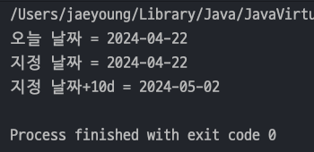
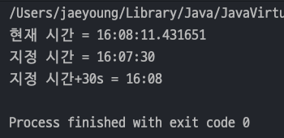
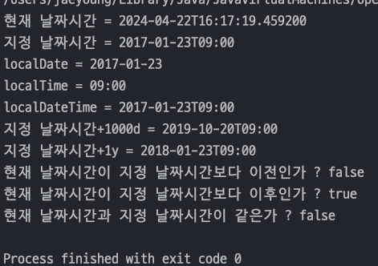

## 자바 중급 1편

### 날짜와 시간
> 1. 자바 날짜와 시간 라이브러리 소개
> 2. 기본 날짜와 시간 - LocalDateTime
---
### 1. 자바 날짜와 시간 라이브러리 소개
> 자바 날짜와 시간 라이브러리는 자바 공식 문서가 제공하는 표 하나로 정리할 수 있다.

| Class or Enum  | Year | Month |Day|Hours|Minute|Seconds*|Zone Offset|Zone ID| toString Output                           |
|----------------|-----|-------|---|---|---|---|---|---|-------------------------------------------|
| LocalDate      | V   | V     |V| | | | | | 2013-08-20                                |
| LocalTime      |     |       | |V|V|V| | | 08:16:226.943                             |
| LocalDateTime  | V   | V     |V|V|V|V| | | 2013-08-20T08:16:26.937                   |
| ZonedDateTime  | V   | V     |V|V|V|V|V|V| 2013-08-20T08:16:26.941+09:00[Asia/Tokyo] |
| OffsetDateTime | V   | V     |V|V|V|V|V| | 2013-08-20T08:16:26.954-07:00             |
| OffsetTime     |     |       | |V|V|V|V| | 08:16:26.957-07:00                        |
| Year           | V   |       | | | | | | | 2013                                      |
| Month          |     | V     | | | | | | | AUGUST                                    |
| YearMonth      |V| V     | | | | | | | 2013-08                                   |
|MonthDay| |V|V| | | | | |--08-20|
|Instant| | | | | |V| | |2013-08-20T15:16:26.355Z|
|Period|V|V|V| | |***|***| |P10D (10 days)|
|Duration| | |**|**|**|V| | |PT20H (20 hours)|
  - [원문](https://docs.oracle.com/javase/tutorial/datetime/iso/overview.html)

#### LocalDate, LocalTime, LocalDateTime
- `LocalDate` : **날짜**만 표현할 때 사용 (2013-11-21)
- `LocalTime` : **시간**만을 표현할 때 사용 (08:20:30.213)
- `LocalDateTime` : `LocalDate` 와 `LocalTime을` 합한 개념 (2013-11-21T08:20:30.213)
- `Local` 이 앞에 붙는 이유는 ***세계 시간대를 고려하지 않아서 타임존이 적용되지 않기 때문***이다. -> 국내 서비스만 고려할 때

#### ZonedDateTime, OffsetDateTime
- `ZonedDateTime` : 시간대를 고려한 날짜와 시간을 표현할 때 사용 -> _타임존 포함_
  - 예) `2013-11-21T08:20:30.213+9:00[Asia/Seoul]`
  - `+9:00` 는 UTC(협정 세계시)로 부터 시간대 차이다. -> 오프셋이라 한다.
  - `Asia/Seoul` 은 타임존이다.
  - 일광 절약 시간제(썸머타임)가 적용되지 않는다.
- `OffsetDateTime` : 시간대를 고려한 날짜와 시간을 표현할 때 사용 -> _타임좀 미포함_
  - 예) `2013-11-21T08:20:30.213+9:00`
  - 타임존이 없고 오프셋만 있기 때문에 썸머타임을 알 수 없다.

#### Year, Month, YearMonth, MonthDay
- 년, 월, 년월, 달일을 각각 다룰 때 사용. 자주 사용하지는 않는다.

#### Instant
- `Instant` 는 1970년 1월 1일 0시 0분 0초(UTC)기준으로 경과한 시간으로 계산된다.
- 즉, ***Instant 내부에는 초 데이터***만 들어있다.

#### Period, Duration
- 시간의 개념은 크게 2가지로 표현할 수 있다.
  1. `특정 시점의 시간` -> 예) 이 프로젝트는 2013년 8월 16일 까지 완료해야해!
  2. `시간의 간격` -> 예) 앞으로 4년은 더 공부해야 해
- `Period` : 두 날짜 사이의 간격을 **년, 월, 일 단위**로 나타낸다.
- `Duration` : 두 날짜 사이의 간격을 **시, 분, 초(나노초)** 단위로 나타낸다.\
---
### 2. 기본 날짜와 시간 - LocalDateTime
> 가장 기본이 되는 날짜와 시간 클래스는 `LocalDate` , `LocalTime` , `LocalDateTime` 이다.

#### LocalDate
  - `now()` : **현재 시간을 기준**으로 생성
  - `of(year,month,day)` : **특정 날짜를 기준**으로 생성(년, 월, 일 입력)
  - `plusDays(day)` : **특정 일**을 더한다.
    > 모든 날짜 클래스는 불변객체이다. 반드시 반환값을 받아서 사용 !!
    ```java
    import java.time.LocalDate;
    
    public class LocalDateMain {
        public static void main(String[] args) {
            LocalDate nowDate = LocalDate.now();
            LocalDate ofDate = LocalDate.of(2024, 4, 22);
            System.out.println("오늘 날짜 = " + nowDate);
            System.out.println("지정 날짜 = " + ofDate);
    
            // 계산(불변)
            LocalDate ofDate2 = ofDate.plusDays(10);
            System.out.println("지정 날짜+10d = " + ofDate2);
        }
    }
    ```
    
#### LocalTime
- 메서드들은 `LocalDate` 와 똑같으며 불변이다 !
    ```java
    public class LocalTimeMain {
        public static void main(String[] args) {
            LocalTime nowTime = LocalTime.now();
            LocalTime ofTime = LocalTime.of(16, 7, 30);
    
            System.out.println("현재 시간 = " + nowTime);
            System.out.println("지정 시간 = " + ofTime);
    
            // 계산(불변)
            LocalTime ofTime2 = ofTime.plusSeconds(30);
            System.out.println("지정 시간+30s = " + ofTime2);
        }
    }
    ```
    

#### LocalDateTime 
- `LocalDateTime` 클래스 내부를 보면 `LocalTime` 과 `LocalDate` 를 가지고 있다.
    ```java
    public class LocalDateTime {
    private final LocalDate date;
    private final LocalTime time;
    }
    ```
- 이로인해 많은 메서드들을 갖고 있다.
  - `now()`, `of()` : 현재 또는 특정 날짜와 시간을 기준으로 생성
  - `LocalDate` 와 `LocalTime` 을 `toXxx()` 메서드로 분리 할 수 있다.
  - `LocalDateTime.of(localDate, localTime)` 으로 새로운 LocalDateTime을 만든다.
  - `plusXxx()` : 특정 날짜와 시간을 더한다.
  - `isBefore()` , `isAfter()` : 서로 다른 날짜시간을 비교한다.(true/false  반환)
  - `isEquals()` : 시간을 계산해서 시간으로만 둘을 비교 -> _**타임존이 달라도 시간적으로 같으면**_ `true`
    - 예) 서울의 9시와 UTC 의 0시는 시간적으로 같기 때문에 둘을 비교하면 true
  - equals() : _**객체의 타입, 타임존 등등 내부 데이터의 모든 구성요소가 같아야**_ `true` 반환
    - 예) 서울의 9시와 UTC의 0시는 시간적으로 같다. 하지만 타임존 데이터가 다르기 때문에 false 반환
      ```java
      import java.time.LocalDate;
      import java.time.LocalDateTime;
      import java.time.LocalTime;
    
      public class LocalDateTimeMain {
          public static void main(String[] args) {
              LocalDateTime nowDt = LocalDateTime.now();
              LocalDateTime ofDt = LocalDateTime.of(2017, 1, 23, 9, 0, 0);
    
              System.out.println("현재 날짜시간 = " + nowDt);
              System.out.println("지정 날짜시간 = " + ofDt);
    
              // 날짜와 시간 분리
              LocalDate localDate = ofDt.toLocalDate();
              LocalTime localTime = ofDt.toLocalTime();
    
              System.out.println("localDate = " + localDate);
              System.out.println("localTime = " + localTime);
    
              // 날짜와 시간 합치기
              LocalDateTime localDateTime = LocalDateTime.of(localDate, localTime);
              System.out.println("localDateTime = " + localDateTime);
    
              // 계산(불변)
              LocalDateTime ofDtPlus = ofDt.plusDays(1000);
              System.out.println("지정 날짜시간+1000d = " + ofDtPlus);
              LocalDateTime ofDtPlus1Year = ofDt.plusYears(1);
              System.out.println("지정 날짜시간+1y = " + ofDtPlus1Year);
    
              // 비교
              System.out.println("현재 날짜시간이 지정 날짜시간보다 이전인가 ? " + nowDt.isBefore(ofDt));
              System.out.println("현재 날짜시간이 지정 날짜시간보다 이후인가 ? " + nowDt.isAfter(ofDt));
              System.out.println("현재 날짜시간과 지정 날짜시간이 같은가 ? " + nowDt.isEqual(ofDt));
          }
      }
      ```
      
---
