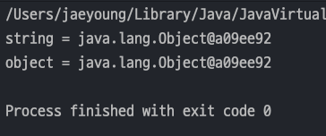
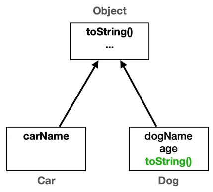
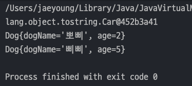
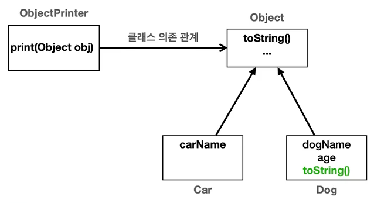
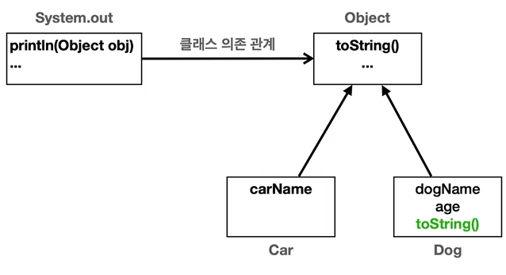
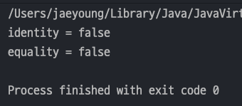
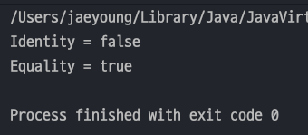
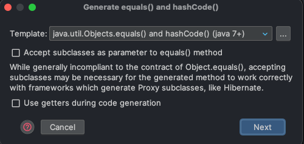
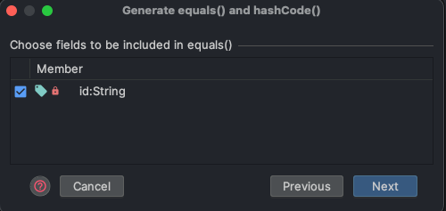
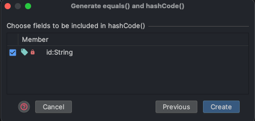

## 자바 중급 1편

### Object 클래스 학습
> 1. toString()
> 2. Object 와 OCP
> 3. equals() - 동일성과 동등성
> 4. equals() - 구현
> 5. 정리
---
### 1. toString()
> 1. `toString()` 이란?
> 2. `toString()` 오버라이딩
> 3. 객체의 참조값 직접 출력

#### toString()이란?
- `Object.toString()` 메서드는 객체의 정보를 문자열 형태로 제공한다.
    ```java
    public String toString() {
            return getClass().getName() + "@" + Integer.toHexString(hashCode());
    }
    ```
- 디버깅과 로깅에 유용하게 사용된다.
- 아래 코드를 보면 `Object` 인스턴스의 출력결과와 `toString()`의 결과가 같은 것을 알 수 있다.
    ```java
    public class ToStringMain1 {
        public static void main(String[] args) {
            Object object = new Object();
            // toString()출력
            System.out.println("string = " + object.toString());
    
            // object 직접 출력
            System.out.println("object = " + object);
        }
    }
    ```
  
- `System.out.println()` 메서드 내부에는 `Object.toString()` 을 호출하기 때문에 결과가 같다!

#### toString() 오버라이딩
- `toString()` 의 출력값으로는 객체의 정보를 알기가 불편하다. 
- 보통 객체에서 `toString()`을 오버라이딩하여 유용한 정보를 제공하는 것이 일반적이다.
- 아래 그림처럼 `Dog` 클래스만 `toString()` 을 오버라이딩 하고 `Car` 클래스는 기본 `toString()` 을 쓴다면 다른 결과가 나오게 된다.
  
  
- `toString()` 은 직접 출력값을 바꿀 수 있고 툴에서 제공해주는 자동완성기능을 이용하면 편리하게 객체정보를 볼 수 있다.
  ```java
  public class Dog {
      private String dogName;
      private int age;
  
      public Dog(String dogName, int age) {
          this.dogName = dogName;
          this.age = age;
      }
  
      @Override
      public String toString() {
          return "Dog{" +
                  "dogName='" + dogName + '\'' +
                  ", age=" + age +
                  '}';
      }
  }
  ```
- ***오버라이딩을 하면 객체의 정보를 알아보기가 쉽게 출력***할 수 있다.
  ```java
  public class ToStringMain2 {
      public static void main(String[] args) {
          Car car = new Car("Model Y");
          Dog dog1 = new Dog("뽀삐", 2);
          Dog dog2 = new Dog("삐삐", 5);
  
          System.out.println(car.toString());
          System.out.println(dog1.toString());
          System.out.println(dog2.toString());
      }
  }
  ```
  

#### 객체의 참조값 직접 출력
- `toString()`을 **오버라이딩 하지 않고 쓰면 객체의 참조값을 출력**한다.
- 하지만 오버라이딩을 하면 객체의 참조값을 출력못하지만 아래 코드를 사용하면 객체의 참조값도 출력 가능하다 !!
  ```java
      // 객체의 참조값 직접 출력
      String refValue = Integer.toHexString(System.identityHashCode(dog1)); // 참조값을 16진수로 변환 !
      System.out.println("refValue = " + refValue);
  ```
---
### 2. Object 와 OCP
> 1. `Object` 와 `OCP` 관계
> 2. `OCP(Open-Closed Principle)` 원칙
> 3. `System.out.println()`

#### Object 와 OCP 관계
- 아래 코드인 `ObjectPrinter` 클래스는 `Cat`, `Dog` 와 같은 ***구체적인 클래스를 사용하지 않고 추상적인 Object 클래스를 사용***한다.
  ```java
  public class ObjectPrinter {
       public static void print(Object obj) {
          String string = "객체 정보 출력: " + obj.toString();
          System.out.println(string);
       }
  }
  ```
- 위 코드를 해석하면  `ObjectPrinter` 는 `Object` 에 의존한다고 한다.

  
- `ObjectPrinter` 는 _**추상적인 것에 의존하기 때문에 OCP 원칙을 위배하지 않는다.**_ 

#### OCP(Open Closed Principle) 원칙
- `Open` : 새로운 클래스(객체)를 추가하고, `toString()`을 오버라디이해서 *기능을 확장*할 수 있다.
- 'Closed` : 새로운 클래스(객체)를 추가해도 `Object` 와 `toString()`을 사용하는 _클라이언트 코드는 변경하지 않아도 된다._
- 즉, 클라이언트 코드(`ObjectPrinter`)가 Object 클래스에 의존하면서 OCP 원칙을 지킬 수 있다.

#### System.out.println()
- 위에서 구현한 `ObjectPrinter` 는 결국엔 `Java` 에서 자주쓰는 `System.out.println()` 과 똑같은 기능을 가졌다.
- `System.out.println()` 메서드 내부에 `Object.toString()` 메서드가 있기 때문에 객체 자체를 출력해도 객체 정보가 출력된다.
  
---
### 3. equals() - 동일성과 동등성
> 1. 동일성과 동등성이란?

#### 동일성과 동등성
- 자바에서는 '두 객체(클래스)가 같다' 라는 표현을 2가지로 분리해서 제공한다.
  - `동일성(Identity)` : `==` 연산자를 사용해서 두 객체의 참조가 동일한 객체를 가리키고 있는지 확인
  - `동등성(Equality)` : `equals()` 메서드를 사용하여 두 객체가 논리적으로 동등한지 확인
- 쉽게 말해 ***동일성은 물리적으로 같은 메모리에 있는 객체 인스턴스인지 참조값을 확인***하고, ***동등성은 논리적으로 같은지 확인***하는 것이다.
- **동일성(물리)**, **동등성(논리)** 라고 이해하면 쉽다.
- 아래 코드는 같은 메모리에 있지 않아서 물리적으로는 다르지만 값은 같기때문에 논리적으로 같다. 즉, **동일성은 다르지만 동등성은 같다!**
  ```java
  User a = new User("id-100"); // 참조값: x001
  User b = new User("id-100"); // 참조값: x002
  ```
- 직접 `==` 과 `equals()` 로 동일성과 동등성을 확인해보면 둘다 `False` 이 나오는걸 알 수 있다.
  ```java
  public class EqualsMainV1 {
      public static void main(String[] args) {
          UserV1 user1 = new UserV1("id-100");
          UserV1 user2 = new UserV1("id-100");
  
          System.out.println("identity = " + (user1 == user2));
          System.out.println("equality = " + (user1.equals(user2)));
      }
  }
  ```
  
- `equals()` 는 동등성을 비교하는데 False 가 나오는 이유는 `equals()` 메서드 내부를 보면 알 수 있다.
  ```java
   public boolean equals(Object obj) {
          return (this == obj);
  }
  ```
- `Object` 클래스가 기본으로 제공하는 `equals()` 는 `==` 연산자를 통해 비교하기 때문에 동일성을 확인하는 것과 같은 코드이다.
- 즉, `equals()` 도 오버라이딩 해서 써야한다 !!
---
### 3. equals() - 구현
> 1. `UserV2` 클래스로 구현해보기
> 2. 정확한 `equals()` 구현
> 3. 

#### UserV2 클래스로 구현해보기
- `Object` 가 기본으로 제공하는 equals()를 오버라이딩 하여 클래스를 생성했다.
    ```java
    public class UserV2 {
  
        private String id;
  
        public UserV2(String id) {
            this.id = id;
        }
  
        @Override
        public boolean equals(Object obj) {
            UserV2 user = (UserV2) obj;
            return id.equals(user.id);
        }
    }
    ```
  - `UserV2` 의 `String` 타입인 `id`를 비교하여 동등성을 검증한다.
  - `String` 타입 비교는 `equals()` 를 사용한다.
- `main()` 메서드로 구현하여 동등성과 동일성을 확인해보면 이제 제대로된 결과가 나온다.
  ```java
  public class EqualsMainV2 {
      public static void main(String[] args) {
          UserV2 user1 = new UserV2("id-100");
          UserV2 user2 = new UserV2("id-100");
  
          System.out.println("Identity = " + (user1 == user2));
          System.out.println("Equality = " + (user1.equals(user2)));
      }
  }
  ```
  

#### 정확한 equals() 구현
- 위에서 구현한 `equals()` 는 간단한 예제를 위해 오버라이딩 한 것이고, 실제로 정확히 동작하려면 다음과 같이 구현해야 한다 !
- _IntelliJ 를 포함한 대부분의 IDE_ 에서는 `equals()` 코드를 자동으로 만들어준다.
- `command + n` 을 누르고 `equals() and hashCode()` 를 클릭하면 아래처럼 뜬다. 순서대로 해보자
  
  

  

  

- 최종적으로 정확한 `equals()` 코드가 완성된다.
  ```java
  public class UserV2 {
  
      private String id;
  
      public UserV2(String id) {
          this.id = id;
      }
  
      @Override
      public boolean equals(Object o) {
          if (this == o) return true;
          if (o == null || getClass() != o.getClass()) return false;
          UserV2 userV2 = (UserV2) o;
          return Objects.equals(id, userV2.id);
      }
  
      @Override
      public int hashCode() {
          return Objects.hash(id);
      }
  }
  ```
  - `hashCode()` 는 추후에 설명한다.
- equals() 메서드를 구현할 때 지켜야 하는 규칙이 있다.(외우지 말자 !!)
  - **반사성(Reflexivity)** : 객체는 자기 자신과 동등해야 한다.
  - **대칭성(Symmetry)** : 두 객체가 서로에 대해 동일하다고 판단하면, 이는 양방향으로 동일해야 한다.
  - **추이성(Transitivity)** : 만약 a객체와 b객체가 동일하고, b객체와 c객체가 동일하다면 a객체와 c객체도 동일해야 한다.
  - **일관성(Consistency)** : 두 객체의 상태가 변경되지 않는 한, equals() 메서드는 항상 동일한 값을 반환해야 한다.
  - **null 에 대한 비교** : 모든 객체는 null 과 비교했을 때 false를 반환해야 한다.
---
### 정리

#### Object 의 나머지 메서드
- `clone()` : 객체를 복사할 때 사용한다(잘 사용하지 않음)
- `hashCode()` : `equals()` 와 `hashCode()` 는 종종 함께 사용 -> 추후에 컬렉션 프레임워크때 설명
- `getClass()`: 현재 클래스의 정보
- `notify()`, `notifyAll()`, `wait()` : 멀티쓰레드용 메서드
