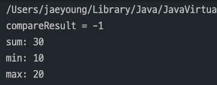
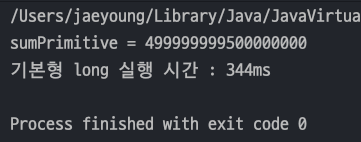
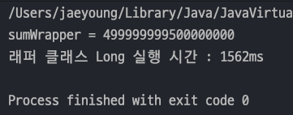
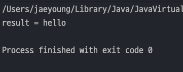
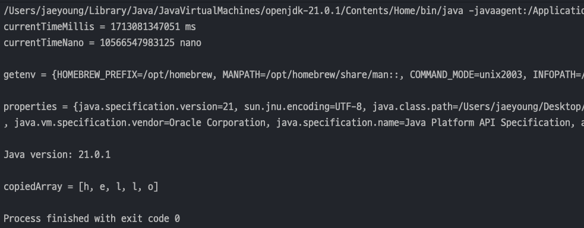
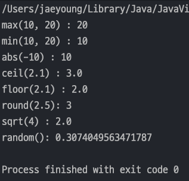
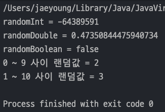

## 자바 중급 1편

### 래퍼, Class 클래스
> 1. 래퍼 클래스 - 주요 메서드와 성능
> 2. Class 클래스
> 3. System 클래스
> 4. Math, Random 클래스
---
### 1. 래퍼 클래스 - 주요 메서드와 성능
- `valueOf()` : 기본형값을 넣어 래퍼 타입을 반환한다.(숫자,문자열 지원)
- `parseInt()` : 문자열을 기본형으로 반환
- `compareTo()` : 자기 자신의 값과 인수로 넘어온 값을 비교(크면 1, 같으면 0 , 작으면 -1)
- `Integer.sum()` , `Integer.min()` , `Integer.max()` : Integer 에서 제공하는 static 메서드이다.
    ```java
    public class WrapperUtilsMain {
        public static void main(String[] args) {
            Integer i1 = Integer.valueOf(10); // Primitive -> Wrapper
            Integer i2 = Integer.valueOf("10"); // String -> Wrapper
    
            int i3 = Integer.parseInt("10"); // String -> Primitive
    
            // 비교
            int compareResult = i1.compareTo(20); // 10 과 20을 비교하기 때문에 왼쪽값 기준으로 결과 출력
            System.out.println("compareResult = " + compareResult);
    
            // 산술연산
            System.out.println("sum: " + Integer.sum(10, 20));
            System.out.println("min: " + Integer.min(10, 20));
            System.out.println("max: " + Integer.max(10, 20));
        }
    }
    ```
  

#### 래퍼 클래스와 성능
- 래퍼 클래스는 기본형보다 다양한 기능을 제공한다.
- 하지만 기본형을 제공하는 이유는 성능차이 때문이다.
- 기본형을 사용할 떄 연산 시간은 아래와 같다.
  ```java
  public class WrapperVsPrimitive {
      public static void main(String[] args) {
          int iterations = 1_000_000_000;
          long startTime, endTime;
  
          // 기본형 long 사용
          long sumPrimitive = 0;
          startTime = System.currentTimeMillis();
          for (int i = 0; i < iterations; i++) {
              sumPrimitive += i;
          }
          endTime = System.currentTimeMillis();
          System.out.println("sumPrimitive = " + sumPrimitive);
          System.out.println("기본형 long 실행 시간 : " + (endTime - startTime) + "ms");
      }
  }
  ```
  
- 래퍼 클래스를 사용할 때 연산 시간은 아래와 같다.
  ```java
  public class WrapperVsPrimitive {
      public static void main(String[] args) {
          int iterations = 1_000_000_000;
          long startTime, endTime;
          
          // 래퍼 클래스 Long 사용
          Long sumWrapper = 0L;
          startTime = System.currentTimeMillis();
          for (int i = 0; i < iterations; i++) {
              sumWrapper += i;
          }
          endTime = System.currentTimeMillis();
          System.out.println("sumWrapper = " + sumWrapper);
          System.out.println("래퍼 클래스 Long 실행 시간 : " + (endTime - startTime) + "ms");
      }
  }
  ```
  
- _**기본형은 래퍼 클래스보다 대략 5배정도의 속도차이가 있다.**_
- 이러한 속도차이가 나는 이유는 **기본형은 메모리에서 단순히 그 크기만큼 공간을 차지**한다. -> `int` 는 `4byte`
- 하지만 래퍼 클래스는 내부에 필드로 가지고 있는 **기본형의 값, 객체 메타 데이터를 포함하므로 더 많은 메모리를 사용.** -> 대략 `8~16byte`(Java 버전과 시스템마다 다름)

#### 유지보수 vs 최적화
> 현재 개발을 할때 유지보수와 최적화를 고려한다면 **유지보수하기 좋은 코드를 먼저 고민**해야 한다.</br>
> 현재 최신 컴퓨터는 성능이 매우 좋기 때문에 연산을 몇 번 줄인다고 실질적이 도움이 되지 않는다.
- 코드 변경 없이 성능 최적화를 하면 가장 좋지만, _**성능 최적화는 대부분 복잡함을 요구하고 더 많은 코드들을 추가로 만들어야 한다.**_
- 웹 어플리케이션 기준으로 _**메모리 안에서 연산 하나 보다 네트워크 호출 한번이 수십만배 더 오래 걸린다**_(연산 < IO(Input,Output))
- 권장하는 방법은 ***유지보수하기 좋은 코드로 짠 후 성능테스트를 해보고 문제가 되는 부분을 찾아서 최적화***를 하는 것이다.
---
### 2. Class 클래스
> `Java` 에서 `Class` 클래스는 **클래스의 메타데이터(정보)를 다루는데 사용**된다.

- `Class` 클래스의 주요 기능은 아래와 같다.
  - **타입 정보 얻기** : 클래스의 이름, 슈퍼클래스, 인터페이스, 접근 제한자 등등
  - **리플렉션** : 클래스에 정의된 메서드, 필드, 생성자 등을 조회하고 이를 통해 객체 인스턴스를 생성하거나 메서드를 호출할 수 있다.
  - **동적 로딩과 생성** : `Class.forName()` 메서드를 사용하여 **클래스를 동적으로 로드**하고, `newInstance()` 메서드를 통해 새로운 인스턴스를 생성할 수 있다.
  - **어노테이션 처리** : 클래스에 적용된 `annotation` 을 조회하고 처리하는 기능을 제공
- 예를 들어, `String.class` 는 `String` 클래스에 대한 메타데이터를 조회하거나 조작할 수 있다.
- 코드를 통해 알아보자
  - 패키지명에 `class`는 사용할 수 없기 때문에 관례상 `clazz` 를 많이 사용한다.
  ```java
  public class ClassMetaMain {
      public static void main(String[] args) throws Exception {
          // Class 조회
          Class clazz = String.class; // 1. 클래스에서 조회
  //        Class clazz = new String().getClass(); // 2. 인스턴스에서 조회
  //        Class clazz = Class.forName("java.lang.String"); // 3. 문자열로 조회
  
          // 모든 필드 출력
          Field[] fields = clazz.getDeclaredFields();
          for (Field field : fields) {
              // field 변수에서도 필드명,필드타입 같이 다양한 정보도 조회 가능
              System.out.println("field : " + field.getName());
          }
  
          // 모든 메서드 출력
          Method[] methods = clazz.getDeclaredMethods();
          for (Method method : methods) {
              System.out.println("method : " + method.getName());
          }
  
          // 상위 클래스 정보 출력
          System.out.println("Superclass : " + clazz.getSuperclass().getName());
  
          // 인터페이스 정보 출력
          Class[] interfaces = clazz.getInterfaces();
          for (Class i : interfaces) {
              System.out.println("Interface : " + i);
          }
      }
  }
  ```
- `Class` 클래스의 주요 기능
  - `getDeclaredFields()` : 클래스의 모든 필드를 조회
  - `getDeclaredMethods()` : 클래스의 모든 메서드를 조회
  - `getSuperclass()` : 클래스의 부모 클래스를 조회
  - `getInterfaces()` : 클래스의 인터페이스들을 조회

#### 클래스 생성하기
- `Class` 클래스의 정보를 기반으로 인스턴스를 생성하는 예제이다.
  - `Hello` 라는 간단한 클래스를 생성한다.
  ```java
  public class Hello {
      public String hello() {
          return "hello";
      }
  }
  ```
  - 그리고 `main` 메서드에서는 `Class` 의 메서드를 사용하여 인스턴스를 생성한다.
  ```java
  public class ClassCreateMain {
      public static void main(String[] args) throws Exception {
          Class helloClass = Hello.class;
  //        Class helloClass = Class.forName("lang.clazz.Hello");
  
          Hello hello = (Hello)helloClass.getDeclaredConstructor().newInstance();
          String result = hello.hello();
          System.out.println("result = " + result);
      }
  }
  ```
  
  - `getDeclaredConstructor()` : 생성자를 선택한다.
  - `nesInstance()` : 선택된 생성자를 기반으로 인스턴스를 생성한다.

#### 리플렉션 - `reflection`
- `Reflection`이란 `Class` 를 사용하여 **클래스의 메타 정보를 기반으로 클래스에 정의된 메서드, 필드, 생성자를 조회**하고 이를 통해 **객체 인스턴스를 생성하고 메서드를 호출하는 작업**을 말한다.
  - 추가로 `annotation` 정보를 읽어서 특별한 기능을 수행할 수 도 있다.(최신 프레임워크는 이런 기능을 적극 활용)
---
### 3. System 클래스
> `System` 클래스는 말 그대로 **시스템과 관련된 기본 기능들을 제공**한다.

- **표준 입력**, **출력**, **오류 스트림** : `System.in` , `System.out` , `System.err`
- **시간 측정** : `System.currentTimeMillis()` 로 현재시간을 밀리초, `System.nanoTime()` 로 나노초 단위로 측정 가능
- **환경 변수** : `System.getenv()` 는 현재 **OS 에서 설정한 환경 변수의 값**을 얻을 수 있다.
- **시스템 속성** : `System.getProperties()` 는 **Java 에서 사용하는 설정 값**을 얻을 수 있다.
- **시스템 종료** : `Syttem.exit(int status)` 프로그램을 종료하고, OS에 프로그램 종료 `상태코드(status)`를 전달
  - `status 0` : 정상 종료
  - `status 0` 이 아님 : 오류나 예외적인 종료
- **배열 고속 복사** : `System.arraycopy` 는 ***Java가 아닌 OS에게 연산을 넘겨 최적화된 메모리 복사 연산을 사용***한다.
  - 보통 배열 복사는 인덱스 하나하나를 복사하지만 OS 레벨에서 하는 고속복사는 2배 이상 빠르다.
  ```java
  public class SystemMain {
      public static void main(String[] args) {
          // 현재 시간(ms)
          long currentTimeMillis = System.currentTimeMillis();
          System.out.println("currentTimeMillis = " + currentTimeMillis + " ms");
  
          // 현재 시간(nano)
          long currentTimeNano = System.nanoTime();
          System.out.println("currentTimeNano = " + currentTimeNano + " nano");
  
          // 환경 변수를 읽는다.
          System.out.println("\ngetenv = " + System.getenv());
  
          // 시스템 속성을 읽는다(Java 가 사용하는 시스템 속성)
          System.out.println("\nproperties = " + System.getProperties());
          System.out.println("\nJava version: " + System.getProperty("java.version"));
  
          // 배열을 고속으로 복사(기존 복사는 인덱스 하나하나 접근했지만 고속복사는 한꺼번에 복사하기 때문에 2배 이상 빠르다)
          char[] originalArray = {'h', 'e', 'l', 'l', 'o' };
          char[] copiedArray = new char[5];
          System.arraycopy(originalArray, 0, copiedArray, 0, originalArray.length);
  
          // 배열 출력(그냥 출력하면 참조값이 나오기 때문에 Arrays.toString()으로 감싸서 출력)
          System.out.println("\ncopiedArray = " + Arrays.toString(copiedArray));
  
          // 프로그램 종료
          System.exit(0);
      }
  }
  ```
  
---
### 4. Math, Random 클래스
#### Math 클래스
1. 기본 연산 메서드
   - `abs(x)` : 절대값
   - `max(a, b)` : 최대값
   - `min(a, b)` : 최소값
2. 지수 및 로그 연산 메서드
   - `exp(x)` : e^x 계산
   - `log(x)` : 자연 로그
   - `log10(x)` : 로그10
   - `pow(a, b)` : a의 b제곱
3. 반올림 및 정밀도 메서드
   - `ceil(x)` : 올림
   - `floor(x)` : 내림
   - `rint(x)` : 가장 가까운 정수로 반올림
   - `round(x)` : 반올림
4. 삼각 함수 메서드
   - `sin(x)` : 사인
   - `cos(x)` : 코사인
   - `tan(x)` : 탄젠트
5. 기타 유용한 메서드
   - `sqrt(x)` : 제곱근
   - `cbrt(x)` : 세제곱근
   - `random()` : 0.0 과 1.0 사이의 무작위 값 생성

- 아래는 간단한 예제 코드이다.
    ```java
    public class MathMain {
        public static void main(String[] args) {
            // 기본 연산 메서드
            System.out.println("max(10, 20) : " + Math.max(10, 20)); // 최대값
            System.out.println("min(10, 20) : " + Math.min(10, 20)); // 최소값
            System.out.println("abs(-10) : " + Math.abs(-10)); // 절대값
    
            // 반올림 및 정밀도 메서드
            System.out.println("ceil(2.1) : " + Math.ceil(2.1)); // 올림
            System.out.println("floor(2.1) : " + Math.floor(2.1)); // 내림
            System.out.println("round(2.5): " + Math.round(2.5)); // 반올림
    
            // 기타 유용한 메서드
            System.out.println("sqrt(4) : " + Math.sqrt(4)); // 제곱근
            System.out.println("random(): " + Math.random()); // 0.0 ~ 1.0 사이 double 값 반환
        }
    }
    ```
  
    > 참고 : 아주 정밀한 숫자의 반올림 계산이 필요하면 `BigDecimal` 을 사용

#### Random 클래스
> `Math.random()` 을 사용해도 되지만 `Random` 클래스를 사용하면 더욱 다양한 랜덤값을 구할 수 있다.

- 간단한 예제이다.
  - `random.nextInt()` : 랜덤 `int` 값을 반환
  - `nextDouble()` : 0.0d ~ 1.0d 사이의 랜덤 `double` 값을 반환
  - `nextBoolean()` : 랜덤 `boolean` 값을 반환
  - `nextInt(int bound)` : 0 ~ bound 미만의 숫자를 반환(bound 가 3이면 0, 1, 2 를 반환)
  ```java
  public class RandomMain {
      public static void main(String[] args) {
          Random random = new Random();
    
          int randomInt = random.nextInt();
          System.out.println("randomInt = " + randomInt);
    
          double randomDouble = random.nextDouble(); // 0.0d ~ 1.0d
          System.out.println("randomDouble = " + randomDouble);
    
          boolean randomBoolean = random.nextBoolean();
          System.out.println("randomBoolean = " + randomBoolean);
    
          // 범위 조회
          int randomRange1 = random.nextInt(10); // 0 ~ 9 까지
          System.out.println("0 ~ 9 사이 랜덤값 = " + randomRange1);
    
          int randomRange2 = random.nextInt(10) + 1; // 1 ~ 10 까지
          System.out.println("1 ~ 10 사이 랜덤값 = " + randomRange2);
      }
  }
  ```
  
#### 씨드 - Seed
> `Random` 은 내부에서 씨드(Seed)값을 사용하여 랜덤 값을 구한다. 만약 씨드값이 같으면 항상 같은 결과가 출력된다.