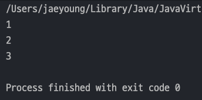
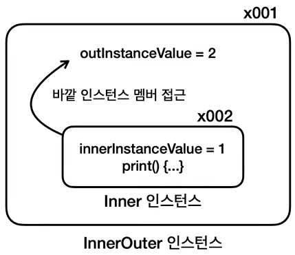
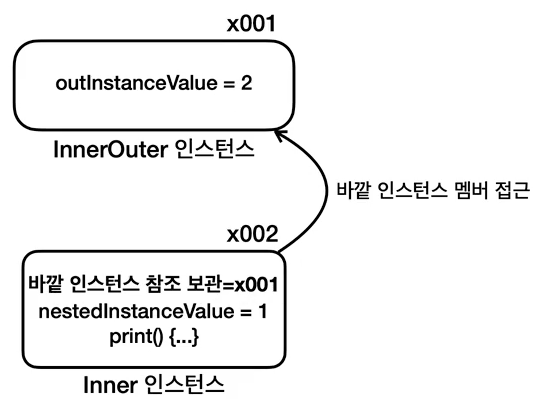
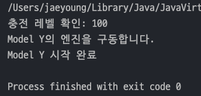
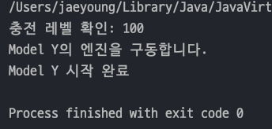
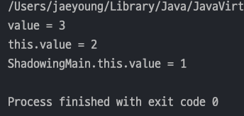

## 자바 중급 1편

## 중첩 클래스, 내부클래스 - 1

> 1. 내부 클래스
> 2. 내부 클래스의 활용
> 3. 같은 이름의 바깥 변수 접근
---

## 1. 내부 클래스

> 정적 중첩 클래스는 바깥 클래스와 서로 관계가 없다. 하지만 내부 클래스는 바깥 클래스의 인스턴스를 이루는 요소가 된다.

### 내부클래스 생성

- 내부 클래스는 앞에 `static`이 붙지 않기 때문에 인스턴스 멤버가 된다.
    - 내부 클래스 자신의 멤버 변수 접근가능
    - 외부 클래스 멤버 변수 접근가능
    - 외부 클래슷 스테틱 멤버변수 접근 가능
        ```java
        public class InnerOuter {
            private static int outClassValue = 3;
            private int outInstanceValue = 2;
        
            class Inner {
                private int innerInstanceValue = 1;
                
                public void print(){
                    // 자기 자신 접근
                    System.out.println(innerInstanceValue);
                    
                    // 외부클래스 인스턴스 멤버 접근
                    System.out.println(outInstanceValue);
                    
                    // 외부클래스 스테틱 멤버 접근
                    System.out.println(outClassValue);
                }
            }
        }
        ```
- 내부 클래스는 바깥 클래스의 인스턴스에 소속되기 떄문에 _**내부클래스를 생성할 때 인스턴스 정보를 알아야 한다 !**_
- 즉, `바깥클래스인스턴스.new 내부클래스();`
    ```java
    public class InnerOuterMain {
        public static void main(String[] args) {
            InnerOuter outer = new InnerOuter();
    
            // 생성할 때는 인스턴스가 필요하다.
            InnerOuter.Inner inner = outer.new Inner();
    
            inner.print();
        }
    }
    ```
  
- 개념상 **바깥 클래스의 인스턴스 내부에서 내부 클래스의 인스턴스가 생성**된다

  
- 하지만 실제 메모리에서는 바깥 클래스의 인스턴스가 생성되고 **내부 클래스는 바깥 클래스의 참조값을 알고 있어 접근이 가능**한 것이다.

  

### 정리
> 정적 중첩 클래스와 다르게 내부 클래스는 바깥 인스턴스에 소속된다.
> - `중첩(Nested)` : 어떤 다른 것이 **내부에 위치하거나 포함되는 구조적인 관계**
> - `내부(Inner)` : 나의 내부에 있는 **나를 구성하는 요소**
---
## 2. 내부 클래스의 활용
> 예제를 리팩토링 하며 내부 클래스 활용 방법을 알아본다.

### 내부 클래스 리팩토링 전
- `Engine` 클래스는 `Car` 클래스엣어만 사용한다.
  - 엔진을 시작할 때 **차의 충전 레벨**과 **차량의 이름**이 필요
  - `Car` 의 정보를 **필드로 받아 생성자에서 초기화함.**
    ```java
    public class Engine {
        private Car car;
  
        public Engine(Car car) {
            this.car = car;
        }
  
        public void start() {
            System.out.println("충전 레벨 확인: " + car.getChargeLevel());
            System.out.println(car.getModel() + "의 엔진을 구동합니다.");
        }
    }
    ```
- `Car` 클래스는 엔진에 필요한 메서드들을 제공한다. `getModel()` , `getChargeLevel()` 은 `Engine` 클래스에서만 사용한다.
  ```java
  public class Car {
      private String model;
      private int chargeLevel;
      private Engine engine;
  
      public Car(String model, int chargeLevel) {
          this.model = model;
          this.chargeLevel = chargeLevel;
          this.engine = new Engine(this);
      }
  
      // Engine 에서만 사용하는 메서드
      public String getModel() {
          return model;
      }
  
      // Engine 에서만 사용하는 메서드
      public int getChargeLevel() {
          return chargeLevel;
      }
  
      public void start(){
          engine.start();
          System.out.println(model + " 시작 완료");
      }
  }
  ```
- `main()` 에서 구동하면 아래와 같다.
  - `Car` 인스턴스 생성시 `model` 과 `chargeLevel` 을 생성자로 입력받고 `Engine` 필드도 초기화된다.
    ```java
    public class CarMain {
        public static void main(String[] args) {
            Car myCar = new Car("Model Y", 100);
            myCar.start();
        }
    }
    ```
    
- 현재 문제점들은 아래와 같다.
  - `Engine` 클래스는 `Car` 클래스에서만 사용한다.
  - `Car` 클래스의 `getModel()` 과 `getChargeLevel()`은 `Engine` 에서만 사용한다.

### 내부 클래스 리팩토링 후
> `Engine` 클래스는 `Car` 클래스 내부에서만 사용된다. 그리고 `Enigne` 은 `chargeLevel` 과 `model` 에 접근해야 한다.

- 기존의 `Engine` 클래스를 `Car` 클래스 내부에 넣었다.
- `Engine` 클래스는 내부 클래스기 때문에 `model` 과 `chargeLevel` 에 직접접근이 가능하다.
  ```java
  public class Car {
      private String model;
      private int chargeLevel;
      private Engine engine;
  
      public Car(String model, int chargeLevel) {
          this.model = model;
          this.chargeLevel = chargeLevel;
          this.engine = new Engine();
      }
  
      public void start() {
          engine.start();
          System.out.println(model + " 시작 완료");
      }
  
      private class Engine {
          public void start() {
              System.out.println("충전 레벨 확인: " + chargeLevel);
              System.out.println(model + "의 엔진을 구동합니다.");
          }
      }
  }
  
  public class CarMain {
    public static void main(String[] args) {
        Car myCar = new Car("Model Y", 100);
        myCar.start();
    }
  }
  ```
  

### 리팩토링 전 문제
- `Car` 클래스는 엔진에 필요한 메서드들을 제공해야 한다. 다음 메서드들은 다른곳에서 사용하지 않는다.
  - `getModel()`
  - `getChargeLevel()`
- `Engine` 클래스 말고는 _**사용되지 않는 메서드들을 불필요하게 노출하기 때문에 캡슐화를 떨어뜨린다.**_
- 그래서 리팩토링 후 내부클래스로 바꿈으로써 다음 메서드들을 제거하여 `Car` 클래스 캡슐화를 높일 수 있었다.
---
## 3. 같은 이름의 바깥 변수 접근
> 바깥 클래스의 인스턴스 변수명과 내부 클래스의 인스턴스 변수명이 같으면 어떻게 될까?

### 예제코드
- 프로그래밍에서 _**우선순위는 대부분 더 가깝거나, 더 구체적인 것이 우선권을 가진다.**_
- 변수명 `value` 만 적었을 때 가장 가까운 내부클래스 지역변수가 지정이 된다.
- 내부클래스 인스턴스 멤버 처럼 다른 변수명을 같게하여 가려서 보이지 않게 하는것을 `셰도잉(Shadowing)` 이라 한다.
  ```java
  public class ShadowingMain {
      public int value = 1;
  
      class Inner {
          public int value = 2;
  
          void go() {
              int value = 3;
              System.out.println("value = " + value); // 지역변수가 우선순위를 잡는다.
              System.out.println("this.value = " + this.value); // 자신의 인스턴스 멤버 전근
              System.out.println("ShadowingMain.this.value = " + ShadowingMain.this.value); // 바깥 클래스 인스턴스 멤버 전근
          }
      }
  
      public static void main(String[] args) {
          ShadowingMain main = new ShadowingMain();
          Inner inner = main.new Inner();
          inner.go();
      }
  }
  ```
  