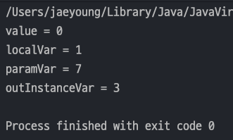
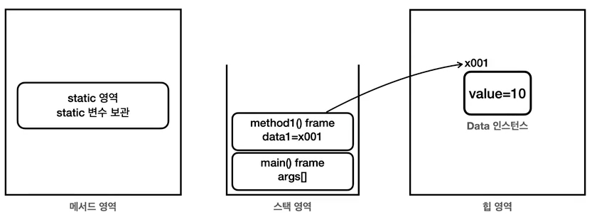
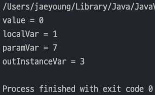
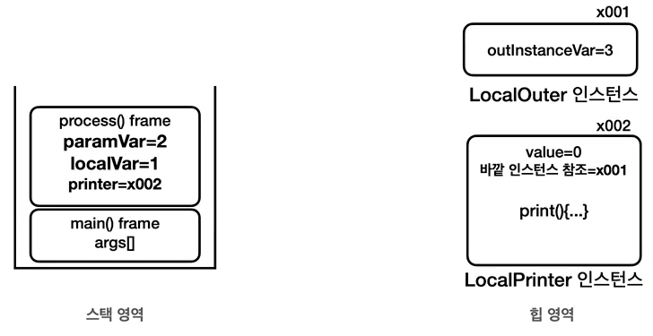
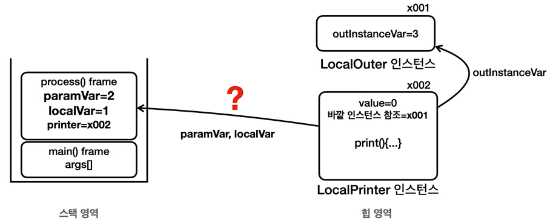
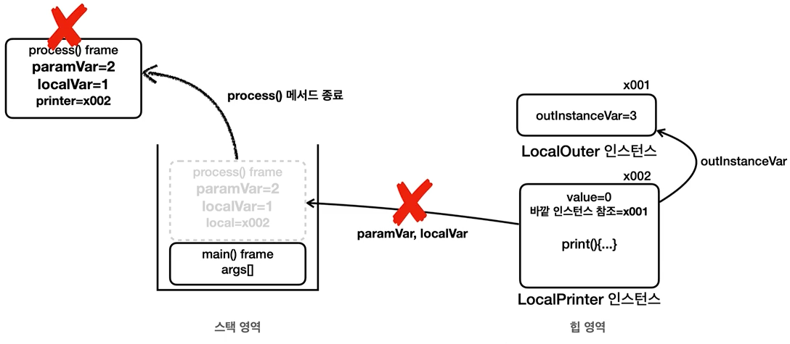
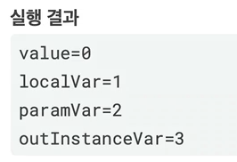
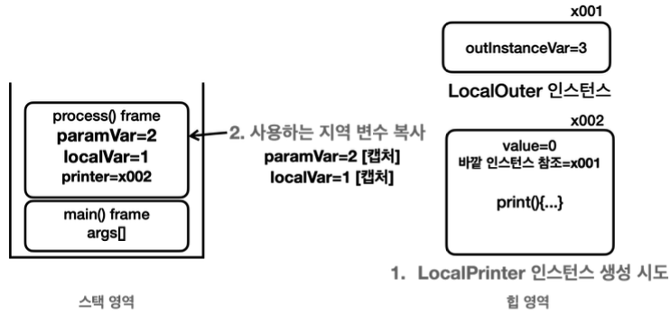
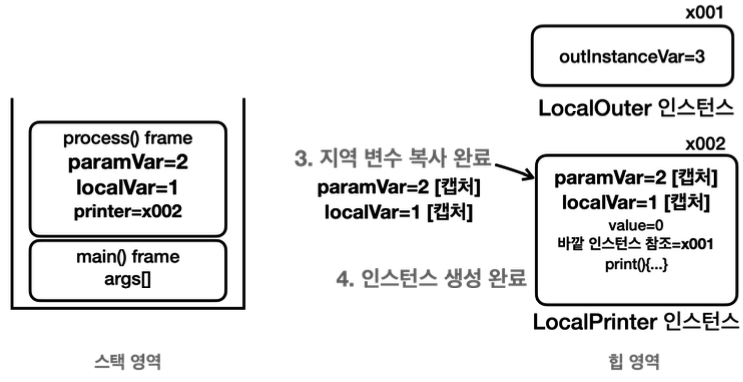
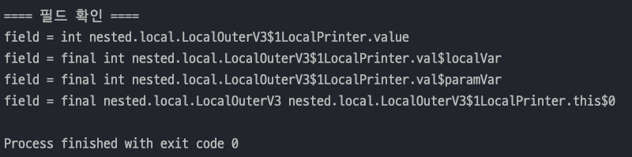

## 자바 중급 1편

## 중첩 클래스, 내부클래스 - 2
> 1. 지역 클래스 - 시작
> 2. 지역 클래스 - 지역 변수 캡처 1
> 3. 지역 클래스 - 지역 변수 캡처 2
> 4. 지역 클래스 - 지역 변수 캡처 3
---

## 1. 지역 클래스 - 시작
> `지역 클래스(Local Class)`는 **내부 클래스의 특별한 종류의 하나**이다.<br>
> 즉, 내부 클래스의 특징을 그대로 가지고 **지역 변수와 같이 코드 블럭 안에서 정의**된다.

#### 지역 클래스 예
- 지역 클래스는 지역 변수처럼 코드 블럭 안에서 선언된다.
- 지역 클래스는 지역 변수에 접근할 수 있다.
    ```java
    class Outer{
        public void process(){
            // 지역 변수
            int localVar = 0;
            
            // 지역 클래스
            class Local {}
            
            Local local = new Local();
        }
    }
    ```

### 지역 클래스 예제 1
- 자신의 **인스턴스 변수**에 접근할 수 있다.
- 자신이 속한 코드 블럭의 **지역 변수**에 접근할 수 있다.
- 자신이 속한 코드 블럭의 **매개변수(파라미터)**에 접근할 수 있다.
- 바깥 클래스의 **인스턴스 멤버**에도 접근할 수 있다.
- _**지역 변수에 접근제어자를 사용할 수 없는것처럼 지역 클래스에 접근제어자를 사용할 수 없다.**_
  ```java
  public class LocalOuterV1 {
      private int outInstanceVar = 3;
  
      public void process(int paramVar) {
          int localVar = 1;
  
          class LocalPrinter {
              int value = 0;
  
              public void printData() {
                  System.out.println("value = " + value);
                  System.out.println("localVar = " + localVar);
                  System.out.println("paramVar = " + paramVar);
                  System.out.println("outInstanceVar = " + outInstanceVar);
              }
          }
  
          LocalPrinter printer = new LocalPrinter();
          printer.printData();
      }
  
      public static void main(String[] args) {
          LocalOuterV1 localOuter = new LocalOuterV1();
          localOuter.process(7);
      }
  }
  ```
  

### 지역 클래스 예제2
- 내부 클래스도 인터페이스의 구현체로 사용할 수 있다.
  ```java
  public interface Printer {
      void print();
  }
  ```
  ```java
  public class LocalOuterV2 {
      private int outInstanceVar = 3;
  
      public void process(int paramVar) {
          int localVar = 1;
  
          class LocalPrinter implements Printer{
              int value = 0;
  
              @Override
              public void print() {
                  System.out.println("value = " + value);
                  System.out.println("localVar = " + localVar);
                  System.out.println("paramVar = " + paramVar);
                  System.out.println("outInstanceVar = " + outInstanceVar);
              }
          }
  
          LocalPrinter printer = new LocalPrinter();
          printer.print();
      }
  
      public static void main(String[] args) {
          LocalOuterV2 localOuter = new LocalOuterV2();
          localOuter.process(7);
      }
  }
  ```
  
---
## 2. 지역 클래스 - 지역 변수 캡처 1

### 변수의 생명 주기
> 변수의 종류는 크게 **클래스 변수**, **인스턴스 변수**, **지역 변수**가 있다.
- `클래스 변수(static 변수)` : **메서드 영역**에 존재하고, 자바가 클래스 정보를 읽어 들이는 순간부터 **프로그램 종료까지 존재**한다.
- `인스턴스 변수` : **힙 영역에 존재**하고, 변수가 소속된 **인스턴스가 GC(Garbage Collection)되기 전까지 존재**한다.
- `지역 변수` : **스택 영역에 존재**하고, **메서드 호출이 끝나면 사라진다.**

  

### 지역 클래스 예제 3
- `process()` 는 `Printer` 타입을 반환하고 기존의 `print()` 함수는 실행하지 않고, `process()` 종료 후 `main()`메서드에서 실행한다.
  ```java
  public class LocalOuterV3 {
      private int outInstanceVar = 3;
  
      public Printer process(int paramVar) {
          int localVar = 1; // 지역 변수는 스택 프레임이 종료되는 순간 함께 제거된다.
  
          class LocalPrinter implements Printer{
              int value = 0;
  
              @Override
              public void print() {
                  System.out.println("value = " + value);
                  // 인스턴스는 지역 변수보다 더 오래 살아남는다.
                  System.out.println("localVar = " + localVar);
                  System.out.println("paramVar = " + paramVar);
                  System.out.println("outInstanceVar = " + outInstanceVar);
              }
          }
  
          LocalPrinter printer = new LocalPrinter();
  //        printer.print(); 를 여기서 실행하지 않고 Printer 인스턴스만 반환.
          return printer;
      }
  
      public static void main(String[] args) {
          LocalOuterV3 localOuter = new LocalOuterV3();
          Printer printer = localOuter.process(7);
  
          // process()의 스택 프레임이 사라진 후에 실행
          printer.print();
      }
  }
  ```
  
- _위 코드를 보면 무언가 이상함이 느껴진다._
#### LocalPrinter 인스턴스 생성 직후 메모리 그림
 

#### LocalPrinter.print() 접근 메모리 그림
- `LocalPrinter` 인스턴스는 `print()` 메서드를 통해 바깥 인스턴스의 변수인 `outInstanceVar` 에 접근한다.(같은 힙 영역이기 때문애)
- `print()` 메서드를 통해 스택 영역에 존재하는 `localVar` 와 `paramVar` 에 접근하는건 생각처럼 단순하지 않다.

  
- 왜냐하면 `main()` 메서드에서 `print()` 를 호출 할때는 이전에 `process()` 의 **호출이 끝났기 떄문에 스택프레임이 사라졌기 때문**이다.

  
- 여기서 문제는 ***process() 메서드가 종료되어서 해당 지역 변수들이 제거된 상태인데 모두 정상적으로 출력된다는 점***이다.

  
---
## 3. 지역 클래스 - 지역 변수 캡처 2
> 지역 클래스를 통해 생성한 인스턴스가 지역 변수에 접근해야 하는데, 인스턴스에 비해 지역변수는 생명주기가 짧기 때문에인스턴스가 지역 변수에 접근 못하는 경우가 있다.<br>
> 이 때, **지역 변수 캡처**를 이용한다.

#### 지역 변수 캡처
- Java 는 위 와 같은 문제를 해결하기 위해 _지역 클래스의 인스턴스를 생성하는 시점에 필요한 지역 변수를 복사해서 생성한 인스턴스에 함께 넣어둔다._
- 이러한 과정을 변수 `캡쳐(Capture)`라 한다.
- 즉, ***인스턴스를 생성할 때 필요한 지역 변수를 복사해서 보관***해 두는 것이다.(*모든 지역 변수가 아닌 접근이 필요한 지역 변수만 캡처*한다.)

#### 지역 클래스의 인스턴스 생성과 지역 변수 캡쳐 과정
1. **LocalPrinter 인스턴스 생성**
   - 지역 클래스의 인스턴스 생성할 때 **지역 클래스가 접근하는 지역 변수를 확인**한다.
   - `LocalPrinter` 클래스는 `paramVar` , `localVar` 지역 변수에 접근
2. **사용하는 지역 변수 복사**
   - *지역 클래스가 사용하는 지역 변수를 복사*한다.(_사용하지 않는 지역 변수는 복사하지 않는다._)
   - `paramVar` , `locaslVar` 지역 변수 복사
     
     
3. **지역 변수 복사 완료**
   - 복사한 지역 변수를 인스턴스에 포함
4. **인스턴스 생성 완료**
   - 복사한 지역 변수를 포함해서 인스턴스 생성이 완료.
   - 지역 변수를 포함한 스택프레임이 사라져도 인스턴스는 지역 변수에 접근할 수 있다.
       
     

#### 캡쳐 변수 접근
- `LocalPrinter` 인스턴스에서 `print()` 메서드를 통해 `praamVar` , `localVar` 에 접근 하는 것은 ***스택 영역에 접근하는게 아니고 인스턴스에 있는 캡쳐 변수에 접근***하는 것이다.
- 캡쳐 변수를 통해 지역 변수와 지역 클래스를 통해 생성한 인스턴스의 생명주기가 다른 문제를 해결한다.

  

### 예제코드로 캡쳐 변수 확인
- 기존의 `LocalOuterV3` 클래스에 있는 `main()` 메서드에 조금만 추가하여 확인해보자
- `localVar` 와 `paramVar` 가 필드로 들어가있는 것을 알 수 있다.
  ```java
  import java.lang.reflect.Field;
  
  public class LocalOuterV3 {
      private int outInstanceVar = 3;
  
      public Printer process(int paramVar) {
          // 생략...
      }
  
      public static void main(String[] args) {
          LocalOuterV3 localOuter = new LocalOuterV3();
          Printer printer = localOuter.process(7);
  
          // process()의 스택 프레임이 사라진 후에 실행
          printer.print();
  
          // 추가
          System.out.println("==== 필드 확인 ====");
          Field[] fields = printer.getClass().getDeclaredFields();
  
          for (Field field : fields) {
              System.out.println("field = " + field);
          }
      }
  }
  ```
  
- 실행결과를 분석하면 아래와 같다.
  - **인스턴스 변수**인 `value` 
  - **캡쳐 변수**인 `val$localVar` , `val$paramVar`
  - **바깥 클래스의 참조값**을 담는 `this$0` 이 있다.
---
## 4. 지역 클래스 - 지역 변수 캡처 3
> 지역 클래스가 접근하는 _**지역 변수는 절대로 중간에 값이 변하면 안된다.**_<br>
> 따라서 `final` 로 선언하거나 또는 사실상 `final` 이어야 한다. -> 자바 문법이고 규칙이다.

#### 사실상 final 이란?
- 영어로 `effectively final` 이라 한다.
- `final` 키워드를 사용하지 않았지만, 값이 한번도 변경되지 않는 지역 변수를 말한다.

### 예제 코드로 알아보기
- 아래 코드에서 `LocalPrinter printer = new LocalPrinter();` 로 인스턴스 생성 후 인스턴스가 접근하는 지역변수의 값을 바꾸면 컴파일 에러가 난다 !
- 왜냐하면 `LocalPrinter` 인스턴스가 접근하는 **지역변수는 인스턴스 생성시 캡처한 변수이기 때문에 원본과 캡쳐변수의 값이 달라 문제가 발생**한다. -> `동기화 문제`라 한다.
    ```java
    import java.lang.reflect.Field;
    
    public class LocalOuterV4 {
        private int outInstanceVar = 3;
    
        public Printer process(int paramVar) {
            int localVar = 1;
    
            class LocalPrinter implements Printer{
                int value = 0;
    
                @Override
                public void print() {
                    System.out.println("value = " + value);
                    System.out.println("localVar = " + localVar);
                    System.out.println("paramVar = " + paramVar);
                    System.out.println("outInstanceVar = " + outInstanceVar);
                }
            }
    
            LocalPrinter printer = new LocalPrinter();
            // 만약 localVar 지역변수의 값을 변경한다면? 다시 캡처해야 하나 ??
            // localVar = 10; 컴파일 에러 !
    
            return printer;
        }
    
        public static void main(String[] args) {
            // 생략 ...
        }
    }
    ```

#### 캡처 변수의 값을 변경하지 못하는 이유
> Java 언어를 설계할 때 개발자들이 인스턴스 값이 바뀌면 캡쳐변수 값도 바뀌도록 설계 할 수 있다. 하지만 이로 인해 수 많은 문제들이 파생될 수 있다.

- 지역 변수의 값을 변경하면 **인스턴스에 캡쳐한 변수의 값도 변경**해야 한다. 
- 반대로 인스턴스에 있는 캡쳐 변수의 값을 변경하면 **해당 지역 변수의 값도 다시 변경**해야 한다. 
- 개발자 입장에서 보면 **예상하지 못한 곳에서 값이 변경될 수 있기 때문에 디버깅을 어렵게 한다.**
- 지역 변수의 값과 인스턴스에 있는 캡처 변수의 값을 **서로 동기화 해야 하는데, 멀티쓰레드 상황에서 이런 동기화는 매우 어렵고, 성능에 나쁜 영향**을 줄 수 있다.