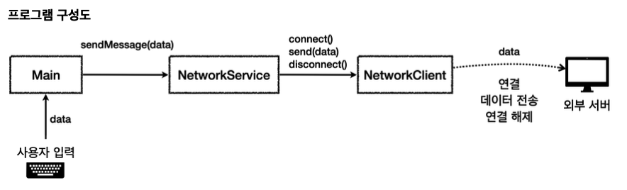
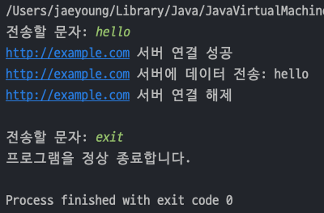
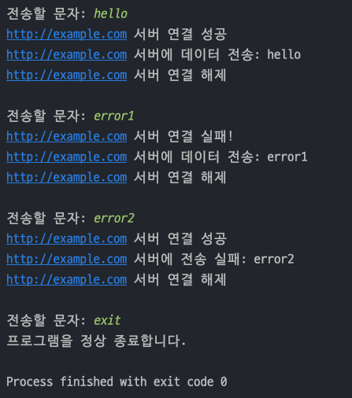
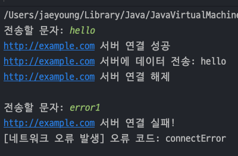
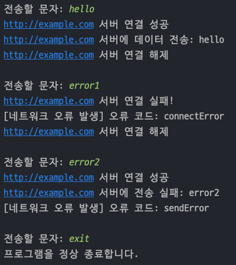

## 자바 중급 1편

## 예외 처리1 - 이론
> 1. 예외처리가 필요한 이유 1 - 시작
> 2. 예외처리가 필요한 이유 2 - 오류 상황 만들기
> 3. 예외처리가 필요한 이유 3 - 반환 값으로 예외 처리
---
## 1. 예외처리가 필요한 이유 1 - 시작
> 이론학습을 위해 네트워크 통신을 하는(실제 코드로는 구현하지 않는다) 예제를 만든다.
> 

### 클래스 설명
- `NetworkClient` : 외부 서버와 **연결**하고, 데이터 **전송**, 연결 **종료**하는 기능을 제공한다.
- `NetworkService` : `NetworkClient` 를 사용해서 데이터를 전송한다. `NetworkClient` 의 복잡한 흐름을 제어한다.
- `Main` : 사용자의 입력을 받는다.

### 예제코드
- `String address` : 접속할 외부 서버 주소
- `connect()` : 외부 서버 연결 메서드
- `send(String data)` : 연결한 외부 서버에 데이터를 전송한다.
- `disconnect()` : 외부 서버와 연결을 해제한다.
    ```java
    public class NetworkClientV0 {
        private final String address;
    
        public NetworkClientV0(String address) {
            this.address = address;
        }
    
        public String connect(){
            // 연결 성공
            System.out.println(address + " 서버 연결 성공");
            return "success";
        }
    
        public String send(String data){
            // 전송 성공
            System.out.println(address + " 서버에 데이터 전송: " + data);
            return "success";
        }
    
        public void disconnect(){
            System.out.println(address + " 서버 연결 해제");
        }
    }
    ```
- 서비스 코드에서는 `NetworkClient` 를 통해 **연결**,**전송**,**종료**를 제어한다.
    ```java
    public class NetworkServiceV0 {
    
        public void sendMessage(String data){
            String address = "http://example.com";
    
            NetworkClientV0 client = new NetworkClientV0(address);
            
            client.connect();
            client.send(data);
            client.disconnect();
        }
    }
    ```
- 그리고 `main()` 에서는 사용자의 입력을 받을때마다 전송하고 `exit` 문자를 입력받으면 종료되도록 구현하였다.
  ```java
  public class MainV0 {
      public static void main(String[] args) {
          NetworkServiceV0 networkService = new NetworkServiceV0();
  
          Scanner sc = new Scanner(System.in);
  
          while (true) {
              System.out.print("전송할 문자: ");
              String input = sc.nextLine();
              if (input.equals("exit"))
                  break;
  
              networkService.sendMessage(input);
              System.out.println();
          }
          System.out.println("프로그램을 정상 종료합니다.");
  
      }
  }
  ```
  
---
## 2. 예외처리가 필요한 이유 2 - 오류 상황 만들기
> 외부 서버와 통신할 때는 다음과 같은 문제들이 발생한다.
> 1. 외부 서버와 연결에 실패(네트워크 오류 등)
> 2. 데이터 전송에 문제가 발생

### 예제코드
- 넘어오는 데이터에 `error1` 이 들어있으면 **연결실패**, `error2` 가 들어있으면 **전송실패**라고 하자. 그러면 아래와 같이 코드가 바뀐다.
  ```java
  public class NetworkClientV1 {
      private final String address;
      public boolean connectError;
      public boolean sendError;
  
      public NetworkClientV1(String address) {
          this.address = address;
      }
  
      public String connect() {
          // 연결 실패
          if (connectError) {
              System.out.println(address + " 서버 연결 실패!");
              return "connectError";
          }
          // 연결 성공
          System.out.println(address + " 서버 연결 성공");
          return "success";
      }
  
      public String send(String data) {
          // 전송 실패
          if (sendError) {
              System.out.println(address + " 서버에 전송 실패: " + data);
              return "sendError";
          }
          // 전송 성공
          System.out.println(address + " 서버에 데이터 전송: " + data);
          return "success";
      }
  
      public void disconnect() {
          System.out.println(address + " 서버 연결 해제");
      }
  
      public void initError(String data){
          if(data.contains("error1"))
              connectError = true;
          if(data.contains("error2"))
              sendError = true;
      }
  }
  ```
- 서비스 코드는 `data`를 먼저 검증하는 로직이 추가된다.
  ```java
  public class NetworkServiceV1_1 {
  
      public void sendMessage(String data){
          String address = "http://example.com";
          NetworkClientV1 client = new NetworkClientV1();
          client.initError(data);
          
          client.connect();
          client.send(data);
          client.disconnect();
      }
  }
  ```
- `main()` 코드에서는 `error1` , `erro2` 를 입력했을때 오류 메시지가 나온다.
  ```java
  public class MainV1 {
      public static void main(String[] args) {
          NetworkServiceV1_1 networkService = new NetworkServiceV1_1();
  
          Scanner sc = new Scanner(System.in);
  
          while (true) {
              System.out.print("전송할 문자: ");
              String input = sc.nextLine();
              if (input.equals("exit"))
                  break;
  
              networkService.sendMessage(input);
              System.out.println();
          }
          System.out.println("프로그램을 정상 종료합니다.");
  
      }
  }
  ```
  

### 남은 문제 및 추가 요구사항
- 연결이 실패하면 데이터를 전송하지 않아야 하는데, 여기서는 데이터를 전송한다.
- 오류가 발생했을 때 어떤 오류가 발생했는지 자세한 내역을 남기면 이후 디버깅에 도움이 될 것이다. 오류 로그가 필요하다.
---
## 3. 예외처리가 필요한 이유 3 - 반환 값으로 예외 처리

- 기존의 `Service` 코드에서는 오류가 발생해도 데이터가 전송됐기 때문에 아래와 같이 수정한다.
- 에러를 체크하는 메서드를 추출한 후, ***에러 로그를 남기고 메서드를 즉시 종료***시킨다.
  ```java
  public class NetworkServiceV1_2 {
  
      public void sendMessage(String data) {
          String address = "http://example.com";
  
          NetworkClientV1 client = new NetworkClientV1(address);
  
          client.initError(data);
  
          String connectResult = client.connect();
          if (isError(connectResult)) {
              System.out.println("[네트워크 오류 발생] 오류 코드: " + connectResult);
              return;
          }
  
          String sendResult = client.send(data);
          if (isError(sendResult)){
              System.out.println("[네트워크 오류 발생] 오류 코드: " + sendResult);
              return;
              }
          client.disconnect();
      }
  
      private static boolean isError(String connectResult) {
          return !connectResult.equals("success");
      }
  }
  ```
- `main()` 함수를 실행해보면 아래와 같이 바뀐다.
  ```java
  public class MainV1 {
      public static void main(String[] args) {
  //        NetworkServiceV1_1 networkService = new NetworkServiceV1_1();
          NetworkServiceV1_2 networkService = new NetworkServiceV1_2();
  
          Scanner sc = new Scanner(System.in);
  
          while (true) {
              System.out.print("전송할 문자: ");
              String input = sc.nextLine();
              if (input.equals("exit"))
                  break;
  
              networkService.sendMessage(input);
              System.out.println();
          }
          System.out.println("프로그램을 정상 종료합니다.");
      }
  }
  ```
  

### NetworkClient 사용시 주의 사항
- 현재 `connect()` 실패 시 `send()` 가 실행되지 않기 때문에 예외처리를 잘했다.
- 하지만 `disconnect()` 가 실행되지 않는다. `Java` 내부 리소스는 `GC(가비지 컬렉션)`이 있기 때문에 자동으로 지우지만, **_외부 자원은 GC가 지워주지 않는다._**
- 그래서 `connect()` 가 실패해도 _**네트워크 연결은 계속 되어 있기 때문에 메모리 누수가 생기게 된다.**_
- 즉, `connect()` 가 실패가 되도 `disconnect()` 는 무조건 실행하게 해야한다!

### 예제코드 수정
- 기존 `Service` 코드에서 `disconnect()` 메서드를 반드시 호출하도록 변경한다.
  ```java
  public class NetworkServiceV1_3 {
  
      public void sendMessage(String data) {
          String address = "http://example.com";
  
          NetworkClientV1 client = new NetworkClientV1(address);
  
          client.initError(data);
  
          String connectResult = client.connect();
          if (isError(connectResult)) {
              System.out.println("[네트워크 오류 발생] 오류 코드: " + connectResult);
  
          } else {
              String sendResult = client.send(data);
              if (isError(sendResult)) {
                  System.out.println("[네트워크 오류 발생] 오류 코드: " + sendResult);
                  return;
              }
          }
          client.disconnect();
      }
  
      private static boolean isError(String connectResult) {
          return !connectResult.equals("success");
      }
  }
  ```
- `main()` 코드를 실행하면 아래와 같이 나온다.
  ```java
  public class MainV1 {
      public static void main(String[] args) {
  //        NetworkServiceV1_1 networkService = new NetworkServiceV1_1();
  //        NetworkServiceV1_2 networkService = new NetworkServiceV1_2();
          NetworkServiceV1_3 networkService = new NetworkServiceV1_3();
  
          Scanner sc = new Scanner(System.in);
  
          while (true) {
              System.out.print("전송할 문자: ");
              String input = sc.nextLine();
              if (input.equals("exit"))
                  break;
  
              networkService.sendMessage(input);
              System.out.println();
          }
          System.out.println("프로그램을 정상 종료합니다.");
      }
  }
  ```
  

### 정상 흐름과 예외 흐름
- 현재 `NetworkServiceV1_2`, `NetworkServiceV1_3` 과 같이 반환 값으로 예외를 처리하는 코드들을 보면 _**정상흐름과 예외흐름이 분리되어 있지 않다.**_
- 코드를 보면 예외 흐름을 처리하는 부분이 더 많다.
- _**정상흐름과 예외흐름이 섞여 있기 때문에 코드를 한눈에 이해하기 어렵다.**_ 정상흐름이 한눈에 들어오지 않는다.