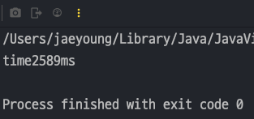
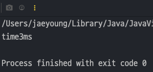
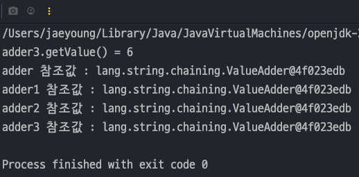
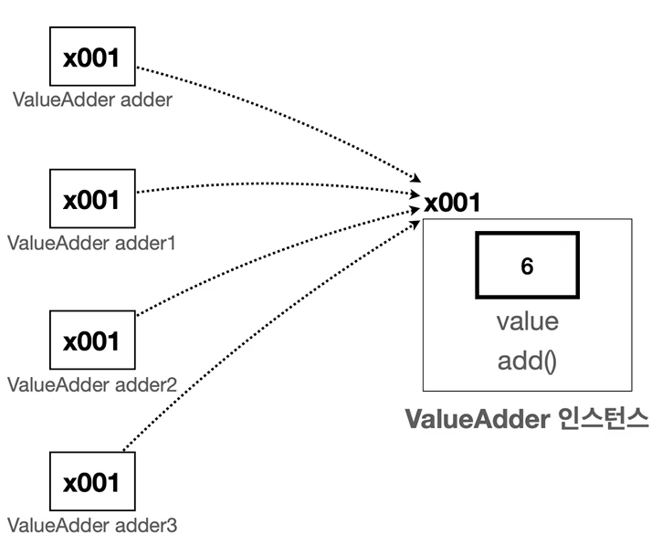
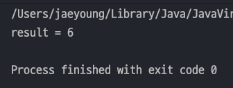

## 자바 중급 1편

### String 클래스 학습
> 1. String 최적화
> 2. 메서드 체인닝 - Method Chaining
---
### 1. String 최적화
> Java 컴파일러는 아래와 같이 문자열 리터럴을 더하는 부분을 자동으로 합쳐준다.

#### 문자열 리터럴 최적화
- 자바는 컨타임에 별도의 문자열 결합 연산을 수행하지 않고 **컴파일러가 직접 결합 연산을 해주기 때문에 성능이 향상**된다.
    ```java
    String helloWorld = "Hello, " + "World!"; // 컴파일 전
    String helloWorld = "Hello, World!"; // 컴파일 후
    ```
#### String 변수 최적화
- 문자열 리터럴의 경우 단순히 합치면 되지만 변수의 경우에는 그 값을 알지 못하기 때문에 합칠 수 없다.
- 이런 경우 컴파일러는 `StringBuilder` 를 사용하여 최적화를 한다(Java 버전별로 다르다)
    ```java
    String result = str1 + str2; // 단순 결합 불가
    String result = new StringBuilder().append(str1).append(str2).toString(); // 최적화
    ```
    > `Java 9` 부터는 `StringConcatFactory` 를 사용해서 최적화를 수행한다.

#### String 최적화가 어려운 경우
- 문자열을 루프안에서 문자열을 더하는 경우에는 최적화가 이루어지지 않는다.
- 아래 코드는 문자열 결합을 10만번 하는동안 걸린시간을 알아보는 코드다.
  ```java
  public class LoopStringMain {
      public static void main(String[] args) {
          long startTime = System.currentTimeMillis(); // 현재 ms 시간을 얻는다.
          String result = "";
          for (int i = 0; i < 100000; i++) {
              result += "Hello Java ";
          }
  
          long endTime = System.currentTimeMillis();
          System.out.println("time" + (endTime - startTime) + "ms");
      }
  }
  ```
  
- 고작 10만번 연산하는데 2초나 걸리는건 문자열 결합이 루프안에서 최적화가 안된다는것을 뜻한다.
- 반복문에서 n번동안 n개의 객체를 생성한다.
  ```java
  String result = "";
  for(int i=0;i<100000;i++){
      result = new StringBuilder().append(result).append("Hello Java ").toString();
  }
  ```
- 저렇게 `StringBuilder` 객체를 10만번을 만들어서 오래 걸린것이다.
- 루프문안에서 문자열 결합을 한다면 `String` 이 아닌 `StringBuilder` 를 써야한다.
  ```java
  public class LoopStringBuilderMain {
      public static void main(String[] args) {
          long startTime = System.currentTimeMillis(); // 현재 ms 시간을 얻는다.
          StringBuilder sb = new StringBuilder();
          for (int i = 0; i < 100000; i++) {
              sb.append("Hello Java ");
          }
  
          long endTime = System.currentTimeMillis();
          String result = sb.toString();
          System.out.println(result);
          System.out.println("time" + (endTime - startTime) + "ms");
      }
  }
  ```
  

#### StringBuilder 사용하는게 좋은 경우
1. 반복문에서 반복해서 문자를 연결할 때
2. 조건문을 통해 동적으로 문자열을 조합할 때
3. 복잡한 문자열의 특정 부분을 변경해야 할 때
4. 매우 긴 대용량 문자열을 다룰 때

> 참고 : `StringBuilder` VS `StringBuffer` </br>
> `StringBuffer` : `StringBuilder` 와 똑같은 기능을 수행하지만 내부에 동기화가 되어 있어서, **멀티 쓰레드 상황에 안전하지만 동기화 오버헤드로 인해 성능이 느리다.**</br>
> `StringBuilder` : **멀티 쓰레드 상황에 안전하지 않지만 동기화 오버헤드가 없으므로 속도가 빠르다.**
---
### 2. 메서드 체인닝 - Method Chaining
- 단순히 값을 누적해서 더하는 기능을 제공하는 클래스이다.
  - `add()` 메서드는 호출할 때 마다 value 에 값을 누적하고 자기 자신(`this`)의 참조값을 반환한다.
  ```java
  public class ValueAdder {
  private int value;
  
      public ValueAdder add(int addValue) {
          value += addValue;
          return this;
      }
  
      public int getValue() {
          return value;
      }
  }
  ```
- main() 메서드에서 add() 가 ValueAdder 를 반환하는 것을 이용하여 누적값과 참조값을 보자
  ```java
  public class MethodChainingMain2 {
      public static void main(String[] args) {
          ValueAdder adder = new ValueAdder();
          ValueAdder adder1 = adder.add(1);
          ValueAdder adder2 = adder1.add(2);
          ValueAdder adder3 = adder2.add(3);
  
          System.out.println("adder3.getValue() = " + adder3.getValue());
  
          System.out.println("adder 참조값 : " +adder);
          System.out.println("adder1 참조값 : " +adder1);
          System.out.println("adder2 참조값 : " +adder2);
          System.out.println("adder3 참조값 : " +adder3);
      }
  }
  ```
  
- 모든 객체가 같은 참조값을 가리킨다. 그림으로 보면 아래와 같다.

  
- 하지만 이런 방식은 코드가독성도 좋지않고 불편한 코드이다.
- 그러나 위 방식을 아래와 같이 바꾸면 왜 저렇게 자기자신을 반환하고 사용했는지 알게 된다.
  ```java
  public class MethodChainingMain3 {
    public static void main(String[] args) {
      ValueAdder adder = new ValueAdder();
      int result = adder.add(1).add(2).add(3).getValue();
      System.out.println("result = " + result);
    }
  }
  ```
  
- `adder` 라는 참조변수의 참조값에 `.` 을 찍어 체인처럼 계속 연결되어 값을 가져온다 -> 이를 `메서드 체이닝` 이라 한다!!
- _**메서드 체이닝 기법은 코드를 간결하고 읽기 쉽게 만들어준다.**_
- `StringBuilder` 클래스는 **메서드 체이닝 기법을 제공**한다.