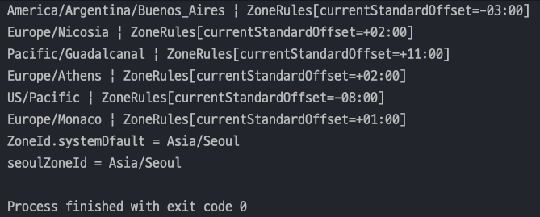
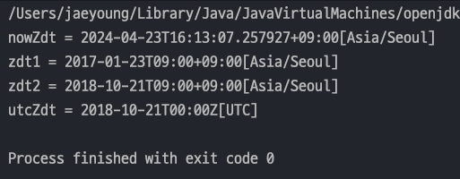
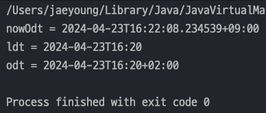
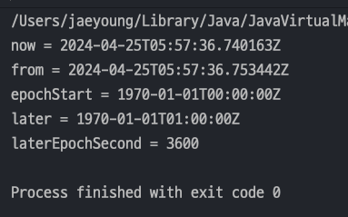
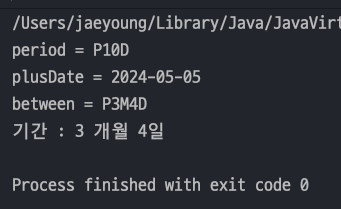

## 자바 중급 1편

### 날짜와 시간
> 1. 타임존 - ZonedDateTime
> 2. 기계 중심의 시간 - Instant
> 3. 기간, 시간의 간격 - Duration, Period
---
### 1. 타임존 - ZonedDateTime
- `Asia/Seoul` 같은 타임존 안에는 **일광절약 시간제(썸머타임)**에 대한 정보와 `UTC+9:00`와 같은 `UTC` 로 부터 시간차이인 **오프셋** 정보를 모두 포함하고 있다.
- `Europe/London` , `GMT` , `UTC` , `Asia/Seoul +09:00` 등등이 있다.
#### ZoneId
- `ZoneId.systemDefault()` : **시스템이 사용하는 기본 ZoneId 를 반환**한다.
  - 각 PC 환경마다 다를 수 있음.
- `ZoneId.of()` : 타임존을 직접 제공해서 ZoneId 를 반환한다.
- `ZoneId` 내부에 ***썸머타임 정보, UTC와의 오프셋 정보를 포함***한다.
    ```java
    import java.time.ZoneId;
    import java.util.Set;
    
    public class ZoneIdMain {
        public static void main(String[] args) {
            Set<String> availableZoneIds = ZoneId.getAvailableZoneIds();
    
            for (String availableZoneId : availableZoneIds) {
                ZoneId zoneId = ZoneId.of(availableZoneId);
                System.out.println(zoneId + " | " + zoneId.getRules());
            }
    
            ZoneId zoneId = ZoneId.systemDefault(); // 현재 OS가 갖고있는 타임존
            System.out.println("ZoneId.systemDfault = "+ zoneId);
    
            ZoneId seoulZoneId = ZoneId.of("Asia/Seoul"); // 타임존을 입력받아 갖고옴
            System.out.println("seoulZoneId = " + seoulZoneId);
        }
    }
    ```
  

#### ZonedDateTime
- `ZonedDateTime` 은 `LocalDateTime` 에 시간대 정보인 `ZoneID` 가 합쳐진 것이다.
    ```java
    public class ZonedDateTime {
        private final LocalDateTime dateTime;
        private final ZoneOffset offset;
        private final ZoneId zone;
    }
    ```
- `ZonedDateTime` 은 시간대를 고려한 날짜와 시간을 표현할 때 사용한다. 시간대를 표현하는 **타임존이 포함**된다.
  - `now()` : 현재 날짜와 시간을 기준으로 생성, ZoneId 는 현재 시스템을 따른다
  - `of(...)` : 특정 날짜와 시간을 기준으로 생성한다. ZoneId 를 추가해야 한다.
    - `LocalDateTime` 에 `ZoneId`를 추가해서 생성할 수 있다.
    ```java
    public class ZonedDateTimeMain {
        public static void main(String[] args) {
            ZonedDateTime nowZdt = ZonedDateTime.now(); // 시스템 디폴즈 ZoneId 사용
            System.out.println("nowZdt = " + nowZdt);
    
            LocalDateTime ldt = LocalDateTime.of(2017, 1, 23, 9, 0, 0);
            ZonedDateTime zdt1 = ZonedDateTime.of(ldt, ZoneId.of("Asia/Seoul")); // LocalDateTime 와 ZonedID 를 사용하여 만들 수 있다.
            System.out.println("zdt1 = " + zdt1);
    
            ZonedDateTime zdt2 = ZonedDateTime.of(2018, 10, 21, 9, 0, 0, 0, ZoneId.of("Asia/Seoul"));
            System.out.println("zdt2 = " + zdt2);
    
            ZonedDateTime utcZdt = zdt2.withZoneSameInstant(ZoneId.of("UTC"));
            System.out.println("utcZdt = " + utcZdt);
        }
    }
    ```
    

#### OffsetDateTime
- 위에있는 `ZonedDateTime` 에서 `ZoneId` 만 빠진 클래스이다.
    ```java
    public class OffsetDateTime {
        private final LocalDateTime dateTime;
        private final ZoneOffset offset;
    }
    ```
- `OffsetDateTime` : 시간대를 고려한 날짜와 시간을 표현할 때 사용한다. **타임존이 없고 UTC로 부터의 시간차인 오프셋만 포함**된다.
    ```java
    import java.time.LocalDateTime;
    import java.time.OffsetDateTime;
    import java.time.ZoneOffset;
    
    public class OffsetDateTimeMain {
        public static void main(String[] args) {
            OffsetDateTime nowOdt = OffsetDateTime.now();
            System.out.println("nowOdt = " + nowOdt);
    
            LocalDateTime ldt = LocalDateTime.of(2024, 4, 23, 16, 20, 0);
            System.out.println("ldt = " + ldt);
    
            OffsetDateTime odt = OffsetDateTime.of(ldt, ZoneOffset.of("+02:00"));
            System.out.println("odt = " + odt);
        }
    }
    ```
  

#### ZonedDateTime vs OffsetDateTime
- `ZonedDateTime` 은 **구체적인 지역 시간대를 다룰 때 사용**하며, **자동으로 썸머타임(일광 절약 시간)을 처리**한다.
  - 사용자 지정 시간대에 따른 시간 계산이 필요할 때 적합하다.
- `OffsetDateTime` 은 **UTC와의 시간 차이만을 나타낼 때 사용**하며, **지역 시간대의 복잡성을 고려하지 않는다.**
  - 시간대 변환 없이 로그를 기록하고, 데이터를 저장하고 처리할 때 적합하다.
> 참고로 글로벌 서비스를 하지 않는다면 `ZonedDateTime` 과 `OffsetDateTime`을 잘 사용하지 않는다. 달달 외울 필요는 없다.
---
### 2. 기계 중심의 시간 - Instant
- `Instant` 는 UTC 기준으로 ***시간의 한 지점***을 나타낸다.
- 쉽게말해 1970년 1월 1일 0시 0분 0초(UTC기준)를 기준으로 경과한 시간을 말한다.1
- `Instant` 내부에는 초 데이터(나노초 포함)만 들어있기 때문에 _**날짜와 시간을 계산할 때는 적합하지 않다.**_
  ```java
  public class Instant {
      private final long seconds;
      private final int nanos;
      // ....
  }
  ```
#### 참고 - Epoch 시간
- `Epoch time(체포크 시간)` 또는 `Unix timestamp` 는 컴퓨터 시스템에서 시간을 나타내는 방법 중 하나이다.
- 이는 **1970년 1월 1일 00:00:00 UTC부터 현재까지 경과된 시간**을 초 단위로 표현한 것.
- `Instant` 는 바로 이 `Epoch time`을 다루는 클래스이다.

#### Instant 장단점
- 장점
  1. **시간대 독립성** : `UTC`를 기준으로 하기 때문에 **시간대에 영향을 받지 않는다.**
  2. **고정된 기준점** : `Instant` 는 1970년 1월 1일 UTC를 기준으로 하기 때문에 **시간 계산 및 비교가 명확하고 일관**된다.
- 단점
  1. **사용자 친화적이지 않다** : 기계적인 시간 처리에는 적합하지만, **사람이 읽고 이해하기에는 직관적이지 않다.**
  2. **시간대 정보 부재** : `Instant` 에는 **시간대 정보가 포함되어 있지않아 추가적인 작업이 필요**하다.

#### 사용예시
- `now()` : **UTC 기준으로 현재** 시간의 Instant 를 생성
- `from()` : 다른 타입의 날짜와 시간을 기준으로 Instant 생성(`LocalDateTime` 은 사용할 수 없다.)
- `ofEpochSecond()` : **에포크 시간을 기준**으로 Instant를 생성. 0초를 선택하면 1970년1월1일 0시0분0초 생성
- `plusSeconds()` : 에포크 시간에서 초를 더한다.
- `getEpochSecond()` : 에포크 시간으로 부터 흐른 초를 반환
  ```java
  public class InstantMain {
    public static void main(String[] args) {
      // 생성
      Instant now = Instant.now();
      System.out.println("now = " + now); // UTC 기준이기 때문에 현재시간에서 9시간 뺸 시간이 출력
  
      ZonedDateTime zdt = ZonedDateTime.now(); // 타임존 정보를 이용하여 변환
      Instant from = Instant.from(zdt);
      System.out.println("from = " + from);
  
      Instant epochStart = Instant.ofEpochSecond(0); // 에포크시간에서 0초 후
      System.out.println("epochStart = " + epochStart);
  
      // 계산
      Instant later = epochStart.plusSeconds(3600); //  3600초(1시간) 더하기
      System.out.println("later = " + later);
  
      // 조회
      long laterEpochSecond = later.getEpochSecond();
      System.out.println("laterEpochSecond = " + laterEpochSecond);
    }
  }
  ```
  
---
### 3. 기간, 시간의 간격 - Duration, Period
- 시간의 개념은 `특정 시점의 시간` 과 `시간의 간격`으로 표현할 수 있다
  - 예) 앞으로 4년은 더 공부해야 해 , 이 프로젝트트 3개월 남았어 등등
- `Duration` , `Period` 는 시간의 간격을 표현하는데 사용하는 클래스이다.

  |구분|`Period`|`Duration`|
  |---|---|---|
  |단위|년, 월, 일|시간, 분, 초, 나노초|
  |사용 대상|날짜|시간|
  |주요 메서드|`getYears()` , `getMonths()` , `getDays()`|`toHours()` , `toMinutes()` , `getSeconds()` , `getNano()`|

#### Period
- **두 날짜 사이의 간격을 년, 월, 일 단위**로 나타낸다.
  ```java
  public class Period {
      private final int years;
      private final int months;
      private final int days;
  }
  ```
- `of()` : 특정 기간을 지정해서 Period 를 생성
- `between()` : 특정 기간의 차이를 알고싶을 때는 특정 `날짜 객체(LocalDate)` 를 인자로 넣으면 `Period` 가 반환된다.
- `LocalDate` 객체에 특정 기간을 더할 때도 `Period` 객체를 이용할 수 있다.
  ```java
  public class PeriodMain {
      public static void main(String[] args) {
          // 생성
          Period period = Period.ofDays(10);
          System.out.println("period = " + period);
  
          // 계산에 사용
          LocalDate currentDate = LocalDate.of(2024, 4, 25);
          LocalDate plusDate = currentDate.plus(period);
          System.out.println("plusDate = " + plusDate);
  
          // 기간 차이
          LocalDate startDate = LocalDate.of(2024, 04, 25);
          LocalDate endDate = LocalDate.of(2024, 7, 29);
  
          Period between = Period.between(startDate, endDate);
          System.out.println("between = " + between);
          System.out.println("기간 : " + between.getMonths() + " 개월 " + between.getDays() + "일");
      }
  }
  ```
  

#### Duration
- ***두 시간 사이의 간격을 시, 분, 초(나노초) 단위***로 나타낸다.
  ```java
  public class Duration {
      private final long seconds;
      private final int nanos;
  }
  ```
- `of()` : 특정 시간을 지정해서 `Duration` 생성
- 특정 시간의 차이를 구할 때는 `Period` 와 같이 `between()` 메서드 사용
- 계산에 사용할 때는 `시간객체(LocalTime)`의 사용된다.
  ```java
  public class DurationMain {
      public static void main(String[] args) {
          Duration duration = Duration.ofMinutes(30);
          System.out.println("duration = " + duration);
  
          LocalTime lt = LocalTime.of(16, 0);
          System.out.println("lt = " + lt);
  
          // 계산에 사용
          LocalTime plusTime = lt.plus(duration);
          System.out.println("더한 시간: " + plusTime);
  
          // 시간 차이
          LocalTime startTime = LocalTime.of(9, 0);
          LocalTime endTime = LocalTime.of(17, 30);
          Duration between = Duration.between(startTime, endTime);
          System.out.println("차이: " + between.getSeconds() + "초");
          System.out.println("근무 시간: " + between.toHours() + "시간 " + between.toMinutesPart() + "분");
      }
  }
  ```
  