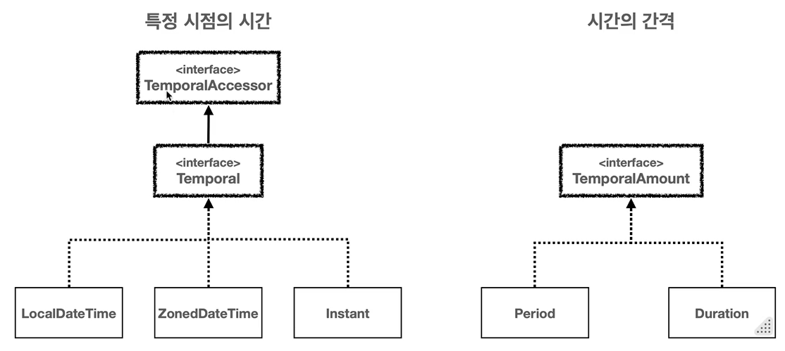
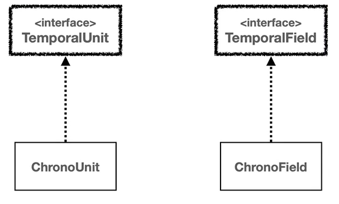
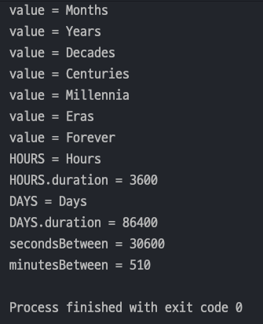
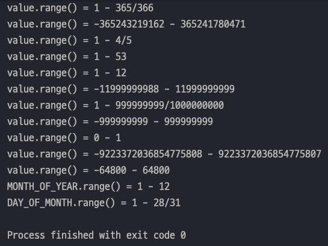
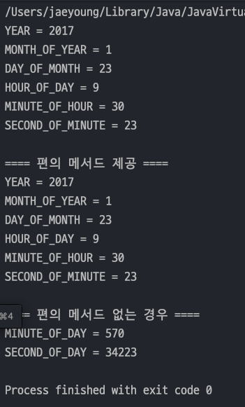
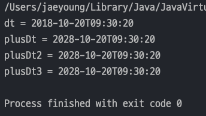
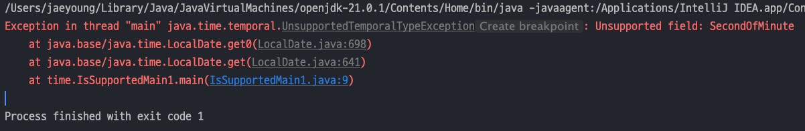
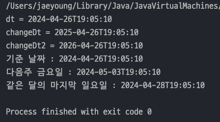

## 자바 중급 1편

## 날짜와 시간

> 1. 날짜와 시간의 핵심 인터페이스
> 2. 시간의 단위와 시간 필드
> 3. 날짜와 시간 조회하고 조작하기
---

## 1. 날짜와 시간의 핵심 인터페이스

> 시간의 개념은 `특정 시점의 시간(시각)` 과 `시간의 간격(기간)`으로 나눌 수 있다.
>
> 

- **특정 시점의 시간** : `Temporal`(`TemporalAccessor` 포함) 인터페이스를 구현한다.
    - `LocalDateTime` , `LocalDate`, `LocalTime` , `ZonedDateTime`, `OffsetDateTime` , `Instant` 등이 있다.
- **시간의 간격** : `TemporalAmount` 인터페이스를 구현한다.
    - 구현으로 `Period` , `Duration` 이 있다.

### `TemporalAccessor` 인터페이스

- 날짜와 시간을 읽기 위한 기본 인터페이스
- ***특정 시점의 날짜와 시간 정보를 읽을 수 있는 최소한의 기능을 제공***한다.

### `Temporal` 인터페이스

- `TemporalAccessor` 인터페이스의 하위 인터페이스로 날짜와 시간을 조작(추가,빼기 등)하기 위한 기능을 제공한다.
- 쉽게 말해 `TemporalAccessor` 는 **읽기 전용 접근**을, `Temporal` 은 **읽기와 쓰기(조작)** 모두를 지원

### `TemporalAmount` 인터페이스

- 시간의 간격을 나타내며 **특정 날짜에 일정 기간을 더하거나 빼는 데 사용**한다.

---

## 2. 시간의 단위와 시간 필드

> `TemporalUnit(ChronoUnit)` 인터페이스는 **시간의 단위**를 뜻하고, `TemporalField(ChronoField)` 는 **시간의 각 필드**를 뜻한다.
>
> 

### 시간의 단위 - TemporalUnit

- `TemporalUnit` 인터페이스는 **날짜와 시간을 측정하는 단위**를 나타내며, 주로 사용되는 구현체는 `java.time.temporal.ChronoUnit` 열거형으로 구현되어 있다.
- `ChoronoUnit` 은 다양한 시간 단위를 제공한다(`Unit`은 단위를 뜻한다)

#### 시간단위

| ChronoUnit | 설명       |
|------------|----------|
| `NANOS`    | 나노초 단위   |
| `MICROS`   | 마이크로초 단위 |
| `MILLIS`   | 밀리초 단위   |
| `SECONDS`  | 초 단위     |
| `MINUTES`  | 분 단위     |
| `HOURS`    | 시간 단위    |

#### 날짜 단위

| ChronoUnit  | 설명     |
|-------------|--------|
| `DAYS`      | 일 단위   |
| `WEEKS`     | 주 단위   |
| `MONTHS`    | 월 단위   |
| `YEARS`     | 년 단위   |
| `DECADES`   | 10년 단위 |
| `CENTURIES` | 세기 단위  |
| `MILLENNIA` | 천년 단위  |

#### 기타 단위

| ChronoUnit | 설명        |
|------------|-----------|
| `ERAS`     | 시대 단위     |
| `FOREVER`  | 무한대의 시간단위 |

#### ChronoUnit의 주요 메서드

| 메서드 이름                        | 설명                                                 |
|-------------------------------|----------------------------------------------------|
| `between(Temporal, Temporal)` | 두 Temporal 객체 사이의 시간을 ChronoUnit 단위로 측정하여 반환한다.    |
| `isDateBased()`               | 현재 ChronoUnit이 날짜 기반 단위인지 여부를 반환한다.                |
| `isTimeBased()`               | 현재 ChronoUnit이 시간 기반 단위인지 여부를 반환한다.                |
| `isSupportedBy(Temporal)`     | 주어진 Temporal 객체가 현재 ChronoUnit 단위를 지원하는지 여부를 반환한다. |
| `getDuration()`               | 현재 ChronoUnit의 기간을 Duration 객체로 반환한다.              |

#### ChronoUnit 예제

- **두 날짜 또는 시간 사이의 차이를 해당 단위로 쉽게 계산**할 수 있다.
- 예를 들면 두 `LocalTime(시간)`과의 차이를 초, 분 단위로 구한다.

```java
  import java.time.LocalTime;
import java.time.temporal.ChronoUnit;

public class ChronoUnitMain {
    public static void main(String[] args) {
        ChronoUnit[] values = ChronoUnit.values();
        for (ChronoUnit value : values) {
            System.out.println("value = " + value); // 내부적으로 toString() 오버라이딩이 되어있다.
        }

        System.out.println("HOURS = " + ChronoUnit.HOURS);
        System.out.println("HOURS.duration = " + ChronoUnit.HOURS.getDuration().getSeconds());
        System.out.println("DAYS = " + ChronoUnit.DAYS);
        System.out.println("DAYS.duration = " + ChronoUnit.DAYS.getDuration().getSeconds());

        // 차이 구하기
        LocalTime startTime = LocalTime.of(9, 0, 0);
        LocalTime endTime = LocalTime.of(17, 30, 0);

        long secondsBetween = ChronoUnit.SECONDS.between(startTime, endTime);
        System.out.println("secondsBetween = " + secondsBetween);

        long minutesBetween = ChronoUnit.MINUTES.between(startTime, endTime);
        System.out.println("minutesBetween = " + minutesBetween);
    }
}
  ```



### 시간 필드 - ChronoField

- `ChronoField` 는 **날짜 및 시간을 나타내는데 사용**되는 열거형이다.
- 이 열거형은 ***다양한 필드를 통해 날짜와 시간의 특정 부분***을 나타낸다.
- 여기서 `Field` 는 날짜와 시간 중에 있는 특정 필드들을 뜻한다.
    - 2024년 8월 16일이면 필드는 다음과 같다.
        - `YEAR` : 2024
        - `MONTH_OF_YEAR` : 8
        - `DAY_OF_MONTH` : 16
    - 단순히 시간의 단위 하나하나를 뜻하는 `ChronoUnit` 과는 다르다. `ChronoField` 를 사용해야 **날짜와 시간의 각 필드 중에 원하는 데이터를 조회**할 수 있다.

#### 연도 관련 필드

| 필드 이름         | 설명                |
|---------------|-------------------|
| `ERA`         | 연대(서기 또는 기원전)     |
| `YEAR_OF_ERA` | 연대 내의 연도          |
| `YEAR`        | 연도                |
| `EPOCH_DAY`   | 1970-01-01 부터의 일수 |

#### 월 관련 필드

| 필드 이름             | 설명           |
|-------------------|--------------|
| `MONTH_OF_YEAR`   | 월(1월 = 1)    |
| `PROLEPTIC_MONTH` | 연도를 월로 확장한 값 |

#### 주 및 일 관련 필드

| 필드 이름                          | 설명                       |
|--------------------------------|--------------------------|
| `DAY_OF_WEEK`                  | 요일(월요일 = 1)              |
| `ALIGNED_DAY_OF_WEEK_IN_MONTH` | 월의 첫 번째 요일을 기준으로 정렬된 요일  |
| `ALIGNED_DAY_OF_WEEK_IN_YEAR`  | 연의 첫 번째 요일을 기준으로 정렬된 요일  |
| `DAY_OF_MONTH`                 | 월의 일(1일 = 1)             |
| `DAY_OF_YEAR`                  | 연의 일(1월 1일 = 1)          |
| `EPOCH_DAY`                    | 유닉스 에폭(1970-01-01)부터의 일수 |

#### 시간 관련 필드

| 필드 이름                | 설명                    |
|----------------------|-----------------------|
| `HOUR_OF_DAY`        | 시간(0-23)              |
| `CLOCK_OF_DAY`       | 시계 시간(1-24)           |
| `HOUR_OF_AMPM`       | 오전/오후 시간(0-11)        |
| `CLOCK_HOUR_OF_AMPM` | 오전/오후 시계 시간(1-12)     |
| `MINUTE_OF_DAY`      | 분(0-59)               |
| `SECOND_OF_DAY`      | 초(0-59)               |
| `NANO_OF_DAY`        | 초의 나노초(0-999,999,999) |
| `MICRO_OF_DAY`       | 초의 마이크로초(0-999,999)   |
| `MILLI_OF_DAY`       | 초의 밀리초(0-999)         |

#### 기타 필드

| 필드 이름             | 설명                   |
|-------------------|----------------------|
| `AMPM_OF_DAY`     | 하루의 AM/PM 부분         |
| `INSTANT_SECONDS` | 초를 기준으로 한 시간         |
| `OFFSET_SECONDSD` | UTC/GMT 에서의 시간 오프셋 초 |

#### 주요 메서드

| 메서드              | 반환 타입          | 설명                                                               |
|------------------|----------------|------------------------------------------------------------------|
| `getBaseUnit()`  | `TemporalUnit` | 필드의 기본 단위를 반환한다.(분 필드의 기본 단위는 `ChronoUnit.MINUTES` 이다.)          |
| `getRangeUnit()` | `TemporalUnit` | 필드의 범위 단위를 반환한다.(`MONTH_OF_YEAR`의 범위 단위는 `ChronoUnit.YEARS` 이다.) |
| `isDataBased()`  | `boolean`      | 필드가 주로 날짜를 기반으로 하는지 여부(`YEAR` 와 같은 날짜 기반 필드는 `true` 반환)          |
| `isTimeBased()`  | `boolean`      | 필드가 주로 시간을 기반으로 하는지 여부(`HOUR_OF_DAY`와 같은 시간 기반 필드는 `ture` 반환     |
| `range()`        | `ValueRange`   | 필드가 가질 수 있는 값의 유효 범위를 `ValueRange` 객체로 반환(최소값과 최대값을 제공)          |

#### 예제 코드

- `TemporalUnit` 과 `TemporalField` 는 단독으로 사용하지 않고 날짜와 시간을 조회하거나 조작할 때 같이 사용한다.
    ```java
    public class ChronoFieldMain {
        public static void main(String[] args) {
            ChronoField[] values = ChronoField.values();
            for (ChronoField value : values) {
                System.out.println("value.range() = " + value.range());
            }
    
            System.out.println("MONTH_OF_YEAR.range() = " + ChronoField.MONTH_OF_YEAR.range());
    
            System.out.println("DAY_OF_MONTH.range() = " + ChronoField.DAY_OF_MONTH.range());
        }
    }
    ```
  

---

## 3. 날짜와 시간 조회하고 조작하기

### 날짜와 시간 조회하기

- 날짜와 시간이 있는 객체(`LocalDateTime`)의 특정 시간이나 날짜같은 필드를 조회할 때는 `ChronoField` 가 사용된다.
    ```java
    import java.time.LocalDateTime;
    import java.time.temporal.ChronoField;
    
    public class GetTimeMain {
        public static void main(String[] args) {
            LocalDateTime dt = LocalDateTime.of(2017, 1, 23, 9, 30, 23);
            System.out.println("YEAR = " + dt.get(ChronoField.YEAR));
            System.out.println("MONTH_OF_YEAR = " + dt.get(ChronoField.MONTH_OF_YEAR));
            System.out.println("DAY_OF_MONTH = " + dt.get(ChronoField.DAY_OF_MONTH));
            System.out.println("HOUR_OF_DAY = " + dt.get(ChronoField.HOUR_OF_DAY));
            System.out.println("MINUTE_OF_HOUR = " + dt.get(ChronoField.MINUTE_OF_HOUR));
            System.out.println("SECOND_OF_MINUTE = " + dt.get(ChronoField.SECOND_OF_MINUTE));
    
            System.out.println("\n==== 편의 메서드 제공 ====");
            System.out.println("YEAR = " + dt.getYear());
            System.out.println("MONTH_OF_YEAR = " + dt.getMonthValue());
            System.out.println("DAY_OF_MONTH = " + dt.getDayOfMonth());
            System.out.println("HOUR_OF_DAY = " + dt.getHour());
            System.out.println("MINUTE_OF_HOUR = " + dt.getMinute());
            System.out.println("SECOND_OF_MINUTE = " + dt.getSecond());
    
            System.out.println("\n==== 편의 메서드 없는 경우 ====");
            System.out.println("MINUTE_OF_DAY = " + dt.get(ChronoField.MINUTE_OF_DAY));
            System.out.println("SECOND_OF_DAY = " + dt.get(ChronoField.SECOND_OF_DAY));
        }
    }
    ```
  
    - 위 코드처럼 `get()` 메서드의 `ChoronoField` 를 사용하였는데, `get()` 메서드는 `TemporalAccessor` 인터페이스의 메서드를 `LocalDateTime` 이 오버라이딩
      한것이다.
    - 그래서 `get()` 을 호출하면서 `TemporalAccessor` 의 구현체인 `ChronoField` 를 인자로 넘겨준 것이다.
    - 하지만 많은 코드를 짜다보면 `get()` 을 호출하면 코드가 길어지고 불편하다. 그래서 **편의메서드**를 제공한다.
    - 편의메서드에 없는 기능은 그 때 get() 을 사용하면 된다.

### 날짜와 시간 조작하기
- 날짜와 시간을 조작하려면 **어떤 시간 단위(Unit)을 변경**할 지 선택해야 한다. 이 때 `ChronoUnit` 이 사용된다.
    ```java
    import java.time.LocalDateTime;
    import java.time.Period;
    import java.time.temporal.ChronoUnit;
    
    public class ChangeTimePlusMain {
        public static void main(String[] args) {
            LocalDateTime dt = LocalDateTime.of(2018, 10, 20, 9, 30, 20);
            System.out.println("dt = " + dt);
    
            LocalDateTime plusDt = dt.plus(10, ChronoUnit.YEARS); // 10년후
            System.out.println("plusDt = " + plusDt);
    
            LocalDateTime plusDt2 = dt.plusYears(10); // 편의 메서드
            System.out.println("plusDt2 = " + plusDt2);
    
            Period period = Period.ofYears(10);
            LocalDateTime plusDt3 = dt.plus(period); // Period 객체를 통해 조작가능
            System.out.println("plusDt3 = " + plusDt3);
        }
    }
    ```
  
  - `LocalDateTime` 을 포함한 특정 시점의 시간을 제공하는 클래스는 모두 **Temporal 인터페이스를 구현**한다.
  - `plus()` 메서드를 호출할 때는 **더할 숫자**와 **시간의 단위(Unit)**을 전달해주면 된다.
  - 똑같이 편의메서드도 제공된다, `plus(10, ChronoUnit.YEARS)` -> `plusYears(10)`
  - `Period` 객체를 통해서 조작이 가능하다.

#### 주의점
- `TemporalAccessor` 와 `Temporal` 인터페이스의 구현체가 `LcoalDateTime`, `LocalDate` 등등 이기 때문에 `get()`, `plus()` 와 같은 메서드를 통해 조회, 조작을 쉽게 할 수 있다.
- 하지만 모든 시간 필드를 조회할 수 있는 것은 아니다. 
  - `LocalDate` 에는 날**짜정보만 있기 때문에 시간 정보를 조회할려고하면 예외**가 터진다.
      ```java
      import java.time.LocalDate;
      import java.time.temporal.ChronoField;
    
      public class IsSupportedMain1 {
          public static void main(String[] args) {
              LocalDate now = LocalDate.now();
              int minute = now.get(ChronoField.SECOND_OF_MINUTE);
              System.out.println("minute = " + minute);
          }
      }
      ```
    
- 이런 경우를 대비하여 `TemporalAccessor` 와 `Temporal` 인터페이스는 **현재 타입에서 특정 시간 단위나 필드를 사용할 수 있는지 확인할 수 있는 메서드를 제공**한다.
  ```java
  public class IsSupportedMain2 {
      public static void main(String[] args) {
          LocalDate now = LocalDate.now();
          if (now.isSupported(ChronoField.SECOND_OF_MINUTE)) { // 사용가능한 경우 조회하여 출력
              int minute = now.get(ChronoField.SECOND_OF_MINUTE);
              System.out.println("minute = " + minute);
          }
      }
  }
  ```

### 날짜와 시간 조작하기 2
- `Temporal.with()` 메서드는 **날짜와 시간의 특정 필드의 값만 변경**할 수 있다.
- 똑같이 편의메서드가 제공된다(`withYear()` 등등)
- `TemporalAdjuster` 를 사용하면 복잡한 날짜 계산도 가능하다.(예를 들면 다음주 금요일, 이번달 마지막 일요일 등등)
  ```java
  import java.time.DayOfWeek;
  import java.time.LocalDateTime;
  import java.time.temporal.ChronoField;
  import java.time.temporal.TemporalAdjusters;
  
  public class ChangeTimeWithMain {
      public static void main(String[] args) {
          LocalDateTime dt = LocalDateTime.of(2024, 4, 26, 19, 5, 10);
          System.out.println("dt = " + dt);
  
          LocalDateTime changeDt = dt.with(ChronoField.YEAR, 2025); // 기존의 2017을 2020으로 변경
          System.out.println("changeDt = " + changeDt);
  
          LocalDateTime changeDt2 = dt.withYear(2026); // 편의 메서드 제공
          System.out.println("changeDt2 = " + changeDt2);
  
          // TemporalAdjusters 사용
          // 앞서 with() 는 특정 필드 1개의 데이터를 변경할 떄 썻지만 복잡하게 변경하는 경우가 있다.
          LocalDateTime with1 = dt.with(TemporalAdjusters.next(DayOfWeek.FRIDAY));
          System.out.println("기준 날짜 : " + dt);
          System.out.println("다음주 금요일 : " + with1);
  
          // 이번 달의 마지막 일요일
          LocalDateTime with2 = dt.with(TemporalAdjusters.lastInMonth(DayOfWeek.SUNDAY));
          System.out.println("같은 달의 마지막 일요일 : " + with2);
      }
  }
  ```
  

#### TemporalAdjuster 인터페이스
```java
public interface TemporalAdjuster {
    Temporal adjustInto(Temporal temporal);
}
```
- Java 에서는 `TemporalAdjuster` 인터페이스 구현체들을 `TemporalAdjusters` 에 다 만들어 두었다.
  - `TemporalAdjusters.next(DayOfWeek.FRIDAY)` : 다음주 금요일
  - `TemporalAdjusters.lastInMonth(DayOfWeek.SUNDAY)` : 이번 달의 마지막 일요일