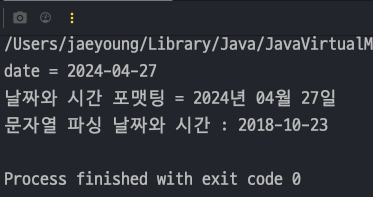
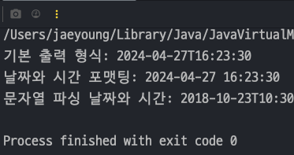

## 자바 중급 1편

## 날짜와 시간
> 1. 날짜와 시간 문자열 파싱과 포맷팅
> 2. 문제
---
## 1. 날짜와 시간 문자열 파싱과 포맷팅
> **포맷팅** : 날짜와 시간 데이터를 원하는 포맷의 문자열로 변경하는 것. `Date` -> `String`<br>
> **파싱** : 문자열을 날짜와 시간 데이터로 변경하는 것. `String` -> `Date`

#### 예제 코드
- `LocalDate` 객체를 문자열 데이터로 **포맷팅** 할때는 `DateTimeFormatter` 클래스의 `ofPattern()` 메서드를 호출하여 날짜 형식을 정해주면 된다.
- 반대로 문자열 데이터를 날짜 객체로 **파싱** 할때는 Loc`alDate 클래스의 `parse()` 메서드를 호출하여 문자열과, 포맷형식을 인자로 전달해준다.
    ```java
    import java.time.LocalDate;
    import java.time.format.DateTimeFormatter;
    
    public class FormattingMain1 {
        public static void main(String[] args) {
            // 포맷팅 : 날짜 -> 문자
            LocalDate date = LocalDate.of(2024, 4, 27);
            System.out.println("date = " + date); // 기본 출력은 YYYY-MM-dd 형식으로 출력(ISO 표준)
    
            DateTimeFormatter formatter = DateTimeFormatter.ofPattern("yyyy년 MM월 dd일"); // 대소문자 구분해야함
            String formattedDate = date.format(formatter);
            System.out.println("날짜와 시간 포맷팅 = " + formattedDate);
    
            // 파싱 : 문자 -> 날짜
            String input = "2018년 10월 23일";
            LocalDate parsedDate = LocalDate.parse(input, formatter);
            System.out.println("문자열 파싱 날짜와 시간 : " + parsedDate);
        }
    }
    ```
  

#### DateTimeFormatter 패턴
[공식사이트](https://docs.oracle.com/javase/8/docs/api/java/time/format/DateTimeFormatter.html#patterns)

### 문자열을 날짜와 시간으로 파싱
- 파싱을 할 때에는 문자열의 어떤 부분이 년이고,월이고 일인지 각각의 위치를 정해서 읽어야 한다.
- 똑같이 포맷팅을 할 때는 `DateTimeFormatter.ofPattern()` 을 이용하고 파싱할 때는 `LocalDateTime.parse()` 를 이용하면 된다.
  ```java
  import java.time.LocalDateTime;
  import java.time.format.DateTimeFormatter;
  
  public class FormattingMain2 {
      public static void main(String[] args) {
          // 포맷팅: 날짜와 시간을 문자로
          LocalDateTime now = LocalDateTime.of(2024, 04, 27, 16, 23, 30);
          DateTimeFormatter formatter = DateTimeFormatter.ofPattern("yyyy-MM-dd HH:mm:ss"); // 가장 많이 쓰는 형식
          String formattedDateTime = now.format(formatter);
          System.out.println("기본 출력 형식: " + now);
          System.out.println("날짜와 시간 포맷팅: " + formattedDateTime);
  
          // 파싱: 문자를 날짜와 시간으로
          String dateTimeString = "2018-10-23 10:30:12";
          LocalDateTime parsedDateTime = LocalDateTime.parse(dateTimeString, formatter);
          System.out.println("문자열 파싱 날짜와 시간: " + parsedDateTime);
      }
  }
  ```
  
