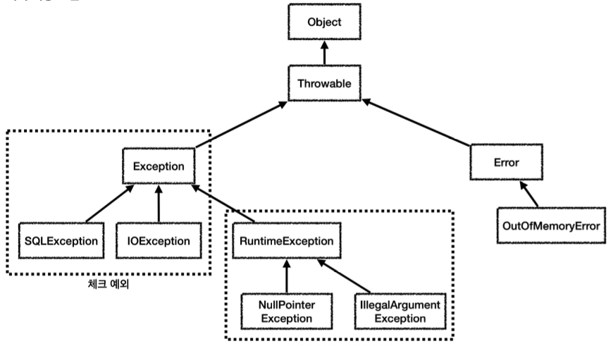
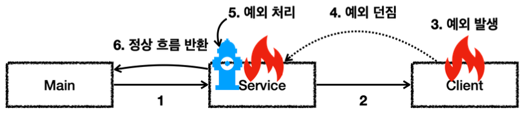
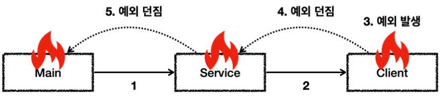
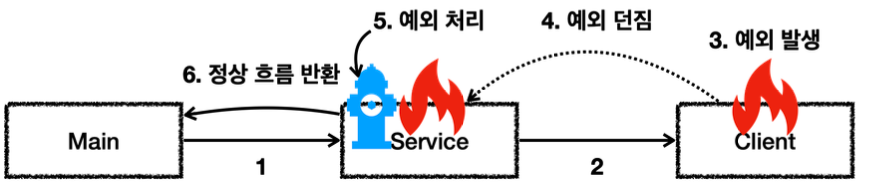
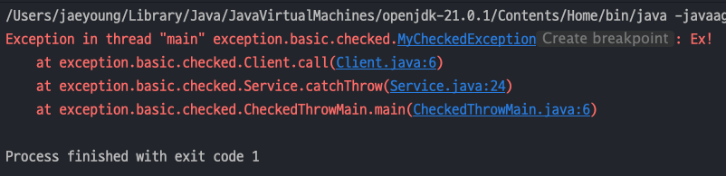
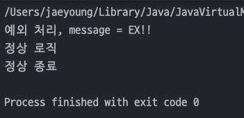
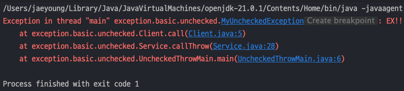

## 자바 중급 1편

## 예외 처리1 - 이론
> 1. 자바 예외 처리 1 - 예외 계층
> 2. 자바 예외 처리 2 - 예외 기본 규칙
> 3. 자바 예외 처리 3 - 체크 예외
> 4. 자바 예외 처리 4 - 언체크 예외
---
## 1. 자바 예외 처리 1 - 예외 계층
> `Java` 는 프로그램 실행 중 발생하는 예상치 못한 상황, 즉, `예외(Exception)`를 처리하기 위한 메커니즘을 제공한다.<br>
> 예외 처리는 다음 키워드를 사용한다.
> 1. `try`
> 2. `catch`
> 3. `finally`
> 4. `throw`
> 5. `throws`

### 예외 계층 그림
- `Object` : 자바에서 **예외도 객체**이기 때문에 최상위 부모에는 `Object` 가 있다.
- `Throwable` : 예외 객체 중 **최상위 예외 객체**이다. 하위에는 `Exception` 과 `Error` 가 있다.
- `Error` : **메모리 부족**이나 **심각한 시스템 오류**와 같이 ***애플리케이션에서 복구가 불가능***한 `시스템 예외`이다.
- `Exception` : 체크 예외이다.
  - **애플리케이션 로직에서 사용할 수 있는 실질적인 최상위 예외**이다.
  - `Exception` 과 그 하위 예외들은 모두 ***컴파일러가 체크하는 체크 예외***이다. 단, `RuntimeException` 은 예외로 한다.
- `RuntimeException` : 언체크 예외(런타임 예외)
  - ***컴파일러가 체크 하지 않는 언체크 예외***이다.
  - `RuntimeException` 을 포함한 하위 예외들도 모두 언체크 예외이다.

  

### 체크 예외 vs 언체크 예외
- `체크 예외`는 발생한 예외를 개발자가 **명시적으로 처리**해야 한다. 그렇지 않으면 컴파일 오류가 발생한다.
- `언체크 예외`는 개발자가 발생한 예외를 **명시적으로 처리하지 않아도 된다.**
---

## 2. 자바 예외 처리 2 - 예외 기본 규칙
> 예외는 폭탄 돌리기와 같다. 예외가 발생하면 잡아서 처리하거나, 처리할 수 없으면 밖으로 던져야 한다.

### 예외를 처리할 때
1. `Main` 은 `Service` 를 호출한다.
2. `Service` 는 `Client`를 호출한다.
3. `Client` 에서 예외가 발생했다.
4. `Client` 에서 예외를 처리하지 못하고 밖으로 던진다. 여기서 `Client` 의 밖은 `Client`를 호출한 `Service` 를 뜻한다.
5. `Service` 로 예외가 전달된다. `Service` 에서 에외를 처리하면 이후 애플리케이션 로직은 정상 흐름으로 동작한다.

    

### 예외를 던질 때
- 예외를 처리하지 못하면 자신을 호출한 곳으로 예외를 던져야 한다.
  
  
- _**예외는 반드시 잡아서 처리하거나 밖으로 던져야 한다.**_
- 만약 예외를 처리하지 못하고 계속 던지게 된다면 최종적으로 `main()` 에서 밖으로 던지게 된다, 그렇게 되면 ***예외 로그를 출력하면서 시스템이 종료***된다.
---
## 3. 자바 예외 처리 3 - 체크 예외

### 체크 예외 전체 코드
- 예외 클래스를 만들려면 예외를 상속받으면 된다.
- `Exception` 을 상속받은 예외는 **체크 예외**가 된다.
  ```java
  public class MyCheckedException extends Exception{
    public MyCheckedException(String message) {
      super(message);
    }
  }
  ```
- **예외를 임의로 터뜨리기** 위해서는 `throw` 키워드를 사용한다. 그리고 내부에서 예외를 처리하던지 **호출한 쪽으로 던질 수 있는데 던질 때**는 `throws` 키워드를 사용한다.
  ```java
  public class Client {
      
      public void call() throws Exception { // 예외를 던진다. - throws
          // 문제 상황 발생하여 예외를 발생 - throw
          throw new MyCheckedException("Ex!");
      }
  }
  ```
- `Client` 에서 던진 예외를 받는 `Service` 에서는 예외를 2가지 방법으로 처리할 수 있다.
  - 직접 예외를 처리
  - `Service를` 호출한 쪽으로 예외 처리
  ```java
  public class Service {
      Client client = new Client();

      public void callCatch(){
          try {
              client.call();
          }catch (MyCheckedException e){
              // 예외 처리 로직
              System.out.println("예외 처리, message=" + e.getMessage());
          }
          System.out.println("정상 흐름");
      }
      
      public void catchThrow() throws MyCheckedException {
          client.call();
      }
  }
  ```
### 예외를 잡아서 처리
- 아래 `main()` 메서드에서 `service.callCatch()` 를 호출하게 되면 `Service` 내부에서 예외를 잡아서 정상흐름으로 바뀌게 된다.
  ```java
  public class CheckedCatchMain {
      public static void main(String[] args) {
          Service service = new Service();
          service.callCatch();
          System.out.println("정상 종료");
      }
  }
  ```
  
- 전체적인 흐름은 아래와 같다.

  
- 예외를 잡아서 처리하기 위해 `try-catch` 문을 사용한다.
- `try` 블럭 안에서 예외가 발생하게 되면 `catch` 블럭으로 이동하여 예외를 처리하게 된다. 이 때, ***catch(예외타입) 에 맞는 예외만 처리***할 수 있다!
- 예외 타입을 `Exception` 으로 정하면 `Exception` 을 포함한 하위 예외를 다 잡을 수 있기 때문에 편해진다. 

### 예외를 처리하지 않고 던지기
- `main()` 메서드에서 예외를 잡지 않고 throws 로 던지게 되면 예외 로그가 남겨진다.
  ```java
  public class CheckedThrowMain {
      public static void main(String[] args) throws MyCheckedException {
          Service service = new Service();
          service.catchThrow();
          System.out.println("정상 종료");
      }
  }
  ```
  
- `main()` 메서드에서 `service.catchThrow();` 를 호출하면서 예외가 넘어올 때 `main()` 메서드 내부에서도 예외를 처리하던지 던질 수 있다.
- `main()` 메서드에서 예외를 던지면 예외 정보와 `스택 트레이스(Stack Trace)`를 출력하고 프로그램이 종료된다.
- 만약 ***예외를 던지지도 않고 예외를 처리하지도 않으면 컴파일 에러가 발생***한다 !

### 체크 예외의 장단점
- 체크 예외는 예외를 잡아서 처리할 수 없을 때, 예외를 밖으로 던지는 `throws` 를 ***필수로 선언***해야 한다. 그렇기 때문에 `체크 예외`라 한다.
  - **장점** : 개발자가 실수로 **예외를 누락하지 않도록 컴파일러를 통해 미리 컴파일 에러**를 내주는 훌륭한 안전 장치
  - **단점** : **모든 체크 예외를 잡거나 던지도록 처리**해야 하기 때문에 번거롭다.

---
## 4. 자바 예외 처리 4 - 언체크 예외
> `RuntimeException` 과 그 하위 예외객체는 언체크 예외로 분류된다.<br>
> 언체크 예외는 말 그대로 예외를 체크하지 않는다. 즉, **컴파일러가 체크를 해주지 않는 예외**이다.<br>
> 체크 예외와의 차이점은 `throws` 를 선언하지 않고, **생략이 가능**하다는 점이다.

### 언체크예외 코드
- `RuntimeException` 을 상속받으면 언체크 예외가 된다.
  ```java
  public class MyUncheckedException extends RuntimeException{
      public MyUncheckedException(String message) {
          super(message);
      }
  }
  ```
- `Client` 코드에서는 `throw` 를 통해 `MyUncheckedException` 을 터뜨린다. 기존 **체크예외와 다른점은 throws 를 생략**해도 된다는 점이다.
  ```java
  public class Client {
      public void call(){
          throw new MyUncheckedException("EX!!");
      }
  }
  ```
- 그리고 `Service` 코드에서는 **예외를 처리하는 메서드**와 **예외를 던지는 메서드**를 나누어 구현한다.
  ```java
  public class Service {
  
      Client client = new Client();
      
      public void callCatch() {
          try {
              client.call();
          } catch (MyUncheckedException e) {
              // 예외 처리 로직
              System.out.println("예외 처리, message = " + e.getMessage());
          }
          System.out.println("정상 로직");
      }
      
      public void callThrow(){
          client.call();
      }
  }
  ```
- `main()` 에서는 예외를 처리하는 메서드를 호출하면 정상흐름으로 된다.
  ```java
  public class UncheckedCatchMain {
      public static void main(String[] args) {
          Service service = new Service();
          service.callCatch();
          System.out.println("정상 종료");
      }
  }
  ```
  
- 예외를 던지는 메서드를 호출하면 `main()` 에서 예외를 처리하든 `throws` 로 던지든가 해야하는데 **언체크 예외는 생략이 가능**하다.
  ```java
  public class UncheckedThrowMain {
    public static void main(String[] args) {
      Service service = new Service();
      service.callThrow();
      System.out.println("정상 종료");
    }
  }
  ```
  

### 언체크 예외의 장단점
- 언체크 예외는 예외를 잡아서 처리할 수 없을 때, 예외를 밖으로 던지는 `throws` 키워드를 생략할 수 있다.
  - **장점** : 신경쓰고 싶지 않은 **언체크 예외를 무시**할 수 있다.
  - **단점** : 언체크 예외는 **개발자가 실수로 예외를 누락**할 수 있다.