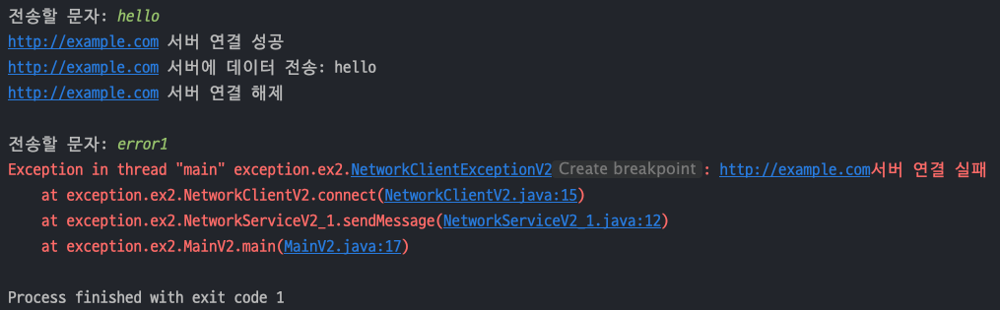
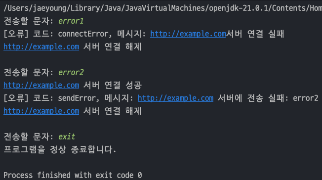

## 자바 중급 1편

## 예외 처리2 - 실습
> 1. 예외 처리 도입 1 - 시작
> 2. 예외 처리 도입 2 - 예외 복구
> 3. 예외 처리 도입 3 - 정상, 예외 흐름 분리
> 4. 예외 처리 도입 4 - 리소스 반환 문제
> 5. 예외 처리 도입 5 - finally
---
## 1. 예외 처리 도입 1 - 시작

### 예외 객체 생성
- 예외흐름에 필요한 체크 예외를 상속받는 예외 객체를 만든다.
- `errorCode` : 이전에는 오류 코드를 반환값으로 나타내서 오류 구분을 했지만, 이제는 오류코드를 필드로 갖고 있는다.
- `message` : 어떤 오류가 발생했는지 개발자가 보고 이해할 수 있게 설명을 담는다.
    ```java
    public class NetworkClientExceptionV2 extends Exception{
        
        private String errorCode;
    
        public NetworkClientExceptionV2(String errorCode, String message) {
            super(message);
            this.errorCode = errorCode;
        }
        
        public String getErrorCode() {
            return errorCode;
        }
    }
    ```

### 클라이언트 코드 수정
- 기존의 `Client` 코드에서는 오류코드를 보고 실패 메시지, 성공메시지를 띄웠지만 이제는 위에서 만든 예외를 터뜨려서 던진다.
- 반환값도 필요없어졌기 때문에 메서드 반환타입이 `void` 로 바뀌었다.
  ```java
  public class NetworkClientV2 {
    private final String address;
    public boolean connectError;
    public boolean sendError;
  
    public NetworkClientV2(String address) {
      this.address = address;
    }
  
    public void connect() throws NetworkClientExceptionV2 {
      // 연결 실패
      if (connectError)
        throw new NetworkClientExceptionV2("connectError", address + "서버 연결 실패");
  
      // 연결 성공
      System.out.println(address + " 서버 연결 성공");
    }
  
    public void send(String data) throws NetworkClientExceptionV2 {
      // 전송 실패
      if (sendError)
        throw new NetworkClientExceptionV2("sendError", address + " 서버에 전송 실패: " + data);
  
      // 전송 성공
      System.out.println(address + " 서버에 데이터 전송: " + data);
    }
  
    public void disconnect() {
      System.out.println(address + " 서버 연결 해제");
    }
  
    public void initError(String data) {
      if (data.contains("error1"))
        connectError = true;
      if (data.contains("error2"))
        sendError = true;
    }
  }
  ```
### 서비스 코드 및 main() 메서드
- 서비스 코드는 위에서 만든 `NetworkClientV2` 를 주입받는다.
  ```java
  public class NetworkServiceV2_1 {
  
      public void sendMessage(String data) throws NetworkClientExceptionV2 {
          String address = "http://example.com";
  
          NetworkClientV2 client = new NetworkClientV2(address);
  
          client.initError(data);
  
          client.connect();
          client.send(data);
          client.disconnect();
      }
  }
  ```
- 그리고 `main()` 메서드에서는 일단은 받은 예외를 던진다.
  ```java
  public class MainV2 {
      public static void main(String[] args) throws NetworkClientExceptionV2 {
          NetworkServiceV2_1 networkService = new NetworkServiceV2_1();
  
          Scanner sc = new Scanner(System.in);
  
          while (true) {
              System.out.print("전송할 문자: ");
              String input = sc.nextLine();
              if (input.equals("exit"))
                  break;
  
              networkService.sendMessage(input);
              System.out.println();
          }
          System.out.println("프로그램을 정상 종료합니다.");
      }
  }
  ```
  
  

### 해결된 문제 및 남은 문제
- 현재까지는 예외를 처리를 도입했지만, **예외가 복구되지 않고 프로그램이 종료**된다.
- 사용 후에는 반드시 `disconnect()` 를 호출해서 **연결을 해제**해야 한다.
---
## 2. 예외 처리 도입 2 - 예외 복구
> 위 예제에서는 예외를 계속 던지기만 해서 결국에는 프로그램이 종료되었다. 이제는 예외를 잡아 정상흐름으로 복구시킨다.

### 서비스 코드 변경
- 기존 서비스 코드에서는 `throws` 로 `main()` 메서드로 예외를 던졌지만 지금은 try-catch 로 예외를 잡고 정상흐름으로 복구시킨다.
  ```java
  public class NetworkServiceV2_2 {
  
      public void sendMessage(String data) {
          String address = "http://example.com";
  
          NetworkClientV2 client = new NetworkClientV2(address);
  
          client.initError(data);
  
          try {
              client.connect();
          } catch (NetworkClientExceptionV2 e) {
              System.out.println("[오류] 코드: " + e.getErrorCode() + ", 메시지: " + e.getMessage());
              return;
          }
  
          try {
              client.send(data);
          } catch (NetworkClientExceptionV2 e) {
              System.out.println("[오류] 코드: " + e.getErrorCode() + ", 메시지: " + e.getMessage());
              return;
          }
  
          client.disconnect();
      }
  }
  ```
- `main()` 메서드에서는 위 서비스 코드를 주입받아 테스트를 한다.
- 기존에는 예외가 터지면 프로그램이 종료됐지만 현재는 예외를 잡고 정상흐름으로 복구시켰기 때문에 프로그램이 종료되지 않는다.
  ```java
  public class MainV2 {
      public static void main(String[] args) throws NetworkClientExceptionV2 {
  //        NetworkServiceV2_1 networkService = new NetworkServiceV2_1();
          NetworkServiceV2_2 networkService = new NetworkServiceV2_2();
  
          Scanner sc = new Scanner(System.in);
  
          while (true) {
              System.out.print("전송할 문자: ");
              String input = sc.nextLine();
              if (input.equals("exit"))
                  break;
  
              networkService.sendMessage(input);
              System.out.println();
          }
          System.out.println("프로그램을 정상 종료합니다.");
      }
  }
  ```
  

### 해결된 문제 및 남은 문제
- 예외를 잡아서 정상흐름으로 복구하여서 프로그램이 종료되지 않았다.
- 예외를 잘 처리했지만 **정상 흐름과 예외 흐름이 섞여 있어서 코드를 읽기 어렵다.**
- 리소스 연결 후에는 반드시 `disconnect()` 를 호출하여 **리소스를 해제**해야 한다.


---
## 3. 예외 처리 도입 3 - 정상, 예외 흐름 분리
> `try-catch` 기능을 제대로 사용해서 정상 흐름과 예외 흐름이 섞여 있는 문제를 해결한다.

### 서비스 코드 수정
- 기존에는 각 예외마다 `try-catch` 로 묶어서 예외처리를 하였으나, 이제는 **하나의 여러 예외를 하나의 try-catch 로 묶어서 예외처리**를 하였다.
- 코드를 보면 **try 블럭 안에는 정상흐름**, **catch 블럭 안에는 예외흐름**으로 명확하게 구분이 된다.
  ```java
  public class NetworkServiceV2_3 {
  
      public void sendMessage(String data) {
          String address = "http://example.com";
  
          NetworkClientV2 client = new NetworkClientV2(address);
  
          client.initError(data);
  
          try {
              client.connect();
              client.send(data);
              client.disconnect();
          } catch (NetworkClientExceptionV2 e) {
              System.out.println("[오류] 코드: " + e.getErrorCode() + ", 메시지: " + e.getMessage());
          }
      }
  }
  ```
- 기존 `main(`) 메서드에서는 위 서비스 코드를 주입받아 실행해보면 아래와 같이 문제없이 동작한다.
  
  

### 해결된 문제
- `Java` 의 예외 처리 메커니즘과 `try`, `catch` 구조 덕분에 ***정상 흐름은 try 안에 예외 흐름은 catch 블럭에 모아서 처리***할 수 있다.
- 즉, 정상 흐름과 예외 흐름이 명확하게 구분되었다.

### 남은 문제
- `disconnect()`를 호출하여 리소스를 정리해야 한다.
---

## 4. 예외 처리 도입 4 - 리소스 반환 문제
> 정말 간단하게 생각하면 예외가 터지든 안터지든 try-catch 바깥에 리소스를 종료하는 코드를 호출하면 해결되는 일이다.

### 서비스 코드 수정
- `try-catch` 블럭 바깥에 `disconnect()` 를 호출하면 예외흐름이든 정상흐름이든 다 끝나고 호출된다.
  ```java
  public class NetworkServiceV2_4 {
  
      public void sendMessage(String data) {
          String address = "http://example.com";
  
          NetworkClientV2 client = new NetworkClientV2(address);
  
          client.initError(data);
  
          try {
              client.connect();
              client.send(data);
          } catch (NetworkClientExceptionV2 e) {
              System.out.println("[오류] 코드: " + e.getErrorCode() + ", 메시지: " + e.getMessage());
          }
          client.disconnect();
      }
  }
  ```
- `main()` 에서 실행하면 아래와 같이 동작한다.

  

### 서비스 코드 문제점
- 그냥 보기에는 리소스 정리가 되기때문에 해결된거 처럼 보이지만, 현재 저 예외이외의 다른 예외가 터질 경우 리소스 종료가 되지 않는다 !
- 즉, `RuntimeException` 같은 **예상하지 못한 예외의 경우 프로그램이 종료**되기 때문에 `disconnect()` 를 호출하지 않는다.
---
## 5. 예외 처리 도입 5 - finally
> 자바는 어떤 경우라도 반드시 호출되는 `finally` 기능을 제공한다.

- `try ~ catch ~ finally` 구조는 **정상 흐름**, **예외 흐름**, **마무리 흐름**을 제공한다.
- `try` 를 시작하기만 하면 `finally` 코드 블럭은 어떠한 경우라도 반드시 호출된다.
  ```java
  try {
    // 정상 흐름
  } catch{
    // 예외 흐름
  }
  finally{
    // 마무리 흐름
  }
  ```

### 서비스 코드 수정
- 기존 서비스 코드에서 `finally` 블럭에 `disconnect()` 를 호출하면 끝이다 !
  ```java
  public class NetworkServiceV2_5 {
  
      public void sendMessage(String data) {
          String address = "http://example.com";
  
          NetworkClientV2 client = new NetworkClientV2(address);
  
          client.initError(data);
  
          try {
              client.connect();
              client.send(data);
          } catch (NetworkClientExceptionV2 e) {
              System.out.println("[오류] 코드: " + e.getErrorCode() + ", 메시지: " + e.getMessage());
          } finally {
              client.disconnect();
          }
      }
  }
  ```
- `main()` 메서드에서는 잘 동작한다.

  
- 예상하지 못한 다른 예외가 터져도 리소스는 잘 정리된다.
  
  
---
  