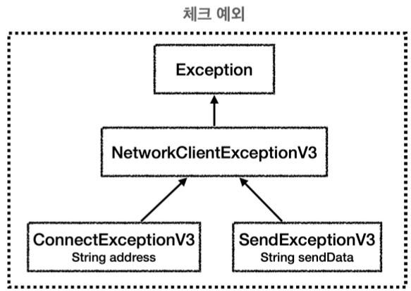
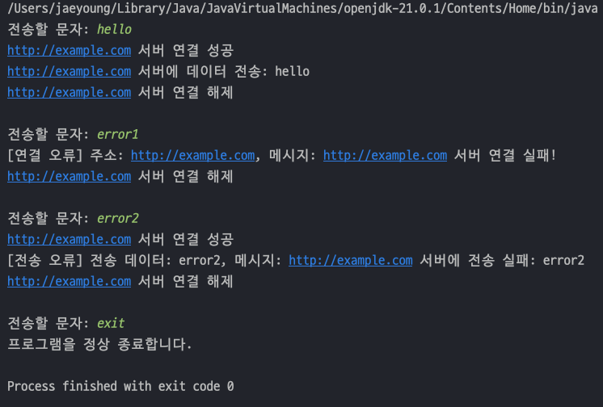
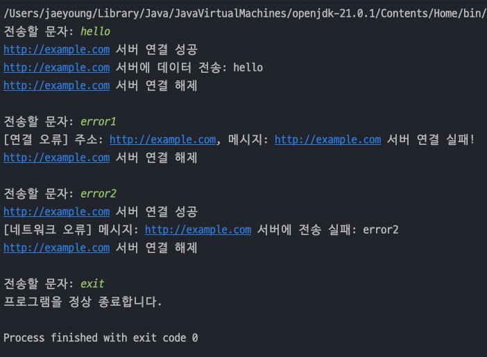

## 자바 중급 1편

## 예외 처리2 - 실습
> 1. 예외 계층 1 - 시작
> 2. 예외 계층 2 - 활용
---
## 1. 예외 게층 1 - 시작
> 예외를 단순히 오류 코드로 분류하지 않고, **예외를 계층화해서 다양하게 만들면 더 세밀하게 예외를 처리**할 수 있다.</br>
>   

### 예외 계층화 시 장점
- Java 에서 예외는 객체이다. 부모 예외를 잡거나 던지면 자식 예외도 함께 잡거나 던질 수 있다.
- 특정 예외를 잡고 싶을 때는 자식 예외를 잡을 수 있다

### 예외객체 코드
- `ConnectExceptionV3` 는 연결실패 시 던질 예외이고, `SendExceptionV3` 는 데이터 전송실패 시 던질 예외이다.
- 이 두 예외는 `NetworkClientExceptionV3` 예외의 자식 예외이다.
  ```java
  public class NetworkClientExceptionV3 extends Exception{
      public NetworkClientExceptionV3(String message) {
          super(message);
      }
  }
  
  public class ConnectExceptionV3 extends NetworkClientExceptionV3{
  
      private final String address;
  
      public ConnectExceptionV3(String address, String message) {
          super(message);
          this.address = address;
      }
  
      public String getAddress() {
          return address;
      }
  }
  
  public class SendExceptionV3 extends NetworkClientExceptionV3{
      private final String sendData;
  
      public SendExceptionV3(String sendData, String message) {
          super(message);
          this.sendData = sendData;
      }
  
      public String getSendData() {
          return sendData;
      }
  }
  ```
- 그리고 서비스 코드는 각 예외에 맞는 예외를 던지게 된다.
  ```java
  public class NetworkClientV3 {
      private final String address;
      public boolean connectError;
      public boolean sendError;
  
      public NetworkClientV3(String address) {
          this.address = address;
      }
  
      public void connect() throws ConnectExceptionV3 {
          // 연결 실패
          if (connectError)
              throw new ConnectExceptionV3(address, address+" 서버 연결 실패!");
  
          // 연결 성공
          System.out.println(address + " 서버 연결 성공");
      }
  
      public void send(String data) throws SendExceptionV3 {
          // 전송 실패
          if (sendError)
              throw new SendExceptionV3(data, address + " 서버에 전송 실패: " + data);
  
          // 전송 성공
          System.out.println(address + " 서버에 데이터 전송: " + data);
      }
  
      public void disconnect() {
          System.out.println(address + " 서버 연결 해제");
      }
  
      public void initError(String data) {
          if (data.contains("error1"))
              connectError = true;
          if (data.contains("error2"))
              sendError = true;
      }
  }
  ```
- 예외를 세분화하면서 `try-catch` 로 예외를 처리할 때 각 예외에 맞는 예외처리를 디테일하게 할 수 있다.
- 연결예외를 잡을 때는 주소와 메시지를 남기고, 전송예외를 잡을 때는 전송데이터와 메시지를 남길 수 있다.
  ```java
  public class NetworkServiceV3_1 {
  
      public void sendMessage(String data) {
          String address = "http://example.com";
  
          NetworkClientV3 client = new NetworkClientV3(address);
  
          client.initError(data);
  
          try {
              client.connect();
              client.send(data);
          } catch (ConnectExceptionV3 e) {
              System.out.println("[연결 오류] 주소: " + e.getAddress() + ", 메시지: " + e.getMessage());
          } catch (SendExceptionV3 e) {
              System.out.println("[전송 오류] 전송 데이터: " + e.getSendData() + ", 메시지: " + e.getMessage());
          } finally {
              client.disconnect();
          }
      }
  }
  ```
- `main()` 에서 실행해보면 아래와 같이 디테일한 예외처리 내용을 확인할 수 있다.
  ```java
  public class NetworkServiceV3_1 {
  
      public void sendMessage(String data) {
          String address = "http://example.com";
  
          NetworkClientV3 client = new NetworkClientV3(address);
  
          client.initError(data);
  
          try {
              client.connect();
              client.send(data);
          } catch (ConnectExceptionV3 e) {
              System.out.println("[연결 오류] 주소: " + e.getAddress() + ", 메시지: " + e.getMessage());
          } catch (SendExceptionV3 e) {
              System.out.println("[전송 오류] 전송 데이터: " + e.getSendData() + ", 메시지: " + e.getMessage());
          } finally {
              client.disconnect();
          }
      }
  }
  ```
  
---
## 2. 예외 계층 2 - 활용
> `NetworkClientV3` 에서 수많은 예외를 발생시킨다고 가정해보자. 이런 경우 모든 예외를 하나하나 다 잡아서 처리하는 것은 상당히 번거롭다.</br>
> 예외를 우선순위를 정하여 처리한다.</br>
> 1. 연결 오류는 가장 중요 : `[연결 오류 ] 주소: ...` 로 출력
> 2. NetworkClientExceptionV3 의 다른 자식 예외 : `[네트워크 오류] 메시지: ...` 로 출력
> 3. 그 외 모든 예외 : `[알 수 없는 오류] 메시지: ...` 로 출력

### 예외처리 코드 수정
- 기존의 `NetworkService` 코드를 아래와 같이 수정한다.
- 가장 중요한 연결 오류는 디테일하게 잡고, 그 외의 `NetworkClientExceptionV3` 예외를 포함한 자식 예외는 네트워크 오류, 그 외의 체크 예외들은 알수없는 오류로 처리한다.
  ```java
  public class NetworkServiceV3_2 {
  
      public void sendMessage(String data) {
          String address = "http://example.com";
  
          NetworkClientV3 client = new NetworkClientV3(address);
  
          client.initError(data);
  
          try {
              client.connect();
              client.send(data);
          } catch (ConnectExceptionV3 e) {
              System.out.println("[연결 오류] 주소: " + e.getAddress() + ", 메시지: " + e.getMessage());
          } catch (NetworkClientExceptionV3 e) {
              System.out.println("[네트워크 오류] 메시지: " + e.getMessage());
          } catch (Exception e) {
              System.out.println("[알 수 없는 오류] 메시지: " + e.getMessage());
          } finally {
              client.disconnect();
          }
      }
  }
  ```
- `main()`에서 `NetworkServiceV3_2` 를 주입받아 테스트해보면 아래와 같이 출력이 된다.

  

### 여러 예외를 한번에 잡기
- 위 코드에서는 `ConnectExceptionV3` , `NetworkClientExcpetionV3` , `Excpetion` 을 따로따로 `catch` 로 처리했지만 `|` 를 이용하여 한번에 처리도 가능하다.
  ```java
  public class NetworkServiceV3_2 {
  
      public void sendMessage(String data) {
          String address = "http://example.com";
  
          NetworkClientV3 client = new NetworkClientV3(address);
  
          client.initError(data);
          
          try{
              client.connect();
              client.send(data);
          }catch (ConnectExceptionV3 | SendExceptionV3 e){
              System.out.println("[연결 또는 전송 오류] 메시지: " + e.getMessage());
          }finally {
              client.disconnect();
          }
      }
  }
  ```
---