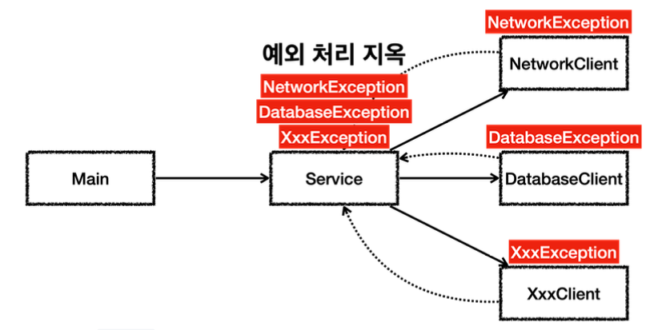
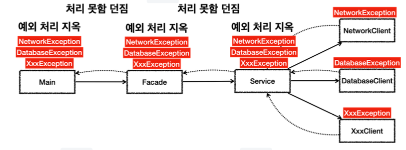
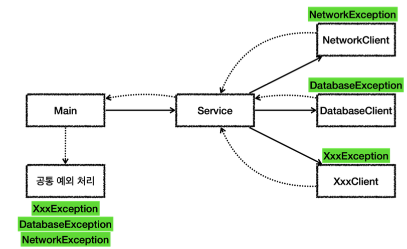
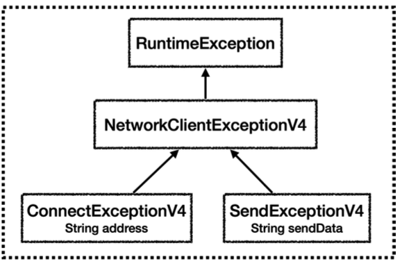
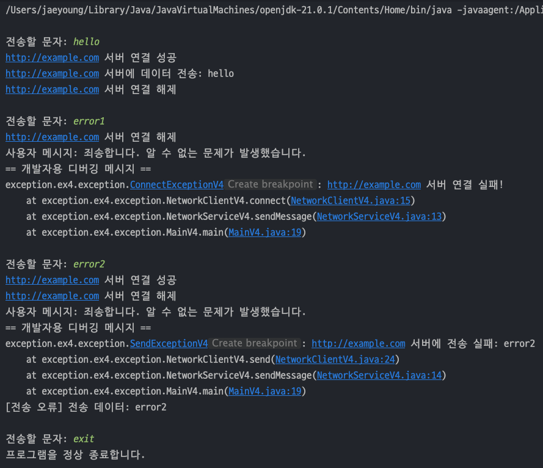
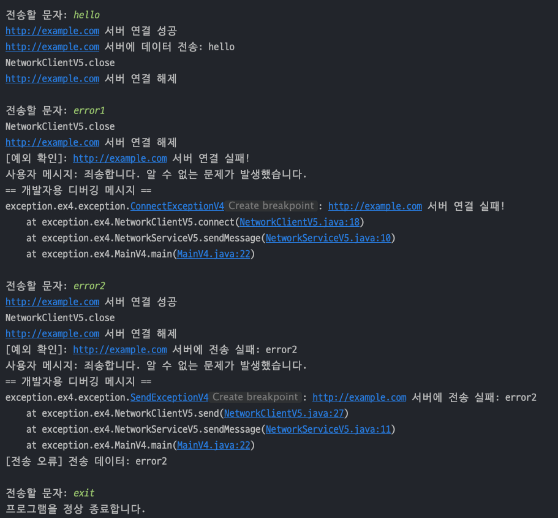

## 자바 중급 1편

## 예외 처리2 - 실습
> 1. 실무 예외 처리 방안 1 - 설명
> 2. 실무 예외 처리 방안 2 - 구현
> 3. try-with-resources
---
## 1. 실무 예외 처리 방안 1 - 설명

#### 처리할 수 없는 예외
- 상대 네트워크 서버에 문제가 발생하여 통신이 불가능하거나, 데이터베이스 서버에 문제가 발생하여 접속이 안된다면 **네트워크 연결 오류**, **데이터베이스 접속 오류**가 발생한다.
- 이런 _**시스템 오류같은 예외들은 잡아도 해결할 수 없다.**_
- 이런 경우 고객에게는 시스템에 문제가 있다는 **메시지**를 보여주고, _**내부 개발자가 문제상황을 인식할 수 있게 로그를 남겨두어야 한다.**_

#### 체크 예외의 부담
- **체크 예외**는 개발자가 실수로 예외를 놓쳐도 ***컴파일러가 체크해주기 때문에 오래전부터 많이 사용***되었다.
- 하지만 위 예시처럼 처리할 수 없는 예외가 많아지고 프로그램이 복잡해지면서 체크 예외를 사용하는 것이 점점 부담스러워졌다.

### 체크 예외 사용 시나리오 
- 현대 프로그램은 수 많은 라이브러리를 사용하게 된다. 만약 아래 그림처럼 `Main` -> `Service` -> 라이브러리 들 의 구조에서 예외를 처리하게 되면 `Service`에서 예외를 다 처리해줘야 한다.

  
- 하지만 네트워크 오류나 데이터베이스 접속 오류같은 경우 `Service`에서 예외를 처리할 수 없다. 이 경우 `throws` 로 던지는게 나은 방법이다.
- 그리고 라이브러리가 늘어날 수록 던져야하는 예외가 많아지게 된다.
- 문제는 `Main` 과 `Service` 사이에 `Facade` 라는 클래스가 있으면 거기서도 던져야 하는 지저분한 코드가 만들어진다.

  
- 하지만 `Exception` 으로 묶으면 모든 예외를 잡을 수 있다.
- `throws Exception` 으로 모든 예외를 잡아서 코드가 깔끔해진다. 그러나 치명적인 문제가 있다.

#### throws Exception 의 문제
- `Exception` 은 최상위 타입이므로 모든 체크 예외를 다 밖으로 던지는 문제가 발생한다.
- 체크 예외의 최상위 타입인 `Exception` 을 던지게 되면 _**다른 체크 예외를 체크할 수 있는 기능이 무효화 되고, 중요한 체크 예외를 다 놓치게 된다.**_
- 컴파일러는 `Exception` 을 던지기 때문에 _**문법에 맞다고 판단해서 컴파일 오류가 발생하지 않는다.**_
- 즉, `Exception` 자체를 밖으로 던지는 것은 좋지 않은 방법이다.

#### 문제 정리
1. **처리할 수 없는 예외** : 예외를 잡아서 복구할 수 있는 예외보다 **복구할 수 없는 예외가 더 많다.**
2. **체크 예외의 부담** : **처리할 수 없는 예외는 밖으로 던져야 한다.** 체크 예외이므로 `throws` 에 예외타입을 일일이 명시해야 한다.

### 언체크(런타임) 예외 사용 시나리오
- 언체크 예외의 경우 `NetworkException` , `DatabaseException` 은 잡아도 복구할 수 없기 때문에 무시하면 된다.

  
- 사용하는 라이브러리가 늘어나서 **언체크 예외가 늘어나도 본인이 필요한 예외만 잡으면 된다.**

#### 예외 공통 처리
- 처리할 수 없는 예외들은 중간에 여러고셍서 나누어 처리하기 보다는 예외를 공통으로 처리할 수 있는 곳을 만들어서 한 곳에서 해결하면 된다.
- 해결할 수 없는 예외들이기 때문에 고객에게는 현재 시스템에 문제가 있습니다 라고 메시지를 보여주고, 웹이면 오류 페이지를 보여주면 된다.
- 그리고 개발자가 문제 상황을 인지할 수 있도록, 오류에 대한 로그를 남겨 두면 된다.
---
## 2. 실무 예외 처리 방안 2 - 구현
> 지금까지 실습한 내용을 언체크 예외로 만들고, 해결할 수 없는 예외들을 공통으로 처리.

### 언체크(런타임) 예외 구현
- `NetworkClientExceptionV4` 는 언체크 예외인 `RuntimeException` 을 상속받고, `NetworkClientExceptionV4` 하위 자식 예외들도 모두 언체크 예외가 된다.
  ```java
  public class NetworkClientExceptionV4 extends RuntimeException{
      public NetworkClientExceptionV4(String message) {
          super(message);
      }
  }
  
  public class ConnectExceptionV4 extends NetworkClientExceptionV4 {
  
      private final String address;
  
      public ConnectExceptionV4(String address, String message) {
          super(message);
          this.address = address;
      }
  
      public String getAddress() {
          return address;
      }
  }
  
  public class SendExceptionV4 extends NetworkClientExceptionV4 {
      private final String sendData;
  
      public SendExceptionV4(String sendData, String message) {
          super(message);
          this.sendData = sendData;
      }
  
      public String getSendData() {
          return sendData;
      }
  }
  ```
  
- `NetworkClientV4` 클래스에서는 언체크 예외를 발생 시키기 때문에 `throws` 가 다 없어졌다.
  ```java
  public class NetworkClientV4 {
      private final String address;
      public boolean connectError;
      public boolean sendError;
  
      public NetworkClientV4(String address) {
          this.address = address;
      }
  
      public void connect() {
          // 연결 실패
          if (connectError)
              throw new ConnectExceptionV4(address, address + " 서버 연결 실패!");
  
          // 연결 성공
          System.out.println(address + " 서버 연결 성공");
      }
  
      public void send(String data) {
          // 전송 실패
          if (sendError)
              throw new SendExceptionV4(data, address + " 서버에 전송 실패: " + data);
  
          // 전송 성공
          System.out.println(address + " 서버에 데이터 전송: " + data);
      }
  
      public void disconnect() {
          System.out.println(address + " 서버 연결 해제");
      }
  
      public void initError(String data) {
          if (data.contains("error1"))
              connectError = true;
          if (data.contains("error2"))
              sendError = true;
      }
  }
  ```
- `NetworkServiceV4` 클래스에서 예외처리 했던 `ConnectExceptionV4` , `SendExceptionV4` 를 잡아도 해당 오류를 복구할 수 없다. 따라서 예외를 밖으로 던진다.
- 언체크 예외기 때문에 `throws` 가 없어도 자동으로 던지게 된다.
- 언체크 예외의 방식 덕분에 코드가 매우 깔끔해진다.
  ```java
  public class NetworkServiceV4 {
  
      public void sendMessage(String data) {
          String address = "http://example.com";
  
          NetworkClientV4 client = new NetworkClientV4(address);
  
          client.initError(data);
  
          try {
              client.connect();
              client.send(data);
          }  finally {
              client.disconnect();
          }
      }
  }
  ```
- `main()` 에서는 최종으로 올라온 ***언체크 예외를 Exception 으로 묶어서 공통으로 처리***할 수 있다.
- 그리고 `exceptionHandler()` 를 호출하면서 예외 객체를 전달하여 **고객에게는 안내 메시지**를 보여주고, **개발자용 디버깅 메시지를 따로 출력해 개발자가 문제인지를 할 수 있게 한다.**
  ```java
  public class MainV4 {
      public static void main(String[] args) {
  
          NetworkServiceV4 networkService = new NetworkServiceV4();
  
          Scanner sc = new Scanner(System.in);
  
          while (true) {
              System.out.print("\n전송할 문자: ");
              String input = sc.nextLine();
              if (input.equals("exit"))
                  break;
  
              try {
                  networkService.sendMessage(input);
              } catch (Exception e) { // 공통 처리
                  exceptionHandler(e);
              }
          }
          System.out.println("프로그램을 정상 종료합니다.");
      }
  
      // 공통 예외 처리
      private static void exceptionHandler(Exception e) {
          System.out.println("사용자 메시지: 죄송합니다. 알 수 없는 문제가 발생했습니다."); // 고객에게 보여줄 메시지
          System.out.println("== 개발자용 디버깅 메시지 =="); // 개발자용 메시지
          e.printStackTrace(System.out);
  //        e.printStackTrace();
  
          // 필요한 예외 별도로 추가 처리 가능
          if(e instanceof SendExceptionV4 snedEx)
              System.out.println("[전송 오류] 전송 데이터: " + snedEx.getSendData());
      }
  }
  ```
  

#### `e.printStackTrace()`
- **예외 메시지와 스택 트레이슬르 출력**할 수 있다.
- 이 기능을 사용하면 **예외가 발생한 지점을 역으로 추적**할 수 있다.
- `e.printStackTrace(System.out)` 과 `e.printStackTrace(System.err)` 가 있는데 둘은 똑같이 예외 메시지를 출력하지만 차이가 있다.
- `System.err` 는 메시지를 빨간색 글씨로 표현하지만 스트림의 방식이 달라 출력메시지가 꼬일 수 있다.

#### 참고
  > 실무에서는 에러 로그를 `System.out` 를 쓰지 않고, `Slf4j` 나 `logback` 같은 ***별도의 로그 라이브러리를 사용해서 콘솔과 특정 파일에 함께 결과를 출력***한다.

---
## 3. try-with-resources
> 애플리케이션에서 ***외부 자원을 사용하는 경우 반드시 외부 자원을 해제***해야 한다. 즉, `finally` 구문을 반드시 사용해야 한다.

### try-with-resources 구현
- `try` 에서 **외부 자원을 사용**하고, `try`가 끝나면 외부 자원을 반납하는 패턴이 반복되면서 `Java 7` 부터 `Try with resources` 라는 편의 기능이 도입됐다.
- 이 기능을 사용할려면 `AutoCloseable` 인터페이스를 구현해야 한다.
  ```java
  package java.lang;
  
  public interface AutoCloseable{
      void close() throws Exception;
  }
  ```
- `NetworkClientV5` 를 `AutoCloseable` 의 구현체로 사용한다.
- `AutoCloseable` 인터페이스의 `close()` 메서드를 오버라이딩 해야하는데, 이 메서드에서 **종료 시점에 자원을 반납하는 방법을 정의**하면 된다.
  - 참고로 이 메서드에서는 예외를 안던지므로 `throws Exception` 을 제거했다.
  ```java
  public class NetworkClientV5 implements AutoCloseable {
      private final String address;
      public boolean connectError;
      public boolean sendError;
  
      public NetworkClientV5(String address) {
          this.address = address;
      }
      
      // 생략 ..
      @Override
      public void close() {
          System.out.println("NetworkClientV5.close");
          disconnect();
      }
  }
  ```
- 예외를 처리하는 `NetworkService5` 에서는 아래와 같이 수정된다.
  - `Try with resources` 구문은 **try 괄호 안에 사용할 자원을 명시**한다.
  - 이 자원은 try 구문이 끝나면 자동으로 `AutoCloseable.close()` 를 **호출해서 자원을 해제**한다.
  - 역이서는 **catch 블럭이 없어도 close()는 호출**된다.
  ```java
  public class NetworkServiceV5 {
  
      public void sendMessage(String data) {
          String address = "http://example.com";
  
          try (NetworkClientV5 client = new NetworkClientV5(address)) {
              client.initError(data);
              client.connect();
              client.send(data);
          } catch (Exception e) {
              System.out.println("[예외 확인]: " + e.getMessage());
              throw e;
          }
      }
  }
  ```
- `main()` 에서 `NetworkServiceV5` 를 주입받아 테스트해보면 아래와 같이 리소스가 잘 해제되는 것을 알 수 있다.
- 출력결과 순서를 보면 **try 문이 끝나자마자 자원이 해제되고 catch 로 가게 된다.**

  

#### Try with resources 장점
1. **리소스 누수 방지** : ***모든 리소스가 제대로 닫히도록 보장***되기 때문에 자원 해제 코드를 누락하는 문제를 예방할 수 있다.
2. **코드 간결성 및 가독성 향상** : ***명시적인 close() 호출이 필요없어*** 코드가 더 간결하고 읽기 쉬워진다.
3. **소코프 범위 한정** : ***리소스는 try 블럭 안에서만 한정***되기 때문에 유지보수가 쉬워진다.
4. **조금 더 빠른 자원 해제** : ***try 문이 끝나자마자 자원이 해제***되기 때문에 기존의 `try -> catch -> finally` 보다 빠르다.
---